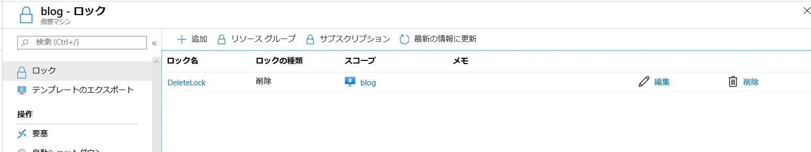
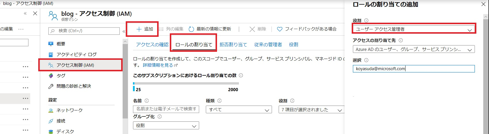

> [!WARNING]
> 本記事は、投稿より時間が経過しており、一部内容が古い可能性がございます。  
> また、ストレージアカウントの復旧については以下の新しい情報をご参照いただけますと幸いです。  
> [https://jpaztech.github.io/blog/storage/storageAccount-Restore/](https://jpaztech.github.io/blog/storage/storageAccount-Restore/)  
> [https://learn.microsoft.com/ja-jp/azure/storage/common/storage-account-recover](https://learn.microsoft.com/ja-jp/azure/storage/common/storage-account-recover)  

こんにちは、Azure テクニカル サポート チームの安田です。

今回は意図せずリソースやリソースグループを消してしまった際のトラブルシューティングおよび、誤削除が発生しないような運用についてご案内させていただきます。

# 本情報の内容（添付文書、リンク先などを含む）は、作成日時点でのものであり、予告なく変更される場合があります。i>また、リソース正常性についても、正しく表記されないことがあることもあるため、表記に差異があれば、サポート部門までお問い合わせください。

## リソースの復旧について

トラブルシューティングと銘打っておきながら大変恐縮ですが、基本的に IaaS 領域のリソースについては削除されたリソースを復元するということはできません。
(お客様から消してください。と言われたリソース・データを保持しておく方が色々と問題となりますので。。。) 

このような背景からも、「リソースグループ / リソースを誤って削除してしまいました。どうにかなりませんか？」と弊サポート部門にお問い合わせいただいても大変心苦しいのですが、復旧することは叶いません。
ただし、Storage Account に限ってはわずかですが復旧できる可能性があります。

## Storage Account の復旧について

Storage Account （の特定の SKU）に限り、Azure 基盤側から復旧を行うことが可能な場合があります。具体的には GRS と RA-GRS （セカンダリリージョンへの地理冗長が組まれている SKU） が前提となります。
これは Storage Account のセカンダリリージョンのデータが削除されるまでに時差があるため、セカンダリリージョンからデータを持ってくることとなります。
なお、復旧対象は Storage Account か コンテナ を丸ごと消してしまった場合のみが対象となり、単一のデータを誤削除しても復旧することは叶いませんので、予めご了承ください。

万が一、誤ってストレージアカウント・コンテナを削除してしまった場合は、削除してしまった Storage Account 名・サブスクリプション ID (英数字32桁)・削除されたおおまかな時刻を記載のうえ弊サポート部門までお問い合わせください。基本的には時間との勝負なので、判明次第すぐにお問い合わせください。
また、復旧を行う際に整合性の問題が発生することを避けるため、同名の Stoage Account・コンテナは作成しないようにお願いいたします。

なお、復旧が可能となる期間についてはリージョンやデータセンター内部の動作等、様々な要因にて前後するためお伝えすることはできません。過去の事例から削除後すぐにお問い合わせをしたものの、復旧できなかったという事例もございますし、お問い合わせの起票が削除から数日後であったものの復元できたというケースもございます。弊サポート部門でもできる限り復旧できるようにご支援いたしますが、ベストエフォートでの対応となり、復旧が叶わない可能性も十分ございますので、予めご了承ください。

## リソースの誤削除を未然に防ぐ方法について（リソースロック機能のご紹介）

リソースの誤削除は得てしてヒューマンエラーから発生するものであり、注意していても発生してしまうものです。
よくある事例として、検証用環境と運用環境でサブスクリプションを分けていたものの、リソース名が同名となっており、コマンドラインから検証用環境のリソースを削除しようとして誤って運用環境リソースを消してしまう等、様々なシナリオが挙げられます。
そのため検証用環境と本番用環境で名前を明確に区別しておく、Backup 用のリソースのみ別のリソースグループに保存しておく等、構築段階でヒューマンエラーをできるだけを招きにくくし、発生しても影響が最低限となるように設計しておくことを推奨いたします。

また、Azure のリソースにはロック機能という誤削除・誤操作防止用の機能を無償にて提供しております。リソースグループやサブスクリプション単位でリソースの削除を防止するだけでなく、Read Only として変更を実行できないようにすることも可能なので、”運用環境に展開済みでこれ以上手を加えたくない。”という場合にもお使いいただく事のできる機能となります。

設定方法や注意事項については下記のドキュメントに記載されておりますので、ご確認ください。

>参考URL: リソースのロックによる予期せぬ変更の防止
>[https://docs.microsoft.com/ja-jp/azure/azure-resource-manager/management/lock-resources](https://docs.microsoft.com/ja-jp/azure/azure-resource-manager/management/lock-resources)

画像例: 仮想マシンにロック機能を使用

画像例: 削除時に失敗する

なお、下記の通り、リソースロックは 所有者 と ユーザー アクセス管理者 等、Microsoft.Authorization/* または Microsoft.Authorization/locks/* アクション へアクセス可能であるユーザーしか作成・削除することはできません。

※上記公開情報より抜粋
><strong>誰がロックを作成または削除できるか</strong>
>管理ロックを作成または削除するには、Microsoft.Authorization/* または Microsoft.Authorization/locks/* アクションにアクセスできる必要があります。 組み込みロールのうち、所有者とユーザー アクセス管理者にのみこれらのアクションが許可されています。

そのため、IAM の項目から対象のリソースやリソースグループに対して、下記のように特定のユーザーに対して "所有者" か "ユーザー アクセス管理者" の権限を割り当てください。

Azure Portal > Virtual Machines > 対象の仮想マシン > アクセス制御(IAM) > ロール割り当て > 追加 > 役割とユーザーを選択し、追加

画像例: 仮想マシンに特定のユーザーに "ユーザー アクセス管理者" を付与

## BLOB ファイルの誤削除を未然に防ぐ方法について（Soft Delete 機能のご紹介）

リソースロック機能は Azure のリソースが対象ですが、"Soft Delete (論理的な削除)機能" を事前に登録いただく事で、Storage Account 内の BLOB ファイルを操作ミス等で削除してしまっても設定した期間内であれば復旧することが可能となります。

ポータルからさくっと設定・復元することができるため、重要なデータを保護している場合には、有効化いただくことを推奨いたします。設定手順や詳細については下記公開ドキュメントをご確認ください。

>参考URL: Azure Storage Blob の論理的な削除
>[https://docs.microsoft.com/ja-jp/azure/storage/blobs/storage-blob-soft-delete?tabs=azure-portal](https://docs.microsoft.com/ja-jp/azure/storage/blobs/storage-blob-soft-delete?tabs=azure-portal)

\# 現段階では Azure Data Lake Storage Gen2 の Storage Account についてはSoft Deleteの機能はサポートされておりませんので、予めご了承ください。

>参考URL: Azure Data Lake Storage Gen2 に関する既知の問題
>[https://docs.microsoft.com/ja-jp/azure/storage/blobs/data-lake-storage-known-issues#support-for-other-blob-storage-features](https://docs.microsoft.com/ja-jp/azure/storage/blobs/data-lake-storage-known-issues#support-for-other-blob-storage-features)
>※ 抜粋
>論理的な削除 : まだサポートされていません

以上、少しでもご参考となれば幸いです。

