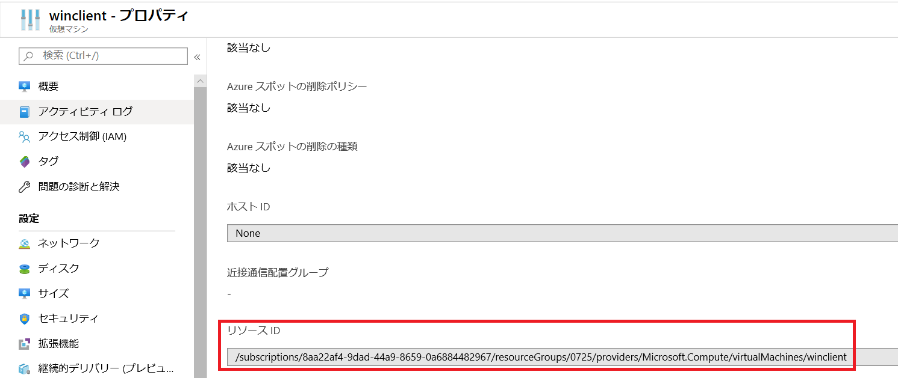
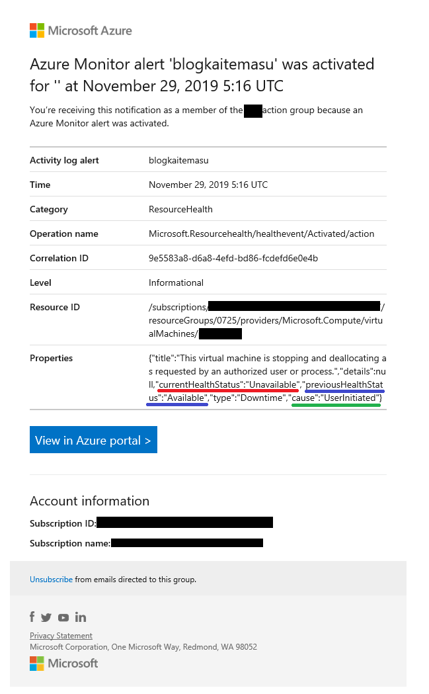
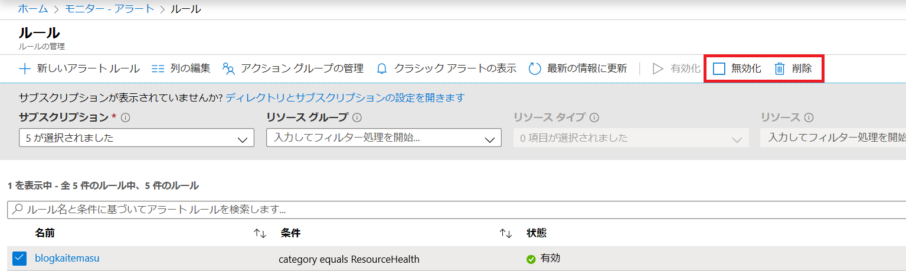

こんにちは、Azure サポートチームの安田です。

「Azure 基盤側の障害によって仮想マシンが ダウン / 復旧 した際に通知を受け取りたい。」
サポート業務をしていてそういったご要望をよくいただきます。
そこで今回は、リソース正常性アラートという機能を用いて、障害発生時に仮想マシンがダウンした際に、アラートを受け取る方法をお伝えします。

<span style="color:gray;">
<ul>
    <li>ブログ執筆時点では本機能はプレビュー段階となりますので、通知が正常に送付されない可能性がありますので、予めご了承ください。</li>
    <li>(鋭意開発中ですが、現段階では一般公開の目途は決まっておりません。)</li>
    <li>また、リソース正常性についても、正しく表記されないことがあることもあるため、表記に差異があれば、サポート部門までお問い合わせください。</li>
</ul>
</span>

## サービス正常性監視やハートビート監視との住み分けについて

Azure が提供している他のリソース監視サービスとの違いを簡単に記載します。それぞれ用途や動作が異なるため、ご要件にあったものを選択ください。


### ■ リソース正常性アラート

リソース正常性アラートはリソース正常性に変化が発生した際に、任意の連絡先に通知を飛ばす機能となります。リソース正常性ではリソース単位で発生した障害について確認することができます。仮想マシンに限らず、Storage Account や Microsoft SQL 等、様々なリソースの稼働状況を確認することができます。

リソース正常性の詳細については、公式ドキュメントおよび、過去の記事とはなりますが、以下の URL を参照ください。

>Resource Health の概要
>[https://docs.microsoft.com/ja-jp/azure/service-health/resource-health-overview](https://docs.microsoft.com/ja-jp/azure/service-health/resource-health-overview)

>リソース正常性を使って、自分のリソースに何が起きたのかを確認する
>[https://blogs.technet.microsoft.com/jpaztech/2017/04/12/resourcehealth/](https://blogs.technet.microsoft.com/jpaztech/2017/04/12/resourcehealth/)

仮想マシンの場合、リソース正常性は Azure 基盤側から仮想マシンを展開する物理ホストサーバー単位で下記の内容を監視しており、ゲスト OS にて異常を検知した際に、”使用不可”　に変更されることが想定されます。

>Azure Resource Health で利用できるリソースの種類と正常性チェック
>[https://docs.microsoft.com/ja-jp/azure/service-health/resource-health-checks-resource-types#microsoftcomputevirtualmachines](https://docs.microsoft.com/ja-jp/azure/service-health/resource-health-checks-resource-types#microsoftcomputevirtualmachines)<br>
>　　・　ホスト サーバーが稼働しているか
>　　・　ホスト OS の起動が完了しているか
>　　・　仮想マシン コンテナーがプロビジョニングされ、オンになっているか
>　　・　ホストとストレージ アカウント間のネットワーク接続が存在する
>　　・　ゲスト OS の起動が完了しているか
>　　・　進行中の定期的なメンテナンスはあるか


### ■ サービス正常性アラート

下記の公開情報の通り、サービス正常性アラートはサービスに変更があった際にアラートが発報されます。サービス正常性は仮想マシンのメンテナンス通知やお使いいただいている各サービスの障害についての情報を確認することができます。本機能はリージョン単位での障害など、大規模な障害に対してのみ通知を行うため、物理ホストサーバー単位といった個別の障害についてはアラートは発報されません。

※公開情報より抜粋

>Azure Resource Health の FAQ
>[https://docs.microsoft.com/ja-jp/azure/service-health/resource-health-faq#how-is-resource-health-different-from-azure-status-or-the-service-health-dashboard](https://docs.microsoft.com/ja-jp/azure/service-health/resource-health-faq#how-is-resource-health-different-from-azure-status-or-the-service-health-dashboard)<br>
>Resource Health は Azure の状態や Service Health ダッシュボードと何が違うのでしょうか。
>Resource Health の方が、Azure の状態や Service Health ダッシュボードと比べて具体的な細かい情報が得られます。
>[Azure の状態](https://status.azure.com/)と Service Health ダッシュボードでは広範な顧客 (Azure リージョンなど) に影響するサービスの問題に関する情報を通知しますが、Resource Health では特定のリソースのみに関連するより詳細なイベントを公開します。 
>たとえば、ホストが予期せず再起動するとき、Resource Health はそのホスト上で仮想マシンが実行されている顧客のみに警告します。
>リソースに影響を与えるイベントを完全に可視化することが重要であるため、Resource Health には、Service Health ダッシュボードで発行されたイベントも表示されます。

サービス正常性アラートについては下記ドキュメントをご確認ください。

>サービス通知のアクティビティ ログ アラートを作成する
>[https://docs.microsoft.com/ja-jp/azure/service-health/alerts-activity-log-service-notifications](https://docs.microsoft.com/ja-jp/azure/service-health/alerts-activity-log-service-notifications)


### ■ ハートビート監視（Log Analytics）

仮想マシン内にインストールした Log Analytics のエージェントから定期的に Azure 基盤通信を行い、仮想マシンが正常かどうか確認します。特定の期間、仮想マシンからの通信が途絶えた場合に、アラートが発報されます。仮想マシン内で発生したや通信断等の問題を検知できる一方で、エージェントの不具合やAzure 基盤側のワイヤーサーバー側が原因となってアラートが誤発報されることもあります。また、Log Analytics では OS 内のメトリック（メモリ使用率や CPU 使用率等）をトリガーとしてアラートを発報することも可能です。ハートビート監視の設定手順については、下記のドキュメント内の「Q. データ収集が停止したときに通知を受けるにはどうすればよいですか?」の項目を参照ください。

>Log Analytics についてよく寄せられる質問
>[https://docs.microsoft.com/ja-jp/azure/azure-monitor/platform/log-faq#q-how-can-i-be-notified-when-data-collection-stops](https://docs.microsoft.com/ja-jp/azure/azure-monitor/platform/log-faq#q-how-can-i-be-notified-when-data-collection-stops)


## アラート作成前に

前提として、現段階ではアラートはポータルから作成することはできず、 Resource Manager テンプレートをデプロイして作成する必要があります。テンプレート内容やデプロイ手順の詳細は下記ドキュメントを参考ください。

>Resource Manager テンプレートを使用して Resource Health アラートを構成する
>[https://docs.microsoft.com/ja-jp/azure/service-health/resource-health-alert-arm-template-guide](https://docs.microsoft.com/ja-jp/azure/service-health/resource-health-alert-arm-template-guide)


### ■ Azure PowerShell のインストール

テンプレートは Azure PowerShell というモジュールを用いてデプロイを行います。そのため、Azure PowerShell が既に導入されている Cloud shell で代用いただくか、下記のドキュメントよりお手元の環境にインストールください。

>Azure Cloud Shell の概要
>[https://docs.microsoft.com/ja-jp/azure/cloud-shell/overview](https://docs.microsoft.com/ja-jp/azure/cloud-shell/overview)

>Azure PowerShell モジュールのインストール
>[https://docs.microsoft.com/ja-jp/powershell/azure/install-Az-ps?view=azps-3.1.0](https://docs.microsoft.com/ja-jp/powershell/azure/install-Az-ps?view=azps-3.1.0)


### ■ アクション グループの作成

本アラート作成前に、アクション グループというリソースを作成しておく必要があります。
アクショングループはアラートのトリガーを満たした際に、何処の宛先にどういった通知を行うかを登録しておくリソースとなります。
作成手順については下記ドキュメントをご確認ください。


## JSONテンプレートの内容について

リソース正常性アラート設定について、公開ドキュメントの補足、Json 内の各パラメータについて自分流にカスタマイズを行うにあたってのポイントを記載します。まずは、公開ドキュメント内の「Resource Health アラートの Resource Manager テンプレート オプション」のテンプレートを参考にして参考にしましょう。手を加える必要のある部分についてそれぞれ説明します。

### ■ スコープ("scopes")

本項目で、対象とするリソースを選択します。規定ではサブスクリプション内の（リソース正常性が確認できる）リソース全てを対象としていますが、リソースグループ単位で対象を選択することができます。リソースは下記のように指定ください。


```
"scopes": [
#リソースグループをスコープとした場合
"/subscriptions/\<subscription id>/resourcegroups/\<resource group>"

#1つのリソースをスコープとした場合
"/subscriptions/\<subscription id>/resourcegroups/\<resource group>/providers/<resource>"

#サブスクリプション全体をスコープとした場合
"/subscriptions/\<subscription id>"
],
```

providers 以下の項目は、Azure ポータルにてリソースのプロパティ内画面を確認いただき、“リソース ID” の項目から引用ください。

#抜粋例


また、サブスクリプションやリソースグループ単位でアラートを設定する場合、特定のサービスからのみ通知を受け取りたい場合には、「アラートを生成するリソースの種類の調整」の項目に従って、受け取るサービスを指定ください。

### ■ 発報のトリガー / リソースの状態 ("condition")


#### ▼ 発報のトリガーについて

アラートはリソースのステータス（**Available** / **Unavailable** 等）の変化（**Active** や **Resolved** 等）をトリガーとして発報されます。リソース正常性の変更が発生したタイミング、解消したタイミングでアラートを受け取るために **Active** および  **Resolved** のみをスコープに含めます。 **Update** / **In Progress** は問題の継続中に常に出力されるステータスなので、取得することは推奨しません。 **Degraded** の項目は Storage Account 等の可用性が下がり、一部のアクセスに失敗する際などに発生しますが、仮想マシンの場合に、このステータスが発生することはありません。

#### ▼ Unkown 状態について

リソース正常性には Azure 基盤側から仮想マシンまでの正常性が一時的に確認ができない際に表記される **Unknown** という状態があります。 **Unknown** 状態となった際にも、リソース正常性のトリガーは **Active** となり、**Active** をトリガーとしていた状態ではアラートが発報されます。 **Unknown** は基盤側にて問題が発生していない場合にも発生することがあるため、正確なアラートを受け取るためには、**Unknown** 時にアラートが発報されないように設定しておくことが無難です。
アラートが **Active** / **Resolved** で、且つ前回 / 現在の仮想マシンの状態が　**Available**　や **Unavailable** であるときにアラートを発生するように指定しておきましょう。（前述の通り、仮想マシンに関しては **Degraded** は発生しないため、こちらは記載してもしなくても大丈夫です。）

記載の方法については、「"Unknown" イベントを回避するための Resource Health アラートの調整」/ 「完全な Resource Health アラート テンプレート」の項目にて記載されているロジックを参考ください。


#### ▼ 発生起因の指定について

**properties.cause** の項目では、原因となるトリガーの発生起因について、指定することができます。  **PlatformInitiated**  と指定することで、基盤側の障害発生時のみアラート対象とすることができます。一方、**UserInitiated** と指定することで、ユーザー起因の操作（停止 / 再起動 / OS 内再起動 等）でアラートが発報されます。**PlatformInitiated** を指定しない場合には、どちらが原因でもアラートが発報されることとなります。記載手順は、「ユーザーが開始したイベントを回避するためのアラートの調整」の項目を参照ください。

テンプレートが完了したらドキュメント内の ”Instructions”  の項目に従って Azure PowerShell からデプロイを行います。ProvisioningState が Succeeded であれば、作成が正常に完了しています。（アラートが適用されるまで 5 分程度かかる可能性があります。）

### ■ 発報されるアラートのサンプル

アラートが発報されると下記画像のようなアラートが azure-noreply@microsoft.com から届きます。



上記のサンプルでは対象の仮想マシン （”Resource ID”  に記載）が使用可能状態<font color="Lightblue">（青下線部）</font>から使用不可の状態<font color="red">（赤下線部）</font>に変更されたこと。ユーザーの操作<font color="green">（緑下線部）</font>による発生であることが記載されております。（基盤側の問題の場合には、**PlatformInitiated**  となることが想定されます。）

### ■ アラートのテストについて

残念ながら、現段階で意図的に Azure 基盤の障害を再現することはできません。そのため、 **UserInitiated**  をトリガーに加えた上で、仮想マシンを Azure ポータルから停止 / 起動等、一時的に使用不可能の状態を作りアラートが発報されるか確認ください。

### ■ アラートの停止 / 削除について

アラートの停止 / 削除 / 再有効化については、Azure ポータルから行うことが可能です。

Azure ポータル　＞　Azure Monitor　＞　アラート　＞　アラート ルールの管理　＞　対象のアラートを選択　＞　無効化 / 削除 / 再有効化

※画像例



## 最後に

アラートには最低限の情報しか記載されないため、発生した事象のより詳細な切り分け・調査報告等が必要な場合には、Azure Portal より弊サポート部門へのお問い合わせを起票ください。  <br>

以上、ご参考となれば幸いです。