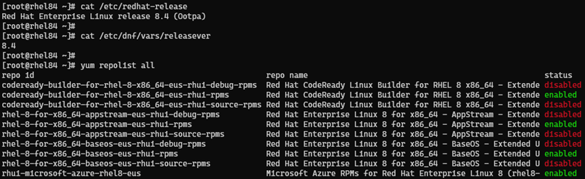
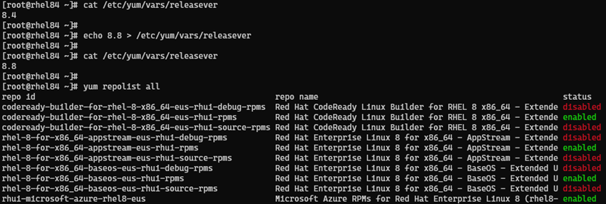
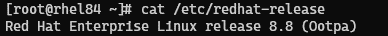
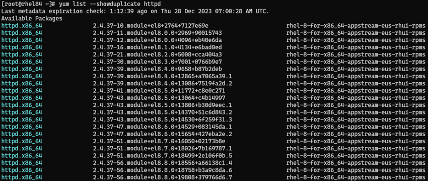
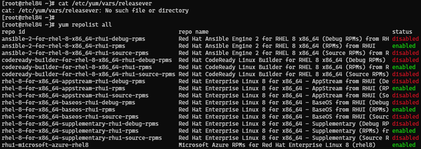
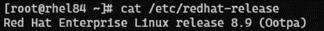
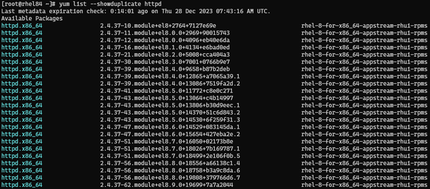
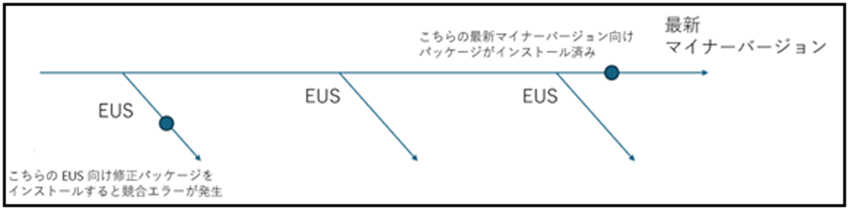

こんにちは！Azure テクニカル サポート チームの高橋です。
今回は、Azure Marketplace から作成した Red Hat Enterprise Linux (RHEL) の
仮想マシンをご利用のお客様からよくお問い合わせを頂く

> ・RHEL のマイナーバージョンがアップデートされない
> ・yum/dnf update したら意図せずマイナーバージョンが上がってしまった
> ・脆弱性対応のためパッケージのバージョンをアップデートしたいのに、yum/dnf update しても対象のバージョンに更新されない
> ・パッケージをインストール / 更新しようとするとパッケージの競合などのエラーが発生する

という内容について、原因と解決方法をご紹介いたします。

<!-- more -->

---

## 原因について
結論から書いてしまうと、RHEL VM に接続されている Azure RHUI リポジトリが
非 EUS か EUS かによって発生している可能性が高いものと存じます。
RHEL VM のマイナーバージョンやパッケージのアップデートを実行する際には、
接続されているリポジトリの確認をする必要があります。

> [!TIP]
> マイナーバージョンがアップデートされない事例として、
> ゲスト OS 内の /etc/dnf/dnf.conf 内に exclude=kernel* の設定がないかご確認をください。
> この設定がある場合、カーネルのアップデートが除外対象となっているため、マイナーバージョンのアップデートもされません。

---

## 非 EUS と EUS リポジトリとは 
ここでは、非 EUS、EUS リポジトリについてご紹介します。
Azure 上の RHEL VM は、既定で Azure RHUI (Red Hat Update Infrastructure) のリポジトリサーバーに接続されています。
Azure RHUI には、非 EUS (Extend Update Support) リポジトリと EUS リポジトリ の 2 種類があります。
RHEL VM が 非 EUS リポジトリに接続されている場合に、yum/dnf update を実施した際には、その時点で提供されている
最新の RHEL マイナーバージョンにアップグレードされ、最新のパッケージを取得できることとなります。 

一方で、RHEL VM が EUS リポジトリに接続されている場合、
yum/dnf update を実行した際に、更新プログラムは、
特定の RHEL マイナーバージョンを超えることはありません。
つまり、特定マイナーバージョンに固定されている状態 (マイナーバージョンロック) となります。
EUS は、ワークロードの都合上、特定のマイナーバージョンに固定して利用したいお客様向けにご利用頂けるものとなります。
EUS の詳細については、以下 Red Hat 社の公開情報にも纏められています。

> □ 参考 : Red Hat Enterprise Linux (RHEL) Extended Update Support (EUS) の概要
>	https://access.redhat.com/ja/articles/3055941

弊社公開情報にもリポジトリについて情報をお纏めしておりますので
併せてご確認ください。

> □ 参考 : Azure のオンデマンド Red Hat Enterprise Linux VM 用 Red Hat Update Infrastructure
>   https://learn.microsoft.com/ja-jp/azure/virtual-machines/workloads/redhat/redhat-rhui?tabs=rhel7#image-update-behavior

---

## 接続しているリポジトリの確認方法

ご利用の RHEL VM が 非 EUS / EUS リポジトリのどちらに接続されているのか
確認する方法についてご紹介します。
yum repolist コマンドで接続されているリポジトリを確認することができます。
yum repolist all コマンドを実行すると、以下のようにリポジトリが設定されていることが確認できます。
また、以下コマンドで、releasever がどのマイナーバージョンに固定されているか確認することができます。
```bash
    # cat /etc/dnf/vars/releasever (RHEL 7 は、/etc/yum/vars/releasever)
```

非 EUS リポジトリに接続されているときは以下のように releasever の固定もありません。


一方で、EUS リポジトリに接続されている環境では、リポジトリ名に **“eus”** の記載があり、
EUS リポジトリに接続されていることが確認できます。
例えば、EUS リポジトリに接続されている RHEL 8.4 の VM での
確認結果は以下のようになります。


---

## 接続しているリポジトリの変更方法と動作について

それでは、接続しているリポジトリを変更する方法についてご紹介します。
リポジトリの変更については、以下 2 つの操作ができます。

> ・非 EUS から EUS リポジトリに切り替える方法 (バージョンロック)
> ・EUS から、非 EUS リポジトリに変更する方法 (バージョンロックの解除)

それぞれの方法について、RHEL 8 の環境を例にご紹介します。
なお、本操作はゲスト OS 内での作業となりますため、
予期せぬ問題に備えて、事前に**バックアップ**を取得頂くことや**十分な検証**をすることを推奨します。

### ■ 非 EUS から EUS リポジトリに切り替える方法
EUS リポジトリへ接続するためには以下の手順でコマンドを実行ください。

1. EUS 以外のリポジトリを無効にする
```bash
    # dnf --disablerepo='*' remove 'rhui-azure-rhel8' -y
```

2. EUS リポジトリを追加する2 EUS リポジトリを追加する
```bash
    # dnf --config='https://rhelimage.blob.core.windows.net/repositories/rhui-microsoft-azure-rhel8-eus.config' install rhui-azure-rhel8-eus -y
```

3. releaseverを固定する
EUS が提供されているバージョンを指定する必要があります。 (RHEL 8 の場合、8.1、8.2、8.4、8.6、8.8 のいずれかである必要があります)
```bash
    # sh -c 'echo 8.x > /etc/dnf/vars/releasever'
```

EUS が提供されているバージョンは以下 Red Hat 社の公開情報からご確認ください。
> □ 参考 : Red Hat Enterprise Linux (RHEL) Extended Update Support (EUS) の概要 
>   https://access.redhat.com/ja/articles/3055941 

以下の環境では、RHEL 8.4 の EUS リポジトリに接続されていることが確認できます。



この状態で dnf update をしても、マイナーバージョンは上がりません。(8.4 のまま)
また、アップデートできるパッケージは RHEL 8.4 向けのパッケージのバージョンまでしか取得できないことになります。
一例ではございますが、本記事の執筆時点で、httpd の最新バージョンは、
RHEL 8.4 に固定されている状態で、2.4.37-39 が取得できることが確認できます。


また、EUS リポジトリを特定のマイナーバージョンに固定することもできます。
以下のように releasever を固定したいバージョンに設定することが可能となります。
( x には、 EUS が提供されているバージョンを指定する必要があります)
```bash
    # echo 8.x > /etc/yum/vars/releasever
```

以下例では、RHEL 8.4 の VM を RHEL 8.8 の EUS リポジトリに接続するよう変更しています。




この状態で、dnf update を実行し、再起動をすると RHEL 8.8 にマイナーバージョンがアップデートされます。
以下 dnf update を実施後の結果



また、パッケージは RHEL 8.8 向けのバージョンを取得することが可能となります。
httpd の場合、2.4.37-56 まで取得できることとなります。



### ■ EUS から、非 EUS リポジトリに変更する方法
非 EUS リポジトリへ接続するためには以下の手順でコマンドを実行ください。

1. releasever ファイルを削除
```bash
    # rm -f /etc/dnf/vars/releasever
```

2. EUS リポジトリを無効にする
```bash
    # dnf --disablerepo='*' remove 'rhui-azure-rhel8-eus' -y
```

3. 非 EUS リポジトリを追加する
```bash
    # dnf --config='https://rhelimage.blob.core.windows.net/repositories/rhui-microsoft-azure-rhel8.config' install rhui-azure-rhel8 -y
```

以下例では、RHEL 8.4 の VM を 非 EUS リポジトリに接続するよう変更しています。


この状態で dnf update をすると、その時点で提供されている最新のマイナーバージョンにアップデートされます。
dnf update を実施後の結果は以下のようになります。


各パッケージについては、RHEL 8 の最新のパッケージまで更新することが可能となります。
非 EUS リポジトリに接続することで、httpd は 2.4.37-62 のバージョンまでアップデートすることができます。


詳細な手順については、以下の公開ドキュメントにもお纏めしております。

> □ 参考 : RHEL Server を EUS リポジトリに切り替えます。
> https://learn.microsoft.com/ja-jp/azure/virtual-machines/workloads/redhat/redhat-rhui?tabs=rhel8#switch-a-rhel-server-to-eus-repositories

> □ 参考 : RHEL Server を EUS 以外のリポジトリに切り替えます。
> https://learn.microsoft.com/ja-jp/azure/virtual-machines/workloads/redhat/redhat-rhui?tabs=rhel8#switch-a-rhel-server-to-non-eus-repositories

マイナーバージョンが想定通りアップグレードできない場合や、
脆弱性対応などで、ご要望のパッケージバージョンが表示されない際には、
上記リポジトリの設定をご確認頂き、適切なリポジトリを設定頂くようご確認頂ければと思います。

> [!TIP]
> リポジトリの設定変更作業において、ゲスト OS の再起動は不要となります。
> ただし、yum / dnf update によりカーネルの更新等を行った場合には、
> 更新を反映させるため再起動が必要となります。
> 再起動の必要性はパッチの適用状況によって異なるため、一概にご案内することは難しいですが、needs-restarting -r を実施することで、再起動が必要か判断することもできます。
> 以下の Red Hat 社の公開情報についてもご確認頂ければと思います。
> □ 参考 : 更新後にシステムの再起動が必要なパッケージを特定する
> https://access.redhat.com/ja/solutions/2725591
> ＃閲覧には Red Hat 社のアカウントが必要になります。

---

## 補足 1 : 依存関係について
マイナーバージョンの固定や、解除は環境に合わせて設定変更ができます。 
しかしながら、以下のような場合、パッケージをインストールする際に、
関連するパッケージの依存関係の問題が発生し、 
正常にインストールできないエラーが発生することがございます。 

> ・マイナーバージョンを固定しない状態でパッケージのアップデートを行った後で、マイナーバージョンを固定した場合 
> ・特定のマイナーバージョンに固定し、パッケージをアップデートした後に、それよりも低いマイナーバージョンに固定した場合

イメージとしては、以下の通りとなります。


EUS リポジトリでは、問題の修正のため、取得できるパッケージのバージョンが分岐されて提供されております。
インストール済みのパッケージのバージョンと、
インストール予定のパッケージのバージョンに差があることで パッケージの **conflict** が発生します。

一例ではございますが、本事象は以下のような手順を実施した場合に再現します。

以下の手順を実施します。

> 1. RHEL 8.4 の VM で 非 EUS リポジトリに接続されている環境から、glibc をアップデート
> 2. 非 EUS リポジトリから、RHEL 8.4 の EUS リポジトリに固定するよう変更
> 3. dnf install gcc を実行する

この手順を実施した際にパッケージの **conflict** が発生して、正常にインストールができない事象が発生します。

エラー内容一部抜粋

```
[root@rhel84 ~]# cat /etc/dnf/vars/releasever
8.4
[root@rhel84 ~]#
[root@rhel84 ~]# dnf install gcc
Last metadata expiration check: 22:49:35 ago on Thu 28 Dec 2023 06:32:39 AM UTC.
Error:
 Problem: package gcc-8.4.1-1.1.el8_4.x86_64 requires glibc-devel >= 2.2.90-12, but none of the providers can be installed
  - package glibc-devel-2.28-127.el8_3.2.x86_64 requires glibc = 2.28-127.el8_3.2, but none of the providers can be installed
  - package glibc-devel-2.28-101.el8.x86_64 requires glibc = 2.28-101.el8, but none of the providers can be installed
~
  - cannot install both glibc-2.28-101.el8.x86_64 and glibc-2.28-236.el8.7.x86_64
  - cannot install both glibc-2.28-42.el8.x86_64 and glibc-2.28-236.el8.7.x86_64
  - cannot install both glibc-2.28-72.el8_1.1.x86_64 and glibc-2.28-236.el8.7.x86_64
  - cannot install both glibc-2.28-127.el8.x86_64 and glibc-2.28-236.el8.7.x86_64
  - cannot install both glibc-2.28-72.el8.x86_64 and glibc-2.28-236.el8.7.x86_64
  - cannot install both glibc-2.28-42.el8_0.1.x86_64 and glibc-2.28-236.el8.7.x86_64
  - cannot install both glibc-2.28-151.el8.x86_64 and glibc-2.28-236.el8.7.x86_64
  - package glibc-gconv-extra-2.28-236.el8.7.x86_64 requires glibc(x86-64) = 2.28-236.el8.7, but none of the providers can be installed
  - cannot install the best candidate for the job
  - problem with installed package glibc-gconv-extra-2.28-236.el8.7.x86_64
(try to add '--allowerasing' to command line to replace conflicting packages or '--skip-broken' to skip uninstallable packages or '--nobest' to use not only best candidate packages)
```

この場合、変更したマイナーバージョンへのアップデートまたは、
作業前のバックアップを取得している場合は、VM を復元頂くことを推奨いたします。
問題となっているパッケージのダウングレードや削除・再インストールで解消できる場合もありますが、
EUS の継続利用が困難になることや、
その他の予期しない問題が発生することもございますため、
再度マイナーバージョンの固定化を実施する際にはご留意ください。

## 補足 2 : RHUI より提供されるパッケージバージョンについて

Azure RHUI はRed Hat社のリポジトリとの即時の同期が実施されないため、タイミングによっては、最新バージョンのパッケージがまだ提供されてない場合もありますので、そのような場合は時間をおいて再度ご確認ください。 

また、OSS のパッケージについてはその OSS が提供している最新のバージョンが RHUI では提供されていない場合もございます。 

不具合に対する修正については、パッケージのバージョンが古い場合でも Red Hatでは適切にバックポートされている場合もございます。

本稿が皆様のお役に立てれば幸いです。

