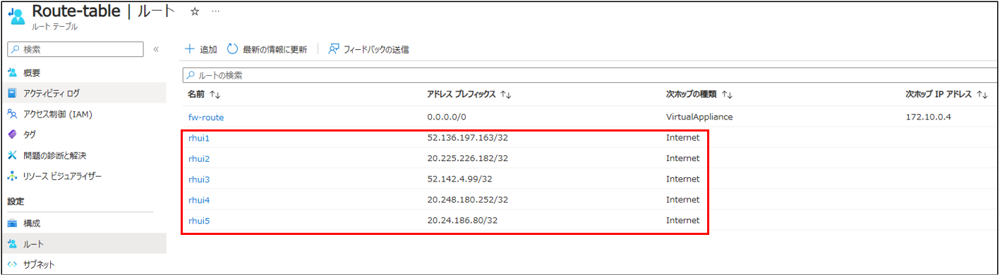

こんにちは！Azure テクニカル サポート チームの高橋です。
今回はよく、お問い合わせを頂く
Azure Marketplace から作成した Red Hat Enterprise Linux (RHEL) の仮想マシンにおいて
yum / dnf update やパッケージのインストールに失敗する場合の
よくある原因とその解決方法についてご紹介いたします。

<!-- more -->

---

## Azure RHUI (リポジトリ) とは？
Azure RHUI  (Red Hat Update Infrastructure) は、Azure Marketplace にある
Red Hat Enterprise Linux (RHEL) の従量課金 (PAYG) イメージから作成した VM を更新するために
提供されているリポジトリサーバーです。

Azure Marketplace から 作成した RHEL VM は、規定で Azure RHUI へのアクセスする構成が設定されているため
追加の設定は不要となります。
 
VM から、Azure RHUI にアクセスするためには、下記の IP アドレスに対する送信規則の 443 ポートの通信許可を設定する必要があります。
Azure RHUI の IP アドレスは下記公開ドキュメントにおまとめしておりますのでご確認ください。

>  □ 参考 : RHUI コンテンツ配信サーバーの IP アドレス
>    https://learn.microsoft.com/ja-jp/azure/virtual-machines/workloads/redhat/redhat-rhui#the-ips-for-the-rhui-content-delivery-servers

> [!IMPORTANT]
> ※Azure RHUI へのアクセスは、弊社バックボーンネットワーク経由にて接続されており、
> Azure VM から、オンプレミスのネットワークインフラストラクチャや、プロキシ、NVA (仮想アプライアンス) 経由でのアクセスはサポートされておらず、
> Azure VM から直接、Azure RHUI に接続する必要がある点に注意してください。

---

## Azure RHUI への接続確認

yum / dnf update やパッケージのインストールに失敗する場合、
Azure RHUI への接続ができていない可能性がございます。
ゲスト OS 内で設定されている RHUI リポジトリ情報は、
/etc/yum.repos.d 配下にある設定ファイルから確認することが可能です。
リポジトリ設定ファイル内にある baseurl に対して Azure VM 内から、
curl コマンド等を使うことで、Azure RHUI への接続状況を確認することができます。
下記のようなコマンドをお試しください。(baseurl は設定ファイルに応じて変更ください)

```bash
    # curl -v https://rhui4-1.microsoft.com:443
    # curl -v https://rhui4-2.microsoft.com:443
    # curl -v https://rhui4-3.microsoft.com:443
```

< 実行結果例 (成功時) >
```
    [root@rheltest ~]# curl -v https://rhui4-1.microsoft.com:443
    * Rebuilt URL to: https://rhui4-1.microsoft.com:443/
    *   Trying 20.24.186.80...
    * TCP_NODELAY set
    * Connected to rhui4-1.microsoft.com (20.24.186.80) port 443 (#0)
    * ALPN, offering h2
    * ALPN, offering http/1.1
    * successfully set certificate verify locations:
    *   CAfile: /etc/pki/tls/certs/ca-bundle.crt
    CApath: none
    * TLSv1.3 (OUT), TLS handshake, Client hello (1):
    * TLSv1.3 (IN), TLS handshake, Server hello (2):
    * TLSv1.3 (IN), TLS handshake, [no content] (0):
    * TLSv1.3 (IN), TLS handshake, Encrypted Extensions (8):
    * TLSv1.3 (IN), TLS handshake, [no content] (0):
    * TLSv1.3 (IN), TLS handshake, Request CERT (13):
    * TLSv1.3 (IN), TLS handshake, [no content] (0):
    * TLSv1.3 (IN), TLS handshake, Certificate (11):
    * TLSv1.3 (IN), TLS handshake, [no content] (0):
    * TLSv1.3 (IN), TLS handshake, CERT verify (15):
    * TLSv1.3 (IN), TLS handshake, [no content] (0):
    * TLSv1.3 (IN), TLS handshake, Finished (20):
    * TLSv1.3 (OUT), TLS change cipher, Change cipher spec (1):
    * TLSv1.3 (OUT), TLS handshake, [no content] (0):
    * TLSv1.3 (OUT), TLS handshake, Certificate (11):
    * TLSv1.3 (OUT), TLS handshake, [no content] (0):
    * TLSv1.3 (OUT), TLS handshake, Finished (20):
    * SSL connection using TLSv1.3 / TLS_AES_256_GCM_SHA384
    * ALPN, server accepted to use http/1.1
    * Server certificate:
    *  subject: C=US; ST=WA; L=Redmond; O=Microsoft Corporation; CN=rhui-1.microsoft.com
    *  start date: Oct 15 21:22:06 2023 GMT
    *  expire date: Jun 27 23:59:59 2024 GMT
    *  subjectAltName: host "rhui4-1.microsoft.com" matched cert's "rhui4-1.microsoft.com"
    *  issuer: C=US; O=Microsoft Corporation; CN=Microsoft Azure ECC TLS Issuing CA 02
    *  SSL certificate verify ok.
    * TLSv1.3 (OUT), TLS app data, [no content] (0):
    > GET / HTTP/1.1
    > Host: rhui4-1.microsoft.com
    > User-Agent: curl/7.61.1
    > Accept: */*
```

< 実行結果例 (失敗時) > 
```
    [root@rhelvm ~]# curl -v https://rhui4-1.microsoft.com:443
    * Rebuilt URL to: https://rhui4-1.microsoft.com:443/
    *   Trying 20.24.186.80...
    * TCP_NODELAY set
    * connect to 20.24.186.80 port 443 failed: Connection timed out
    * Failed to connect to rhui4-1.microsoft.com port 443: Connection timed out
    * Closing connection 0
    curl: (7) Failed to connect to rhui4-1.microsoft.com port 443: Connection timed out
```

Azure RHUI への接続確認が失敗する場合には、NSG やプロキシ等のネットワーク設定を確認する必要がございます。
よくお問い合わせを頂くエラー原因と解決方法は、以下のようになります。

---

## エラーの原因その 1 : Azure RHUI への接続ができない (NSG)

セキュリティ上の理由から、Network Security Group (NSG) を利用して、
Azure VM からインターネットへのアクセスを制限を設定している場合があるかと存じます。
Azure portal から対象の仮想マシンを選択後、[ネットワーク] から確認することができます。
下記画像の例では、送信ポートの規則で、インターネットへの接続を拒否しています。


本設定がある場合には、Azure RHUI への接続確認は、失敗することが想定され、
yum update を実施した際や、パッケージのインストール時にはタイムアウトエラーが発生します。

```
    [root@rhelvm ~]# yum update
    Red Hat Enterprise Linux 8 for x86_64 - BaseOS from RHUI (RPMs)                                                                                      0.0  B/s |   0  B     02:00
    Errors during downloading metadata for repository 'rhel-8-for-x86_64-baseos-rhui-rpms':
    - Curl error (28): Timeout was reached for https://rhui4-1.microsoft.com/pulp/repos/content/dist/rhel8/rhui/8/x86_64/baseos/os/repodata/repomd.xml [Connection timed out after 30000 milliseconds]
    Error: Failed to download metadata for repo 'rhel-8-for-x86_64-baseos-rhui-rpms': Cannot download repomd.xml: Cannot download repodata/repomd.xml: All mirrors were tried
```


この場合の解決方法としては、Azure RHUI へアクセスできるように、
Azure RHUI サーバーの IP アドレスに対する送信規則の 443 ポートの通信許可を設定する必要があります。
下記画像の通り、"送信セキュリティ規則の追加" から、通信許可の設定を追加する必要があります。
また、優先度は、DenyInternet (インターネットへの制限規則) より高くする必要がある点にご注意ください。


---

## エラーの原因その 2 : Azure RHUI への接続ができない (Proxy 等)

Azure VM から、オンプレミスのネットワークインフラストラクチャや、プロキシ、NVA (仮想アプライアンス) 経由での Azure RHUI へのアクセスはサポートされていないため、
Azure RHUI へのアクセスは、Azure 内の IP アドレス範囲内の VM から直接アクセスする必要がございます。 
Azure Firewall をご利用の場合には、適切に Azure RHUI に対してアクセスできるよう設定頂くことで、アクセス可能となります。

この場合の解決方法としては、Azure VM が Azure RHUI の IP アドレスに直接接続できるようユーザー定義のルートテーブル UDR (User Defined Route) を作成する必要があります。
下記画像のように、RHUI コンテンツ配信サーバーの IP アドレス全てに対して、
次ホップ (Next hops) の種類に "Internet" を指定した UDR を作成頂く必要があります。



Azure VM のルートテーブルの作成手順については、下記公開ドキュメントをご確認ください。
>   □ 参考 : ルート テーブルの作成、変更、削除 | ルートの作成
>	https://learn.microsoft.com/ja-jp/azure/virtual-network/manage-route-table#create-a-route-table


> [!TIP]
> ※プロキシの設定を実施している場合は、/etc/yum.conf 内の "proxy=" のプロキシ設定がないかご確認ください。
>   プロキシ設定があった場合、コメントアウト等で無効にしてください。

---

## エラーの原因その 3 : Azure RHUI への接続ができない (外部接続不可の構成)
ご利用の環境によっては、Standard SKU の内部ロードバランサーのバックエンドにAzure VM を配置し、外部へのインターネット接続を制限している場合もあるかと思います。
外部接続不可の環境では、yum update を実施した際や、パッケージのインストール時にタイムアウトエラーが発生します。
Azure RHUI に接続するためには、NAT Gateway または VM にパブリック IP アドレスを関連付けいただくといった構成に変更する必要があります。

ご利用の VM が外部接続不可な構成であるかについての確認手順については、
以下の弊社ブログにもお纏めしておりますのでご参照ください。
>   □ 参考 : Azure VM の外部接続 (SNAT) オプション まとめ
>	https://jpaztech.github.io/blog/network/snat-options-for-azure-vm/

> [!IMPORTANT]
> ※内部ロードバランサーのバックエンドに VM がない場合でも、可用性セット内の VM が内部ロードバランサーのバックエンドに配置されている場合、
> 可用性セット内の VM は全て外部接続ができなくなり、RHUI に繋がらない事象が発生するのでご注意ください。可用性セットの構成変更等ご検討頂ければと思います。

---

## エラーの原因その 4 : クライアント証明書の期限切れ
古い RHEL VM イメージを利用している際には、 TLS/SSL クライアント証明書の期限が切れているために、
Azure RHUI に接続できない問題が発生することがあります。
クライアント証明書の期限が切れた際には、yum update を実施した際に下記のようなエラーが出力されることがあります。

```
    [root@rhelvm ~]# yum update
    Loaded plugins: langpacks, product-id, search-disabled-repos
    rhui-microsoft-azure-rhel7-eus                                                                   | 2.1 kB  00:00:00
    https://rhui-1.microsoft.com/pulp/repos//content/dist/rhel/rhui/server/7/7Server/x86_64/dotnet/1/os/repodata/repomd.xml: [Errno 14] curl#58 - "SSL peer rejected your certificate as expired."
    Trying other mirror.
    https://rhui-2.microsoft.com/pulp/repos//content/dist/rhel/rhui/server/7/7Server/x86_64/dotnet/1/os/repodata/repomd.xml: [Errno 14] curl#58 - "SSL peer rejected your certificate as expired."
    Trying other mirror.
    https://rhui-3.microsoft.com/pulp/repos//content/dist/rhel/rhui/server/7/7Server/x86_64/dotnet/1/os/repodata/repomd.xml: [Errno 14] curl#58 - "SSL peer rejected your certificate as expired."
    Trying other mirror.
```

```
    [root@rhel82 ~]# yum update
    Red Hat Enterprise Linux 8 for x86_64 - BaseOS - Extended Update Support from RHUI (RPM 0.0  B/s |   0  B     00:02
    Errors during downloading metadata for repository 'rhel-8-for-x86_64-baseos-eus-rhui-rpms':
      - Curl error (56): Failure when receiving data from the peer for https://rhui-3.microsoft.com/pulp/repos/content/eus/rhel8/rhui/8.2/x86_64/baseos/os/repodata/repomd.xml [OpenSSL SSL_read: error:14094415:SSL routines:ssl3_read_bytes:sslv3 alert certificate expired, errno 0]
      - Curl error (56): Failure when receiving data from the peer for https://rhui-1.microsoft.com/pulp/repos/content/eus/rhel8/rhui/8.2/x86_64/baseos/os/repodata/repomd.xml [OpenSSL SSL_read: error:14094415:SSL routines:ssl3_read_bytes:sslv3 alert certificate expired, errno 0]
      - Curl error (56): Failure when receiving data from the peer for https://rhui-2.microsoft.com/pulp/repos/content/eus/rhel8/rhui/8.2/x86_64/baseos/os/repodata/repomd.xml [OpenSSL SSL_read: error:14094415:SSL routines:ssl3_read_bytes:sslv3 alert certificate expired, errno 0]
    Error: Failed to download metadata for repo 'rhel-8-for-x86_64-baseos-eus-rhui-rpms': Cannot download repomd.xml: Cannot download repodata/repomd.xml: All mirrors were tried
```

この場合の解決方法としては、下記コマンドを実施頂き、
クライアント証明書を更新頂くことで、Azure RHUI へのアクセスができるようになることが想定されます。

```bash
sudo yum update -y --disablerepo='*' --enablerepo='*microsoft*'
```

※本コマンドは、rhui の rpm のみを更新するコマンドとなります。
本事象については、以下の公開ドキュメントにもお纏めしております。

> □ 参考 : Azure での RHUI 証明書の問題のトラブルシューティング
> https://learn.microsoft.com/ja-jp/troubleshoot/azure/virtual-machines/troubleshoot-linux-rhui-certificate-issues?tabs=rhel7-eus%2Crhel7-noneus%2Crhel7-rhel-sap-apps

> [!TIP]
> 解消しない場合には、下記コマンドも併せてお試しください
> #キャッシュデータの削除し、キャッシュの更新
> sudo yum clean all
> sudo yum makecache

---

## 補足情報

今回ご紹介した方法でも、事象が解消しない場合には、
yum repolist all コマンドを実行頂き、有効なリポジトリをご確認頂ければと思います。
 
カスタムイメージや、ゴールドイメージの BYOS イメージをご利用されている場合には、
RHSM や サテライトに接続する必要があります。
 
> □ 参考 : Azure のオンデマンド Red Hat Enterprise Linux VM 用 Red Hat Update Infrastructure
>	https://learn.microsoft.com/ja-jp/azure/virtual-machines/workloads/redhat/redhat-rhui

本稿が皆様のお役に立てれば幸いです。
