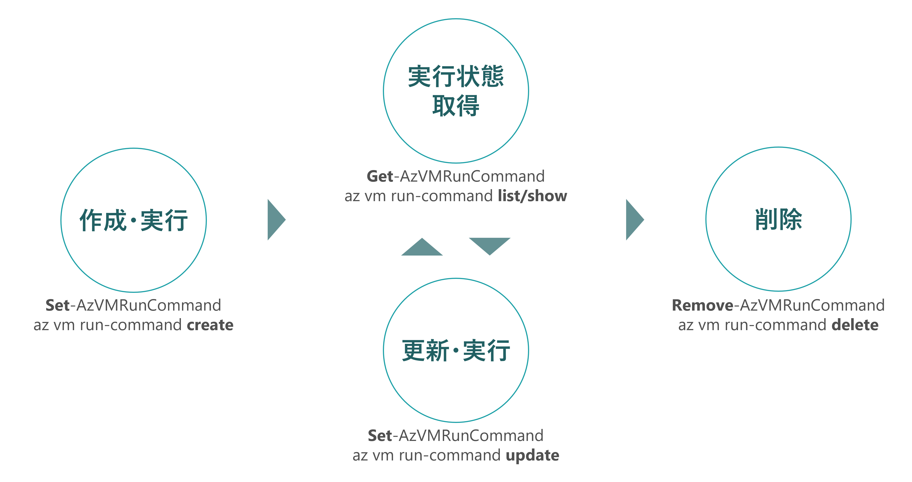
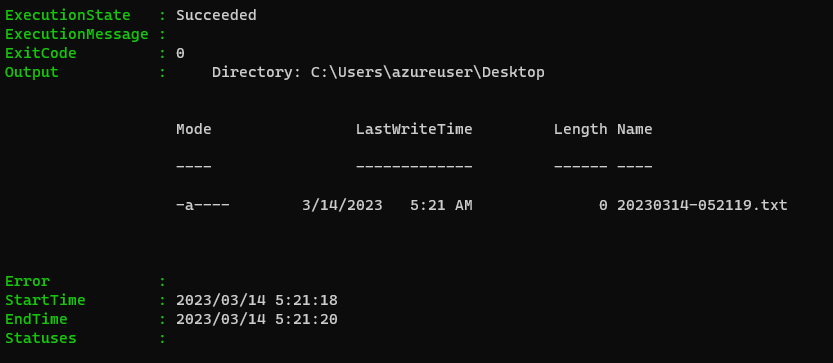

こんにちは。Azure テクニカル サポートチームの井上です。 

本記事では、Azure VM の拡張機能の一つである実行コマンド (RunCommand) について、
利用方法やアクション実行コマンドとマネージド実行コマンドの違い等を解説させていただきます。

<!-- more --> 

--- 
## 実行コマンドとは

実行コマンドは、Azure VM の拡張機能の一つで、仮想マシン エージェントを使用して、
Windows または Linux の Azure VM 内でコマンドやスクリプトをリモートで実行することができる機能です。
特定のコマンドだけでなく、Windows の場合は PowerShell スクリプト、Linux の場合はシェル スクリプトで、
任意のカスタム スクリプトを指定して実行することが可能です。

例えば、接続不調となった VM に対して、疎通の状態等を確認するコマンドをリモートで実行するといったことや、
複数の VM に対してメンテナンス用のスクリプトを実行するといった用途にご活用いただけます。

> ***実行コマンドを使用してお使いの VM でスクリプトを実行する***
> [https://learn.microsoft.com/ja-jp/azure/virtual-machines/run-command-overview](https://learn.microsoft.com/ja-jp/azure/virtual-machines/run-command-overview)

--- 
## アクション実行コマンドとマネージド実行コマンド

実行コマンドには、現在、アクション実行コマンドとマネージド実行コマンドの 2 種類があります。
マネージド実行コマンドは、2023 年 2 月に General Availability (GA) となっており、
アクション実行コマンドと比較し、以下の観点で機能が強化されています。
今後、実行コマンドの利用を予定されている場合は、まずはマネージド実行コマンドをご利用いただくことをご検討ください。

- ARM デプロイ テンプレートを介して更新された実行コマンドをサポート
- 複数のスクリプトの並列実行
- スクリプトの順次実行
- ユーザーが指定したスクリプトのタイムアウト
- 実行時間が長い (時間または日単位) のスクリプトをサポート
- 安全な方法でシークレット (パラメーター、パスワード) を渡す

> ***General Availability: Managed Run Command – Execute PowerShell or shell scripts on Virtual Machines and Scale Sets***
> [https://azure.microsoft.com/en-us/updates/general-availability-run-command-execute-powershell-or-shell-scripts-on-virtual-machines-and-scale-sets/](https://azure.microsoft.com/en-us/updates/general-availability-run-command-execute-powershell-or-shell-scripts-on-virtual-machines-and-scale-sets/)

> ***実行コマンドを使用してお使いの VM でスクリプトを実行する***
> [https://learn.microsoft.com/ja-jp/azure/virtual-machines/run-command-overview#compare-feature-support](https://learn.microsoft.com/ja-jp/azure/virtual-machines/run-command-overview#compare-feature-support)

> [!NOTE]
> マネージド実行コマンドは、2023 年 3 月現在、Azure CLI、Azure PowerShell、REST API で使用できます。

基本的な利用方法につきましては、こちらの公開ドキュメントも併せてご確認ください。

> ***実行コマンド アクションを使用して Linux VM でスクリプトを実行する***
> [https://learn.microsoft.com/ja-jp/azure/virtual-machines/linux/run-command](https://learn.microsoft.com/ja-jp/azure/virtual-machines/linux/run-command)
>
> ***アクション実行コマンドを使用して、Windows VM でスクリプトを実行する***
> [https://learn.microsoft.com/ja-jp/azure/virtual-machines/windows/run-command](https://learn.microsoft.com/ja-jp/azure/virtual-machines/windows/run-command)
>
> ***マネージド実行コマンドを使用して Linux VM でスクリプトを実行する***
> [https://learn.microsoft.com/ja-jp/azure/virtual-machines/linux/run-command-managed](https://learn.microsoft.com/ja-jp/azure/virtual-machines/linux/run-command-managed)
>
> ***マネージド実行コマンドを使用して Windows VM でスクリプトを実行する***
> [https://learn.microsoft.com/ja-jp/azure/virtual-machines/windows/run-command-managed](https://learn.microsoft.com/ja-jp/azure/virtual-machines/windows/run-command-managed)

---
## 実行コマンドをデプロイする
### 仮想マシンで実行する

マネージド実行コマンドとアクション実行コマンドでは、Azure CLI/PowerShell のコマンドに違いがあり、
それぞれのコマンドをご利用いただくことで使い分けることができます。
仮想マシンで実行コマンドを利用する際のコマンドについては、こちらの比較表をご参照ください。

| 操作 | アクション実行コマンド | マネージド実行コマンド |
| :---- | :---- | :---- |
| 実行<br>作成・更新 ※1 | az vm run-command **invoke**<br>**Invoke**-AzVMRunCommand　| az vm run-command **create**<br>**Set**-AzVMRunCommand |
| 削除 | az vm run-command **invoke**<br>**Invoke**-AzVMRunCommand | az vm run-command **delete**<br>**Remove**-AzVMRunCommand |
| 一覧表示 ※1 | - | az vm run-command **list**<br>**Get**-AzVMRunCommand |
| 実行状態と結果の取得 ※1 | - | az vm run-command **show**<br>**Get**-AzVMRunCommand |

※1 : マネージド実行コマンドのみで実行可能な操作です。

アクション実行コマンドで、仮想マシン上でカスタム スクリプトを実行する際のコマンド例は、以下のとおりとなります。

```powershell Windows 仮想マシンの場合 
Invoke-AzVMRunCommand `
  -ResourceGroupName <リソース グループ名> `
  -Name <仮想マシン リソース名> `
  -CommandId 'RunPowerShellScript' `
  -ScriptPath '<実行するスクリプトのパス>'
``` 

また、アクション実行コマンドは、Azure Portal 上で実行することができます。
VM の **[実行コマンド]** ブレードから、カスタム スクリプトや組み込みのスクリプトを実行できます。


マネージド実行コマンドで、仮想マシン上でカスタム スクリプトを実行する際のコマンド例は、以下のとおりとなります。

```powershell 
Set-AzVMRunCommand `
  -ResourceGroupName <リソース グループ名> `
  -VMName <仮想マシン リソース名> `
  -Location <リージョン名> `
  -RunCommandName <任意の実行コマンド名> `
  -ScriptLocalPath '<実行するスクリプトのパス>'
``` 

なお、実行コマンドをご利用いただく際は、仮想マシンが実行中の状態であることをご確認ください。

アクション実行コマンドは、一度実行すると、最終的なスクリプトの実行結果が出力されるのみでした。
マネージド実行コマンドでは、初回の実行時に実行コマンドが仮想マシンに登録され、
実行の進行状況 (最新の出力、開始/終了時刻、終了コード、および実行の終了状態など) を確認することができます。
また、登録された実行コマンドは更新して再実行することができ、不要になり次第、削除することができます。



## 仮想マシン スケール セット (VMSS) で実行する
実行コマンドは、仮想マシン スケール セット (VMSS) で利用することができます。
仮想マシンで実行する場合と同様に、アクション実行コマンドとマネージド実行コマンドで、
Azure CLI/PowerShell のコマンドに違いがあります。こちらの比較表をご参照ください。

| 操作 | アクション実行コマンド | マネージド実行コマンド |
| :---- | :---- | :---- |
| 実行<br>作成・更新 ※1<br>追加 ※1 | az vmss run-command **invoke**<br>**Invoke**-AzVmssVMRunCommand<br>&emsp;　| az vmss run-command **create**<br>**Set**-AzVmssVMRunCommand<br>**Add**-AzVmssRunCommand |
| 削除 | az vmss run-command **invoke**<br>**Invoke**-AzVmssVMRunCommand<br>&emsp; | az vmss run-command **delete**<br>**Remove**-AzVmssVMRunCommand<br>**Remove**-AzVmssRunCommand |
| 一覧表示 ※1 | - | az vmss run-command **list**<br>**Get**-AzVmssVMRunCommand |
| 実行状態と結果の取得 ※1 | - | az vmss run-command **show**<br>**Get**-AzVmssVMRunCommand |

※1 : マネージド実行コマンドのみで実行可能な操作です。

アクション実行コマンドで、VMSS 内の仮想マシン (インスタンス ID が `0` ) 上で、
カスタム スクリプトを実行する際のコマンド例は、以下のとおりとなります。

```powershell Windows 仮想マシンの場合 
Invoke-AzVmssVMRunCommand `
  -ResourceGroupName <リソース グループ名> `
  -VMScaleSetName <VMSS リソース名> `
  -InstanceId 0 `
  -CommandId 'RunPowerShellScript' `
  -ScriptPath '<実行するスクリプトのパス>'
``` 

マネージド実行コマンドで、VMSS 内の仮想マシン (インスタンス ID が `0` ) 上で、
カスタム スクリプトを実行する際のコマンド例は、以下のとおりとなります。

```powershell 
Set-AzVmssVMRunCommand `
  -ResourceGroupName <リソース グループ名> `
  -VMScaleSetName <VMSS リソース名> `
  -Location <リージョン名> `
  -InstanceId 0 `
  -RunCommandName <任意の実行コマンド名> `
  -ScriptLocalPath '<実行するスクリプトのパス>'
``` 

また、マネージド実行コマンドでは、VMSS 内の全ての仮想マシンに実行コマンドを追加する
`Add-AzVmssRunCommand` が利用できます。
`Remove-AzVmssRunCommand` で実行コマンドを削除することも可能です。

なお、実行コマンドをご利用いただく際は、VMSS 内の仮想マシンが実行中の状態であることをご確認ください。

> [!NOTE]
> 仮想マシン スケール セット (VMSS) のオーケストレーション モードが Uniform の場合に、VMSS のコマンド (`Set-AzVmssVMRunCommand` 等) が利用できます。
> Flexible の場合は、VMSS 内の各仮想マシンに対して、仮想マシンのコマンド (`Set-AzVMRunCommand` 等) を実行する必要があります。

---
## 実行するスクリプトを指定する

実行コマンドでは、実行するコマンドをパラメータで直接指定することができます。
また、カスタム スクリプトを指定する場合は、
アクション実行コマンドとマネージド実行コマンドで指定可能なソースに違いがあり、
マネージド実行コマンドでは、BLOB ストレージの SAS URL が指定可能となっています。

アクション実行コマンドの場合は、`Invoke-AzVMRunCommand` の以下のいずれかのパラメータで指定します。

- `-ScriptString` : 実行するコマンド<br>例 : ping 10.0.0.1
- `-ScriptPath` : `Invoke-AzVMRunCommand` を実行する環境のローカル ファイル パス<br>例 : C:\work\test.ps1

マネージド実行コマンドの場合は、`Set-AzVMRunCommand / Set-AzVmssVMRunCommand` の以下のいずれかのパラメータで指定します。

- `-SourceScript` : 実行するコマンド<br>例 : ping 10.0.0.1
- `-ScriptLocalPath` : `Set-AzVMRunCommand / Set-AzVmssVMRunCommand` を実行する環境のローカル ファイル パス<br>例 : C:\work\test.ps1
- `-SourceScriptUri` : スクリプトを配置した BLOB ストレージ の SAS URL<br>例 : https://{ストレージ アカウント名}.blob.core.windows.net/{BLOB コンテナ名}/test.ps1?{SAS}

---
## スクリプトの出力内容を確認する

Azure テクニカル サポートチームでは、実行コマンドの拡張機能を有効または無効とされた際のエラーや
拡張機能のアップデート時のエラー等につきまして、調査をご支援させていただくことが可能です。
その一方で、お客様にて作成されたスクリプトにつきましては、
お客様がご自身でトラブルシューティングを実施していただくことが必要となります。

トラブルシューティングの際に、コマンドの実行結果やエラー等を確認したい場合は、
アクション実行コマンドでは実行時の出力結果をご確認いただきます。
マネージド実行コマンドでは、状態を取得した上で、InstanceView からご確認いただけます。
ただし、これらの出力結果は、実際の出力内容の最後の 4 KB のみとなります。

マネージド実行コマンドで出力結果を確認する際のコマンド例は以下のとおりとなります。

```powershell
(Get-AzVMRunCommand -ResourceGroupName <リソース グループ名> -VMName <仮想マシン リソース名> -RunCommandName <実行コマンド名> -Expand InstanceView).InstanceView
``` 

InstanceView の出力例はこちらになります。
`ExecutionState` にスクリプトの実行が成功したかどうかが表示されます。
`Output` でスクリプトが正常に終了した場合の出力結果、
`Error` でスクリプトの途中でエラーとなった場合の出力結果が確認できます。
`StartTime/EndTime` でスクリプトの実行開始時刻および終了時刻が確認できます。



> ***実行コマンドの作成または更新後に VM の実行コマンド インスタンス ビューを取得する***
> [https://learn.microsoft.com/ja-jp/azure/virtual-machines/windows/run-command-managed#get-a-run-command-instance-view-for-a-vm-after-creating-or-updating-run-command](https://learn.microsoft.com/ja-jp/azure/virtual-machines/windows/run-command-managed#get-a-run-command-instance-view-for-a-vm-after-creating-or-updating-run-command)

4 KB を超える出力内容をご確認いただく方法として、マネージド実行コマンドでは、
標準出力と標準エラー メッセージを追加 BLOB にストリーミングして、ご確認いただくことが可能です。
ストリーミング先の追加 BLOB は、BLOB の SAS URL を指定することができます。
コマンド例は、以下のとおりとなります。

```powershell
Set-AzVMRunCommand `
  -ResourceGroupName <リソース グループ名> `
  -VMName <仮想マシン リソース名> `
  -Location <リージョン名> `
  -RunCommandName <実行コマンド名> `
  -ScriptLocalPath "<実行するスクリプトのパス>" `
  -OutputBlobUri "https://{出力先のストレージ アカウント名}.blob.core.windows.net/{BLOB コンテナ名}/output.txt?{SAS}" `
  -ErrorBlobUri "https://{出力先のストレージ アカウント名}.blob.core.windows.net/{BLOB コンテナ名}/error.txt?{SAS}"
```

> ***OutputBlobUri、ErrorBlobUri を使用して VM で実行コマンドを作成または更新し、標準出力と標準エラー メッセージを出力およびエラー追加 BLOB にストリーミングする***
> [https://learn.microsoft.com/ja-jp/azure/virtual-machines/windows/run-command-managed#create-or-update-run-command-on-a-vm-using-outputbloburi-errorbloburi-to-stream-standard-output-and-standard-error-messages-to-output-and-error-append-blobs](https://learn.microsoft.com/ja-jp/azure/virtual-machines/windows/run-command-managed#create-or-update-run-command-on-a-vm-using-outputbloburi-errorbloburi-to-stream-standard-output-and-standard-error-messages-to-output-and-error-append-blobs)

---
## スクリプトを実行するユーザについて
アクション実行コマンドでは、Windows の場合はシステム アカウント、Linux の場合はルート ユーザで実行されます。

マネージド実行コマンドでは、実行するユーザを指定することができます。
ユーザを指定しない場合は、アクション実行コマンドと同様に、
Windows の場合はシステム アカウント、Linux の場合はルート ユーザで実行されます。
実行するユーザを指定する際のコマンド例は、以下のとおりとなります。

```powershell 
Set-AzVMRunCommand `
  -ResourceGroupName <リソース グループ名> `
  -VMName <仮想マシン リソース名> `
  -Location <リージョン名> `
  -RunCommandName <任意の実行コマンド名> `
  -ScriptLocalPath "<実行するスクリプトのパス>" `
  -RunAsUser <実行ユーザ名> `
  -RunAsPassword <実行ユーザのパスワード>
``` 

---
## 複数の仮想マシンでスクリプトを実行する

複数の仮想マシンで同じスクリプトを実行したい場合は、スクリプトを実行する仮想マシンのリストを取得して、
Azure CLI または Azure PowerShell のコマンドを繰り返し実行することで実現できます。
REST API をご利用いただく場合も同様に実現可能です。

例えば、`testtag` というタグの値が `y` となっている全ての仮想マシンでスクリプトを実行したい場合、
コマンド例は以下のとおりとなります。

```powershell マネージド実行コマンド コマンド例 (Azure PowerShell/PowerShell 7)
$VMList = @(Get-AzResource -Tag @{'testtag'='y'}) 
$VMList | Foreach-Object -Parallel {Set-AzVMRunCommand -ResourceGroupName $_.ResourceGroupName -VMName $_.name -Location <リージョン名> -RunCommandName '<任意の実行コマンド名>' -ScriptLocalPath '<実行するスクリプトのパス>'}  
``` 

> [!NOTE]
> 実行コマンドを繰り返し実行する際、Azure Resource Manager (ARM) の要求スロットルの上限に達して、要求がエラーとなる可能性があります。
> 複数の VM でスクリプトをリモート実行される要件がある場合は、検証等を実施していただき、問題なくスクリプトが実行できることを予めご確認いただくことを推奨します。
> &emsp;
> ***Resource Manager の要求のスロットル***
> [https://learn.microsoft.com/ja-jp/azure/azure-resource-manager/management/request-limits-and-throttling#error-code](https://learn.microsoft.com/ja-jp/azure/azure-resource-manager/management/request-limits-and-throttling#error-code)
> ***API の調整エラーのトラブルシューティング***
> [https://learn.microsoft.com/ja-jp/troubleshoot/azure/virtual-machines/troubleshooting-throttling-errors](https://learn.microsoft.com/ja-jp/troubleshoot/azure/virtual-machines/troubleshooting-throttling-errors)

---
## 長時間のスクリプトを実行する

アクション実行コマンドでは、スクリプトを実行可能な最大時間が 90 分という制約がありましたが、
マネージド実行コマンドでは、実行時間が 90 分を超えるスクリプトの実行が可能です。
マネージド実行コマンドにおいて、長時間のスクリプトを実行する際には、
Azure PowerShell の場合は、以下のパラメータを指定する必要があります。

- `timeoutInSeconds` パラメータを予測される実行時間よりも大きく指定する。
- `asyncExecution` パラメータを `true` とする。

> [!NOTE]
> `timeoutInSeconds` パラメータでは、スクリプトのタイムアウト値を秒で指定します。
> `asyncExecution` パラメータは、デフォルトでは false となっており、スクリプトが完了するまでプロビジョニングが待機する設定となっていますので、90 分でプロビジョニングのタイムアウトが発生します。回避するためには、`true` を指定します。

タイムアウト値を 5 時間に指定する際のコマンド例は以下のとおりです。

```powershell
Set-AzVMRunCommand `
  -ResourceGroupName <リソース グループ名> `
  -VMName <仮想マシン リソース名> `
  -Location <リージョン名> `
  -RunCommandName <任意の実行コマンド名> `
  -ScriptLocalPath "<実行するスクリプトのパス>" `
  -TimeoutInSecond 18000 `
  -AsyncExecution true
```

---
## さいごに 

この記事では、 実行コマンドの利用方法について解説しました。
Azure VM にてスクリプトをリモートで実行されるご要件がある場合や、
アクション実行コマンドからマネージド実行コマンドに運用を移行される際のご参考としていただけますと幸いでございます。 

マネージド実行コマンドでは、本記事で解説した機能に加え、
1 台の VM で複数のスクリプトを同時実行する機能 (ARM テンプレート利用)やギャラリー機能等がご利用いただけます。
記事内でご案内いたしました公開ドキュメントも併せてご確認ください。

上記の解説内容が、皆様のお役に立てますと幸いでございます。