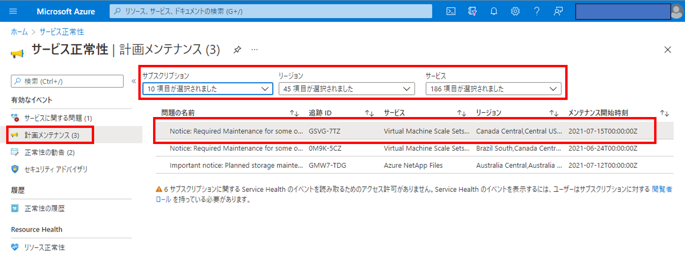

こんにちは、Azure テクニカル サポート チームの富田です。  
今回はよくお問い合わせいただく VM（仮想マシン）の「再起動を伴うメンテナンス」に伴い、事前にメンテナンスが可能となるセルフサービスメンテナンスについて、以下のような内容を解説させていただきます。

- [セルフサービスメンテナンスの概要](.#%E3%82%BB%E3%83%AB%E3%83%95%E3%82%B5%E3%83%BC%E3%83%93%E3%82%B9%E3%83%A1%E3%83%B3%E3%83%86%E3%83%8A%E3%83%B3%E3%82%B9%E3%81%AE%E6%A6%82%E8%A6%81)
- [再起動を伴うメンテナンス対象 VM の確認はどのように行えばよいですか？](.#%E5%86%8D%E8%B5%B7%E5%8B%95%E3%82%92%E4%BC%B4%E3%81%86%E3%83%A1%E3%83%B3%E3%83%86%E3%83%8A%E3%83%B3%E3%82%B9%E5%AF%BE%E8%B1%A1-VM-%E3%81%AE%E7%A2%BA%E8%AA%8D%E3%81%AF%E3%81%A9%E3%81%AE%E3%82%88%E3%81%86%E3%81%AB%E8%A1%8C%E3%81%88%E3%81%B0%E3%82%88%E3%81%84%E3%81%A7%E3%81%99%E3%81%8B%EF%BC%9F)
- [再起動を伴うメンテナンスの計画をメール通知するにはどうすればよいですか？](.#%E5%86%8D%E8%B5%B7%E5%8B%95%E3%82%92%E4%BC%B4%E3%81%86%E3%83%A1%E3%83%B3%E3%83%86%E3%83%8A%E3%83%B3%E3%82%B9%E3%81%AE%E8%A8%88%E7%94%BB%E3%82%92%E3%83%A1%E3%83%BC%E3%83%AB%E9%80%9A%E7%9F%A5%E3%81%99%E3%82%8B%E3%81%AB%E3%81%AF%E3%81%A9%E3%81%86%E3%81%99%E3%82%8C%E3%81%B0%E3%82%88%E3%81%84%E3%81%A7%E3%81%99%E3%81%8B%EF%BC%9F)
- [再起動を伴うメンテナンスの通知のサンプルはありますか？](.#%E5%86%8D%E8%B5%B7%E5%8B%95%E3%82%92%E4%BC%B4%E3%81%86%E3%83%A1%E3%83%B3%E3%83%86%E3%83%8A%E3%83%B3%E3%82%B9%E3%81%AE%E9%80%9A%E7%9F%A5%E3%81%AE%E3%82%B5%E3%83%B3%E3%83%97%E3%83%AB%E3%81%AF%E3%81%82%E3%82%8A%E3%81%BE%E3%81%99%E3%81%8B%EF%BC%9F)
- [セルフサービスメンテナンスはどのように実行すればよいですか？](.#%E3%82%BB%E3%83%AB%E3%83%95%E3%82%B5%E3%83%BC%E3%83%93%E3%82%B9%E3%83%A1%E3%83%B3%E3%83%86%E3%83%8A%E3%83%B3%E3%82%B9%E3%81%AF%E3%81%A9%E3%81%AE%E3%82%88%E3%81%86%E3%81%AB%E5%AE%9F%E8%A1%8C%E3%81%99%E3%82%8C%E3%81%B0%E3%82%88%E3%81%84%E3%81%A7%E3%81%99%E3%81%8B%EF%BC%9F)
- [通常の割り当て解除や再起動等でセルフサービスメンテナンスは完了しますか？](.#%E9%80%9A%E5%B8%B8%E3%81%AE%E5%89%B2%E3%82%8A%E5%BD%93%E3%81%A6%E8%A7%A3%E9%99%A4%E3%82%84%E5%86%8D%E8%B5%B7%E5%8B%95%E7%AD%89%E3%81%A7%E3%82%BB%E3%83%AB%E3%83%95%E3%82%B5%E3%83%BC%E3%83%93%E3%82%B9%E3%83%A1%E3%83%B3%E3%83%86%E3%83%8A%E3%83%B3%E3%82%B9%E3%81%AF%E5%AE%8C%E4%BA%86%E3%81%97%E3%81%BE%E3%81%99%E3%81%8B%EF%BC%9F)
- [再起動を伴うメンテナンス対象一覧から対象 VM が消えていたのですが何故ですか？](.#%E5%86%8D%E8%B5%B7%E5%8B%95%E3%82%92%E4%BC%B4%E3%81%86%E3%83%A1%E3%83%B3%E3%83%86%E3%83%8A%E3%83%B3%E3%82%B9%E5%AF%BE%E8%B1%A1%E4%B8%80%E8%A6%A7%E3%81%8B%E3%82%89%E5%AF%BE%E8%B1%A1-VM-%E3%81%8C%E6%B6%88%E3%81%88%E3%81%A6%E3%81%84%E3%81%9F%E3%81%AE%E3%81%A7%E3%81%99%E3%81%8C%E4%BD%95%E6%95%85%E3%81%A7%E3%81%99%E3%81%8B%EF%BC%9F)
- [再起動を伴うメンテナンスの完了（成功）の確認方法はありますか？](.#%E5%86%8D%E8%B5%B7%E5%8B%95%E3%82%92%E4%BC%B4%E3%81%86%E3%83%A1%E3%83%B3%E3%83%86%E3%83%8A%E3%83%B3%E3%82%B9%E3%81%AE%E5%AE%8C%E4%BA%86%EF%BC%88%E6%88%90%E5%8A%9F%EF%BC%89%E3%81%AE%E7%A2%BA%E8%AA%8D%E6%96%B9%E6%B3%95%E3%81%AF%E3%81%82%E3%82%8A%E3%81%BE%E3%81%99%E3%81%8B%EF%BC%9F)
- [セルフサービスメンテナンス実行時は VM が起動している必要がありますか？](.#%E3%82%BB%E3%83%AB%E3%83%95%E3%82%B5%E3%83%BC%E3%83%93%E3%82%B9%E3%83%A1%E3%83%B3%E3%83%86%E3%83%8A%E3%83%B3%E3%82%B9%E5%AE%9F%E8%A1%8C%E6%99%82%E3%81%AF-VM-%E3%81%8C%E8%B5%B7%E5%8B%95%E3%81%97%E3%81%A6%E3%81%84%E3%82%8B%E5%BF%85%E8%A6%81%E3%81%8C%E3%81%82%E3%82%8A%E3%81%BE%E3%81%99%E3%81%8B%EF%BC%9F)
- [セルフサービスメンテナンス期間中にメンテナンスをしないとどうなりますか？](.#%E3%82%BB%E3%83%AB%E3%83%95%E3%82%B5%E3%83%BC%E3%83%93%E3%82%B9%E3%83%A1%E3%83%B3%E3%83%86%E3%83%8A%E3%83%B3%E3%82%B9%E6%9C%9F%E9%96%93%E4%B8%AD%E3%81%AB%E3%83%A1%E3%83%B3%E3%83%86%E3%83%8A%E3%83%B3%E3%82%B9%E3%82%92%E3%81%97%E3%81%AA%E3%81%84%E3%81%A8%E3%81%A9%E3%81%86%E3%81%AA%E3%82%8A%E3%81%BE%E3%81%99%E3%81%8B%EF%BC%9F)
- [別のサブスクリプションではこのメンテナンスが通知されませんが何故ですか？](.#%E5%88%A5%E3%81%AE%E3%82%B5%E3%83%96%E3%82%B9%E3%82%AF%E3%83%AA%E3%83%97%E3%82%B7%E3%83%A7%E3%83%B3%E3%81%A7%E3%81%AF%E3%81%93%E3%81%AE%E3%83%A1%E3%83%B3%E3%83%86%E3%83%8A%E3%83%B3%E3%82%B9%E3%81%8C%E9%80%9A%E7%9F%A5%E3%81%95%E3%82%8C%E3%81%BE%E3%81%9B%E3%82%93%E3%81%8C%E4%BD%95%E6%95%85%E3%81%A7%E3%81%99%E3%81%8B%EF%BC%9F)
- [メールでのみ対象 VM が通知される再起動を伴うメンテナンスについて](.#%E3%83%A1%E3%83%BC%E3%83%AB%E3%81%A7%E3%81%AE%E3%81%BF%E5%AF%BE%E8%B1%A1-VM-%E3%81%8C%E9%80%9A%E7%9F%A5%E3%81%95%E3%82%8C%E3%82%8B%E5%86%8D%E8%B5%B7%E5%8B%95%E3%82%92%E4%BC%B4%E3%81%86%E3%83%A1%E3%83%B3%E3%83%86%E3%83%8A%E3%83%B3%E3%82%B9%E3%81%AB%E3%81%A4%E3%81%84%E3%81%A6)

---
## セルフサービスメンテナンスの概要

Azure ではお客様の安全のためセキュリティの対応や機能改修等として日々メンテナンスを行っております。  
そのメンテナンスの中で、稀にお客様の VM の再起動を伴う場合がございます。  
このようなメンテナンスは「再起動を伴うメンテナンス」と呼ばれております。

■ご参考：Azure での仮想マシンのメンテナンス  
[https://learn.microsoft.com/ja-jp/azure/virtual-machines/maintenance-and-updates](https://learn.microsoft.com/ja-jp/azure/virtual-machines/maintenance-and-updates)

■ご参考：計画メンテナンスの通知の処理  
[https://learn.microsoft.com/ja-jp/azure/virtual-machines/maintenance-notifications](https://learn.microsoft.com/ja-jp/azure/virtual-machines/maintenance-notifications)

■ご参考：Azure IaaS VM で実施されるメンテナンスについて  
[https://jpaztech.github.io/blog/vm/vm-maintenance/](https://jpaztech.github.io/blog/vm/vm-maintenance/)

VM 再起動を伴うメンテナンスについては原則として、事前にお客様の方で任意の時間にメンテナンスを実施することができる、セルフサービスメンテナンスが提供されます。  
以下にセルフサービスメンテナンスについてよく寄せられる質問のご案内をさせていただきます。  

> [!TIP]
> セルフサービスメンテナンスを実行しても、実際は Azure 基盤側にてハードウェアのメンテナンスがトリガーされるわけではございません。  
> セルフサービスメンテナンスが実行された場合、お客様の VM がメンテナンス対象の物理ホストサーバーからメンテナンス対象外の物理ホストサーバーに移動されるものとなります。

---
## 再起動を伴うメンテナンス対象 VM の確認はどのように行えばよいですか？

以下のドキュメントに記載の通り、Azure ポータル / Azure PowerShell / Azure CLI より確認することが可能です。

■ご参考：ポータルを使用した計画済みメンテナンスの通知の処理  
[https://learn.microsoft.com/ja-jp/azure/virtual-machines/maintenance-notifications-portal](https://learn.microsoft.com/ja-jp/azure/virtual-machines/maintenance-notifications-portal)

■ご参考：PowerShell を使用した計画メンテナンスの処理  
[https://learn.microsoft.com/ja-jp/azure/virtual-machines/maintenance-notifications-powershell](https://learn.microsoft.com/ja-jp/azure/virtual-machines/maintenance-notifications-powershell)

■ご参考：Azure CLI に対する計画済みメンテナンスの通知の処理  
[https://learn.microsoft.com/ja-jp/azure/virtual-machines/maintenance-notifications-cli](https://learn.microsoft.com/ja-jp/azure/virtual-machines/maintenance-notifications-cli)

では、実際にメンテナンスをポータルから確認する例を 2 つの方法よりスクリーンショット交えて紹介させていただきます。  

### 方法 1: サービス正常性よりメンテナンス対象 VM を確認する 

ポータル上部の検索ボックスより「サービス正常性」を検索して選択します。  

表示されたサービス正常性の画面の、左側のメニューより「計画メンテナンス」を表示します。  
サブスクリプション等のフィルタリングを設定し、対象のメンテナンスを選択すると、メンテナンスの概要が表示されます。

下部の「影響を受けたリソース」タブを表示することで、メンテナンス対象となる VM が確認できます。  
「状態」の列が「先行メンテナンスの管理」になっている VM はメンテナンス対象となっております。  
「状態」の列が「更新済み」の VM、もしくはそもそも「影響を受けたリソース」表示されていない VM はメンテナンス対象外となっております。  

### 方法 2: VM 一覧よりメンテナンス対象 VM を確認する 

ポータル上部の検索ボックスより「Virtual Machines」を検索して選択します。  

上部の「メンテナンス」ボタンより「仮想マシンのメンテナンス」を選択します。

仮想マシンのメンテナンス一覧の画面が表示されますので、メンテナンス対象となっている VM があるか確認ができます。

---
## 再起動を伴うメンテナンスの計画をメール通知するにはどうすればよいですか？

一部のメンテナンスについては、設定をしなくとも管理者にメール通知されることがございますが、原則として再起動が伴うメンテナンスが計画された際にメールで通知を行うには、サービス正常性のアラート設定を行う必要がございます。  

■ご参考：ポータルの通知とアラート  
[https://learn.microsoft.com/ja-jp/azure/virtual-machines/maintenance-notifications-portal#notification-and-alerts-in-the-portal](https://learn.microsoft.com/ja-jp/azure/virtual-machines/maintenance-notifications-portal#notification-and-alerts-in-the-portal)

>ーーーーーー抜粋ーーーーーー  
>仮想マシン関連のメンテナンス通知は、Azure portal の [サービスの正常性] で使用できます。   
>一部の特定の仮想マシンの計画メンテナンス シナリオでは、Azure が従来のサブスクリプション管理者、共同管理者、およびサブスクリプション所有者グループに追加のメール (Service Health 以外) を送信して、スケジュールを通知する場合があります。  
>ーーーーーーーーーーーーーー  

メンテナンスに限らず、サービス正常性アラートは Azure サービス自体の正常性を監視するのに役立ちます。  
サービス正常性アラートについては別途弊社の解説ブログ記事もございますので、参考としてご案内させていただきます。  

■ご参考：サービス正常性アラートの設定手順と推奨設定について
[https://jpazmon-integ.github.io/blog/ame/HowToSetUpServiceHealthAlertsAndRecommendedSettings/](https://jpazmon-integ.github.io/blog/ame/HowToSetUpServiceHealthAlertsAndRecommendedSettings/)

では、実際にメール通知を行うための手順についてスクリーンショットを交えて紹介させていただきます。  

ポータル上部の検索ボックスより「サービス正常性」を検索して選択します。  

上部の「サービス正常性アラートの作成」をボタンを選択します。  

スコープにて対象とするサブスクリプションを選択します。  

条件にて、VM および VMSS に関する再起動を伴うメンテナンスの通知を行うため、以下の設定を行います。

- サービス：Virtual Machines および Azure Virtual Machine Scale Sets を選択。  
- 地域：任意のリージョンを選択。
- イベントの種類：計画メンテナンスを選択。

アクションにて、メンテナンスが計画された際にどのように通知アクションを行うのか設定します。  
既にアクション グループが存在する場合は「アクション グループの選択」を選んでください。  
新規にメール通知を行うアクション グループを作成する際は、「アクション グループの作成」を選択いただき、任意のメールアドレスへ通知を行うアクショングループを新規作成してください。

最後に詳細にて、このアラートの名前を設定してアラートを作成します。 

これで再起動を伴うメンテナンスが計画された際に、メール通知を行うアラートが作成できました。

---
## 再起動を伴うメンテナンスの通知のサンプルはありますか？

以下は、再起動を伴うメンテナンスの通知のサンプルとなります。  
「サービス正常性」の「計画メンテナンス」より確認頂くことが可能でございます。  
**メンテナンス毎に内容は変わりますので、実際に通知されたメンテナンス通知内容のご確認をお願い申し上げます。** 

>Dear Azure customer,
>
>One or more Azure Virtual Machines (VMs) associated with your subscription require a maintenance update to migrate these VMs to newer hardware. While the vast majority of platform maintenance causes no interruption to your services, this update will require a reboot.  
>
>This maintenance has two phases: the self-service phase and a scheduled maintenance phase.  
>
>Azure Service Health provides you with the current status of each VM that requires maintenance and allows you to initiate the self-service maintenance proactively – any time between now and July 26, 2023 (23:59 UTC). If self-service maintenance has not been completed by then, Azure will automatically initiate maintenance on any VM that still requires it, sometime between July 27, 2023 (00:00 UTC) to August 02, 2023 (23:59 UTC). This scheduled maintenance will be performed one update domain at a time, to limit impact to environments configured for high availability.  
>
>You can view a list of Affected Resources for this event under the ServiceHealth/PlannedMaintenance tab in the Azure portal  
>
>You should expect each VM to be unavailable for up to 15 minutes after initiating the maintenance and note that operating system and data disks will be retained, but temporary storage will be lost during this maintenance. If you are using Dv1 or DSv1 VM sizes, please refer to the documentation [here](https://docs.microsoft.com/en-us/azure/virtual-machines/windows/sizes-previous-gen) to understand performance changes if any.  
>
>If you are using Proximity Placement Groups, please refer to the documentation [here](https://docs.microsoft.com/en-us/azure/virtual-machines/co-location#planned-maintenance-and-proximity-placement-groups) to understand how to verify the alignment of your resources and to take appropriate action if some resources are not aligned.  
>
>We apologize for any impact that this maintenance may have. We strive to minimize the impact of platform maintenance, and to provide you with as much visibility and control as possible.  

---
## セルフサービスメンテナンスはどのように実行すればよいですか？

セルフサービスメンテナンスを実行するためには、通常の再起動操作とは別の操作が必要となります。  
具体的な実行方法としては、以下のドキュメントに記載の通り、Azure ポータル / Azure PowerShell / Azure CLI より実行することが可能です。  
セルフサービスメンテナンスを開始すると VM が再起動しますのでご留意ください。  

■ご参考：ポータルから VM に対するメンテナンスを開始する  
[https://learn.microsoft.com/ja-jp/azure/virtual-machines/maintenance-notifications-portal#start-maintenance-on-your-vm-from-the-portal](https://learn.microsoft.com/ja-jp/azure/virtual-machines/maintenance-notifications-portal#start-maintenance-on-your-vm-from-the-portal)

■ご参考：PowerShell を使用して VM に対するメンテナンスを開始する  
[https://learn.microsoft.com/ja-jp/azure/virtual-machines/maintenance-notifications-powershell#start-maintenance-on-your-vm-using-powershell](https://learn.microsoft.com/ja-jp/azure/virtual-machines/maintenance-notifications-powershell#start-maintenance-on-your-vm-using-powershell)

■ご参考：メンテナンスを開始する（Azure CLI）  
[https://learn.microsoft.com/ja-jp/azure/virtual-machines/maintenance-notifications-cli#start-maintenance](https://learn.microsoft.com/ja-jp/azure/virtual-machines/maintenance-notifications-cli#start-maintenance)

ポータルから実行する例として、先述のサービス正常性の計画メンテナンスの対象 VM 確認画面より、「先行メンテナンスの管理」ボタンを推すことでメンテナンス開始画面に遷移することができます。  

以下がメンテナンス開始画面の例となります。  
「メンテナンスを開始する」ボタンを選択頂くことで、セルフサービスメンテナンスが開始されます。  

なお、メンテナンス対象となっている VM については対象 VM の概要画面にも、以下のようなリボンが上部に表示されており、このリボンを選択頂くことでメンテナンス開始に進むことができます。  

---
## 通常の割り当て解除や再起動等でセルフサービスメンテナンスは完了しますか？

まずセルフサービスメンテナンスが実行され、完了時にメンテナンス対象外の物理ホストサーバーに VM が移動することを保証している方法としては、上記の「セルフサービスメンテナンスの開始」の方法となっております。  

他方、「割り当て解除」および「再デプロイ」操作を行っていただいた場合は、メンテナンス対象外の物理ホストサーバーに VM が移動することがあり、結果としてメンテナンス完了状態となる可能性がございます。  
しかしながら、引き続きメンテナンス対象の物理ホストサーバーで VM が稼働することもございます。

なお、「ポータルでの再起動」や「OS 内部のシャットダウン / 再起動」の場合、VM の物理ホストサーバー移動は起きませんため、メンテナンス完了とはならないものと存じます。  

すなわち、セルフサービスメンテナンスを行う場合は先述の「セルフサービスメンテナンスの開始」の方法で実施をお願いいたします。  

---
## 再起動を伴うメンテナンス対象一覧から対象 VM が消えていたのですが何故ですか？

以下のドキュメントに記載の通り、VM がメンテナンス対象から外れることがございます。  
よくあるシナリオとしては、お客様の方で VM の割り当て解除および起動が行われたことで、メンテナンス対象外の物理ホストサーバーに VM が移動したことによりメンテナンス対象外となるといったパターンです。  
メンテナンス対象から表示が消えている VM については、セルフサービスメンテナンスが不要となっておりますので、特にご対応をいただく必要はございません。

■ご参考：よく寄せられる質問  
[https://learn.microsoft.com/ja-jp/azure/virtual-machines/maintenance-notifications#faq](https://learn.microsoft.com/ja-jp/azure/virtual-machines/maintenance-notifications#faq)

>ーーーーーー抜粋ーーーーーー  
>Q: VM のメンテナンス情報が表示されません。 問題の原因  
>
>A: VM のメンテナンス情報が表示されない理由はいくつかあります。  
>
>1.Microsoft 社内としてマークされたサブスクリプションを使用している。  
>2.VM のメンテナンスがスケジュールされていない。 メンテナンス ウェーブが終了しているか、取り消し>または変更が行われたため、VM が影響を受けなくなっていると考えられます。  
>**3.あなたは VM の割り当てを解除し、その後、VM を起動しました。 それを行うと、メンテナンス ウェーブを計画していない場所に VM が移動する可能性があります。 そのため、VM にはメンテナンス情報が表示されません。**  
>4.VM リスト ビューに [メンテナンス] 列が追加されていない。 この列は既定のビューに追加されていますが、既定以外の列を表示するように構成しているお客様は、VM リスト ビューに [メンテナンス] 列を手動で追加する必要があります。  
>ーーーーーーーーーーーーーー  

---
## 再起動を伴うメンテナンスの完了（成功）の確認方法はありますか？

先述のサービス正常性の計画メンテナンスの対象 VM 確認画面上で、「影響を受けたリソース」の一覧をご確認いただき、以下のいずれかの状態であればメンテナンスが完了（成功）していると考えていただいて差し支えございません。

- 対象の VM　について「状態」の列が「更新済み」と表示さていている。
- もしくは、対象の VM が「影響を受けたリソース」の一覧表示から消えている。

---
## セルフサービスメンテナンス実行時は VM が起動している必要がありますか？

セルフサービスメンテナンスは VM が「割り当て解除済み」の状態では実行が叶いません。  
「実行中」や「停止済み（OS 内部からのシャットダウン完了）」の状態であればセルフサービスメンテナンスは実行可能となります。  

---
## セルフサービスメンテナンス期間中にメンテナンスをしないとどうなりますか？

セルフサービスメンテナンスの実行可能な期間が終了すると、予定メンテナンス フェーズになります。  
セルフサービスメンテナンス期間中にセルフサービスメンテナンスを実行せずに、予定メンテナンス フェーズに入った場合は、自動的に再起動を伴うメンテナンスが実行されます。  
この場合、予定メンテナンス フェーズではお客様の方でメンテナンス実行のタイミングを制御することは叶いません点、ご了承くださいませ。  

---
##  別のサブスクリプションではこのメンテナンスが通知されませんが何故ですか？

再起動を伴うメンテナンスの通知は、あくまでメンテナンス対象があるサブスクリプションにのみ通知されます。  
そのため、メンテナンスの通知がされていないサブスクリプションに関してはメンテナンス対象が無いと考えて頂いて差し支えございません。

---
## メールでのみ対象 VM が通知される再起動を伴うメンテナンスについて

稀ではございますが、再起動を伴うメンテナンスについて、Azure ポータル等では対象 VM の確認が叶わず、メールでのみメンテナンス対象 VM が通知される場合がございます。  
この場合は、そのメール内に対象 VM の通知を行った旨やどのような対応が必要かといった内容が記載されておりますため、通知に記載の内容をご確認いただきご対応をお願い申し上げます。

---

以上の通り、セルフサービスメンテナンスについて解説をさせていただきました。  
メンテナンスについてご不明点がございます場合は、対象のメンテナンスに割り振られている TrackingID（追跡 ID）を添えて、Azure 技術サポート窓口にお問い合わせを頂けますと幸いでございます。