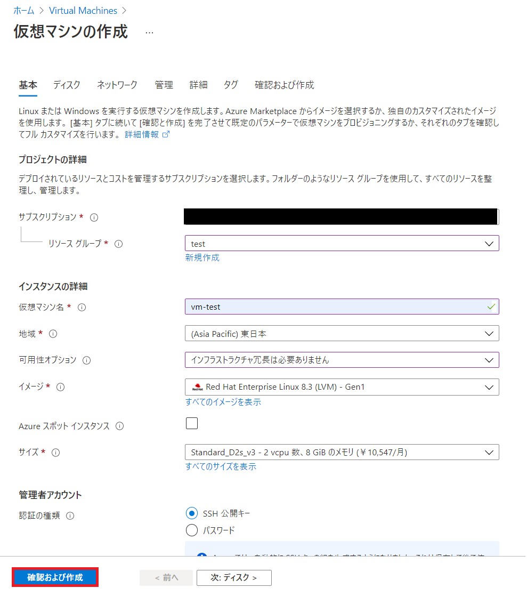
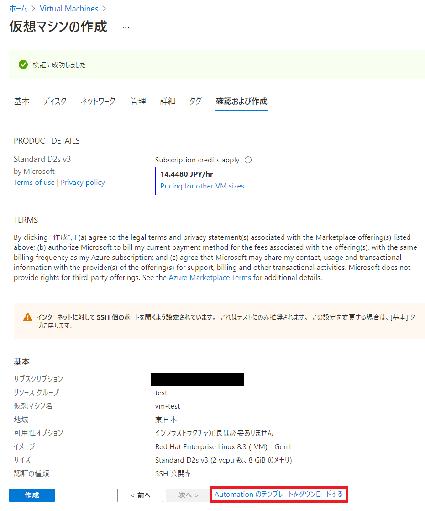
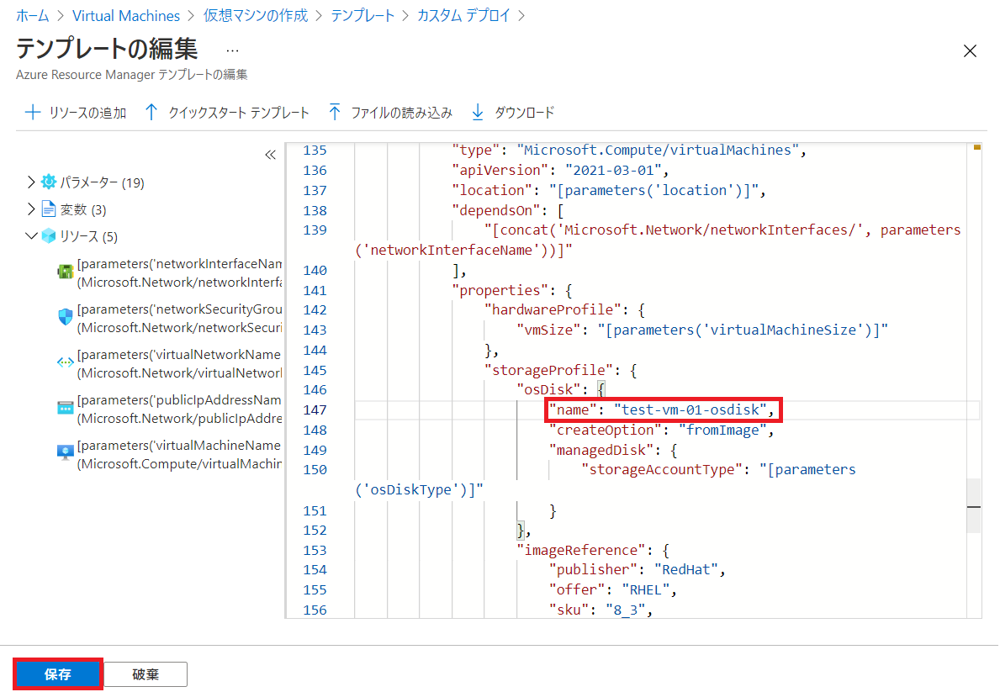
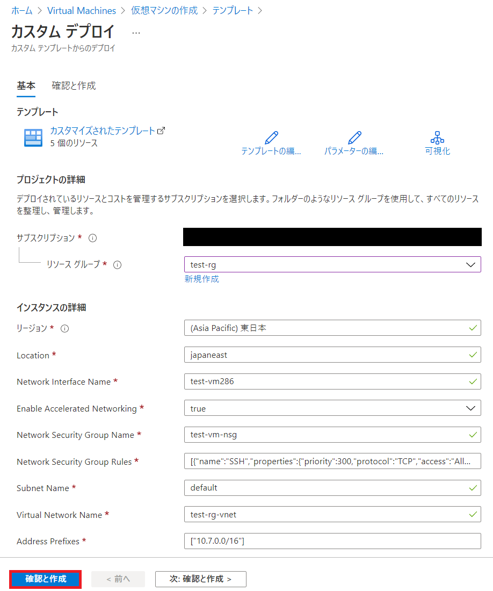
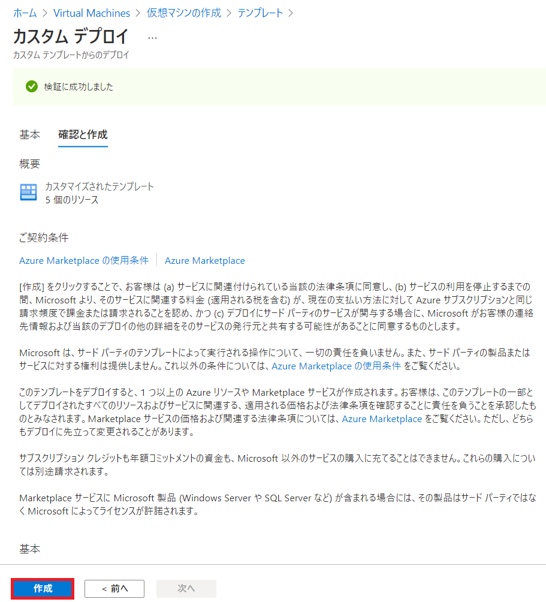

こんにちは。Azure テクニカル サポート チームの西澤です。

Azure VM を作成いただく際、OS ディスクのリソース名は自動で生成されますが、リソース管理の都合上、この OS ディスクのリソース名を任意の名前に変更したいというお問い合わせをいただくことがあります。
本記事では、ARM テンプレートを使用して VM 作成時に OS ディスクのリソース名を変更する手順についてご紹介します。

<!-- more -->

既存の VM の OS ディスクのリソース名を変更する手順については、ブログ [既存 VM の OS ディスクのリソース名を変更する](https://jpaztech.github.io/blog/vm/how-to-change-os-disk-name/) に記載されていますので、併せてご確認いただけますと幸いです。

---

## 概要
下記の手順で OS ディスク名を指定の上、VM をデプロイいたします。
Windows VM、Linux VM ともに同様の手順となります。

1. Azure Portal より ARM テンプレートを用意する
2. OS ディスクの名前を設定する
3. VM をデプロイする 
4. 確認

---

## 手順
## 1. Azure Portal より ARM テンプレートを用意する
Azure ポータルより [Virtual Machines] を開き、VM の新規作成画面を開きます。
必要な項目を設定し、画面下部にある [確認および作成] を選択します。



検証が完了しましたら、画面下部にある [Automation のテンプレートをダウンロードする] を選択します。



 
表示された ARM テンプレートを使用して VM をデプロイするため、[デプロイ] を選択します。


ARM テンプレートを使用したカスタム デプロイの画面へ遷移しましたら、テンプレートを編集するため、
[テンプレートの編集] を選択します。


## 2. OS ディスクの名前を設定する
ARM テンプレート内の下記箇所を追記して、OS ディスクの名前を編集します。
編集が完了しましたら、画面下部にある [保存] を選択します。

```
"resources": [{
	"properties": {
		"storageProfile": {
			"osDisk": {
				"name": "ここにご希望の OS ディスクの名前を記入します",
```

> [!WARNING]
> 最後の「,」の付け忘れにご注意ください。



ARM テンプレートのパラメータに関する詳細内容に関しましては
下記の弊社公式ドキュメントをご参照ください。

> ご参考：Azure Resource Manager テンプレートの仮想マシン
> https://docs.microsoft.com/ja-jp/azure/virtual-machines/windows/template-description

## 3. VM をデプロイする 
必要な項目を設定し、画面下部にある  [確認と作成] を選択します。



検証が正常に完了しましたら、[作成] を押してデプロイください。



## 4. 確認
デプロイが完了したら、Azure Portal からデプロイした Virtual Machine を選択し、[ディスク] を選択ください。
OS ディスクの名前が設定した名前となっていることをご確認いただければ完了です。


---

手順は以上となります。
本記事が皆様のお役に立てれば幸いです。
