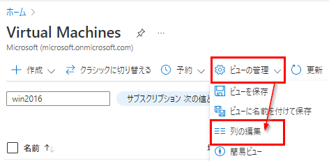
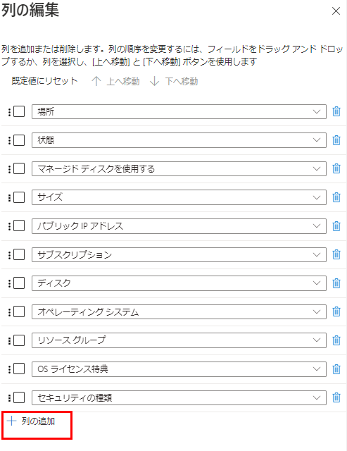
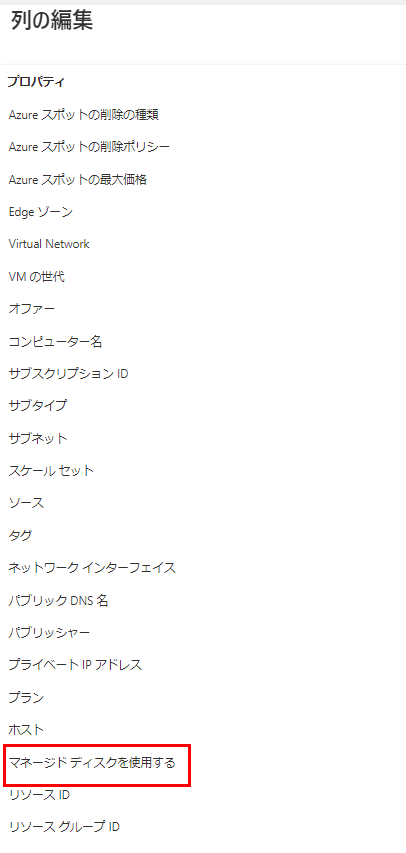
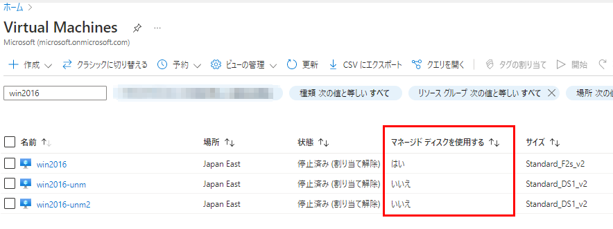
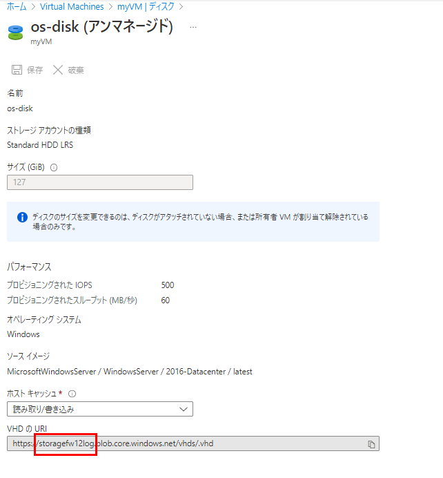
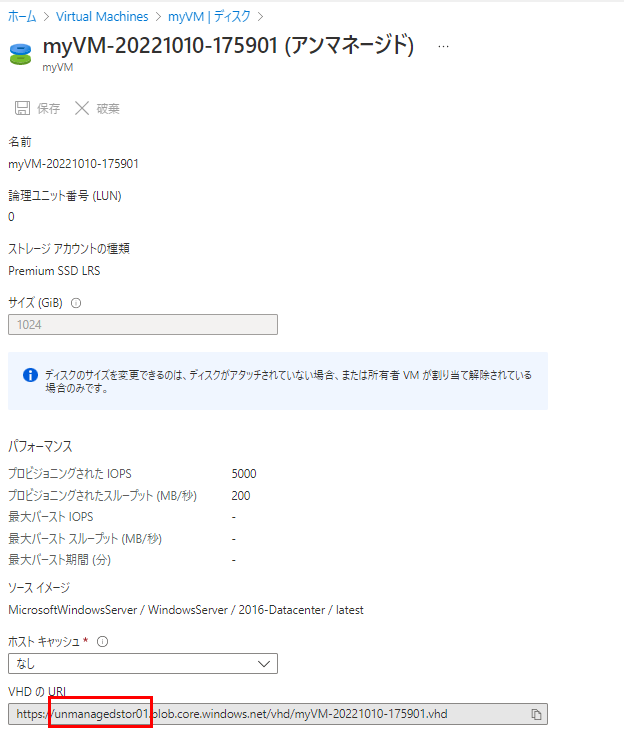
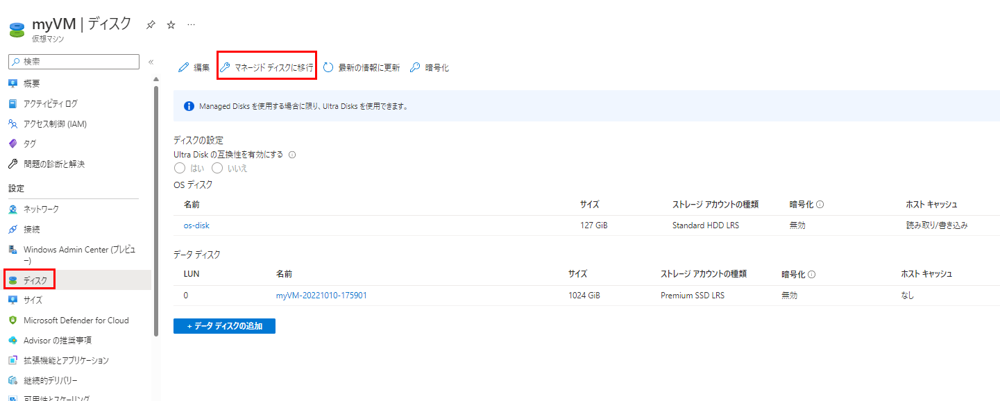
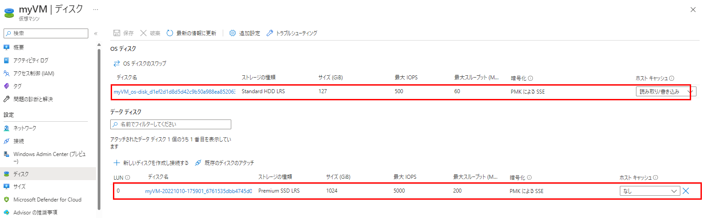
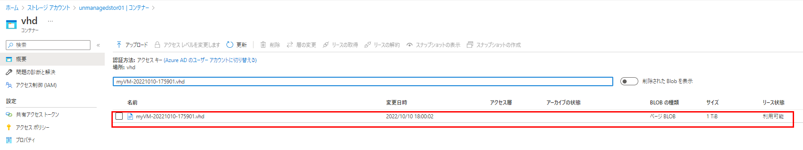
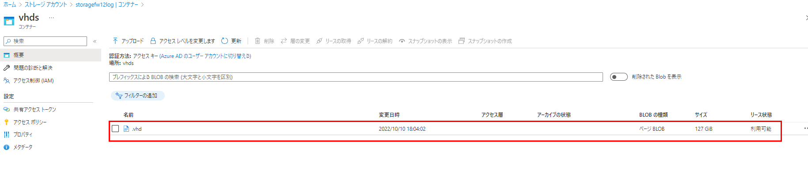

こんにちは、Azure テクニカル サポート チームの木下です。
今回は、度々お問い合わせいただきます、アンマネージド ディスク (非管理ディスク) を使用している仮想マシンのマネージド ディスク (管理ディスク) への移行についてご紹介いたします。
<!-- more -->

---

2017 年にマネージド ディスク (管理ディスク) がリリースされて以降、マネージド ディスクの機能強化が行われてきました。今後もマネージド ディスクの機能向上に備えるため、2022 年 9 月 30 日以降、アンマネージド ディスクは非推奨となり、2025 年 9 月 30 日をもちまして廃止が予定されております。

> [!IMPORTANT]
> Azure の更新情報や Tracking ID: JTP9-JD0 にて周知されている情報となります。
> 参考）Azure unmanaged disks will be retired on 30 September 2025
> https://azure.microsoft.com/ja-jp/updates/azure-unmanaged-disks-will-be-retired-on-30-september-2025/

上記の通り、2025 年 9 月 30 日以降、アンマネージド ディスクを使用している仮想マシンは利用できなくなりますので、この期日までにアンマネージド ディスクを使用している仮想マシンをマネージド ディスクへ移行する必要があります。

> [!NOTE]
> Azure 更新情報 URL 内に記載の "Page blobs will not be affected by this change." の箇所につきまして補足いたします。
> アンマネージド ディスクは Azure ストレージ内にページ BLOB として格納した VHD ファイルであり、これを仮想マシンにて利用しております。
> 今回、アンマネージド ディスクは 2025 年 9 月 30 日をもって廃止となり、アンマネージド ディスクを使用している仮想マシンは利用できなくなりますが、Azure ストレージ内に格納されている VHD ファイル (ページ BLOB) 自体が削除されることはございません。この点はご安心くださいませ。

お客様のご利用の環境において、アンマネージド ディスクを使用した仮想マシンが存在するのかどうかを確認し、存在する場合は計画的にマネージド ディスクへの移行を行いましょう。

---

## 1. アンマネージド ディスクを使用している仮想マシンが存在するかの確認

アンマネージド ディスクを使用している仮想マシンが存在するかどうかは Azure Portal や Azure CLI でご確認いただくことができます。

### ▼ Azure Portal を使用する場合 

[Azure Portal] > [仮想マシン (Virtual Machines)] ＞ [ビューの管理] > [列の編集] をクリックします。



[+ 列の追加] をクリックします。



[マネージド ディスクを使用する] を選択し、保存します。



[マネージド ディスクを使用する] の項目が追加されます。



マネージド ディスクを使用している場合は「はい」、アンマネージド ディスクを使用している場合は「いいえ」と表示されます。
この項目が「いいえ」の場合、アンマネージド ディスクを使用した仮想マシンとなりますので、マネージド ディスクへの移行が必要であるとご判断いただくことが可能です。

### ▼ Azure CLI を使用する場合

コマンド例：

```sh
$ vmids=$(az vm list --query [].id -o tsv)
$ az vm show --ids $vmids --query "[].{vmname:name, rgname:resourceGroup, unmanageddisk:storageProfile.osDisk.vhd.uri}" -o table
Vmname    Rgname    Unmanageddisk
--------  --------  ----------------------------------------------------
testvm01  testrg01
testvm02  testrg02  https://sample.blob.core.windows.net/vhds/sample.vhd
```

[Unmanageddisk] 項目に VHD ファイルの URL が表示されている仮想マシンは、マネージド ディスクを使用した仮想マシンとなります。

### ▼ Azure PowerShell を使用する場合
```sh
PS /home/azureuser> Get-AzVM -Status | Select-Object Name,ResourceGroupName,@{Name="Unmanaged Disk"; Expression={$_.StorageProfile.OsDisk.Vhd.Uri}}

Name                ResourceGroupName   Unmanaged Disk
----                -----------------   --------------------------------
testvm01            testrg01 
testvm02            testrg02            https://sample.blob.core.windows.net/vhds/sample.vhd
```

[Unmanaged Disk] 項目に VHD ファイルの URL が表示されている仮想マシンは、マネージド ディスクを使用した仮想マシンとなります。

---

## 2. マネージド ディスクへの移行方法

アンマネージド ディスクからマネージド ディスクへの移行は、管理層を移行するという挙動となりますため、ディスクに格納されているデータ量に関わらず数分程度で完了することが想定となります。
ただし、移行操作に伴い VM の停止処理が発生しますので、この点は予めご留意いただきますようお願いいたします。

アンマネージド ディスクを使用した仮想マシンをマネージド ディスクへ移行する手順としては以下となります。

1.Azure Portal より対象の VM を選択します。

2.対象 VM の  OS・データ ディスクの VHD ファイルが格納されている Azure ストレージ アカウントを確認します。


OS・データ ディスクの各 [VHD の URI] 箇所より Azure ストレージ アカウント名を確認することができます。





3.[ディスク] ブレードの上部 [マネージド ディスクに移行] 項目をクリックします。



4.マネージド ディスクへの移行画面に遷移しますので、[移行] をクリックします。


5. VM が停止し、移行が開始されます。(約 2-3 分程度で完了します)


6.マネージド ディスクに変換されたことを確認します。



7.1 で確認した対象の Azure ストレージ アカウントのコンテナー内から VHD ファイル自体は削除されていないことを確認します。





マネージド ディスクへの移行方法の詳細や注意事項については以下公開情報にておまとめしておりますのでご参考ください。
なお、マネージド ディスクへの移行は必ずテスト環境等で検証を行っていただいた上でご実施いただきますようお願いいたします。

> 参考）
> - [Windows 仮想マシンをアンマネージド ディスクからマネージド ディスクに移行する](https://docs.microsoft.com/ja-jp/azure/virtual-machines/windows/convert-unmanaged-to-managed-disks)
> - [Linux 仮想マシンをアンマネージド ディスクからマネージド ディスクに移行する](https://docs.microsoft.com/ja-jp/azure/virtual-machines/linux/convert-unmanaged-to-managed-disks)

---

## 3. マネージド ディスクを利用することの利点や価格

マネージド ディスクをご利用いただくことによって得られる利点や価格に関しましては以下におまとめしておりますので、必要に応じてこちらもご参照ください。

> 参考）
> - [マネージド ディスクの利点](https://learn.microsoft.com/ja-jp/azure/virtual-machines/managed-disks-overview#benefits-of-managed-disks)
> - [Managed Disks の価格](https://azure.microsoft.com/ja-jp/pricing/details/managed-disks/)
> - [Unmanaged Disk Azure ページ BLOB の価格](https://azure.microsoft.com/ja-jp/pricing/details/storage/page-blobs/)

なお、アンマネージド ディスクの Standard HDD では、実際に格納しているデータ量に応じた課金となっておりましたが、マネージド ディスクでは Standard HDD も含め、ディスク リソースとしてプロビジョニングされたディスク サイズに対して課金が発生いたします。移行に伴い課金額に差異が発生する可能性がある点について、予めご認識いただけますと幸いです。

マネージド ディスクについてよく寄せられるご質問をおまとめした公開情報のご用意もございますので、こちらも併せてご参考ください。

> 参考）
> - [Azure IaaS VM ディスクと Premium マネージド ディスクおよびアンマネージド ディスクについてよく寄せられる質問](https://learn.microsoft.com/ja-jp/azure/virtual-machines/faq-for-disks)

本稿が皆様のお役に立てれば幸いです。
