こんにちは、Azure テクニカル サポート チームの洪です。  
Azure VM (Windows OS) 作成時には、OS 内で “ビルトイン Administrator” として **管理者アカウント** のユーザー名をご指定いただくことになりますが、こちらのユーザー名の変更が可能であるかとのお問い合わせをいただくことがございます。  
本記事ではそのユーザー名を OS 上から変更する方法および関連の留意事項 についてご案内いたします。
<!-- more -->

---

## 変更対象

本記事にて案内しております手順は、以下のように作成されたユーザーを後から変更するものとなります。

■ 確認例 - Azure ポータル画面
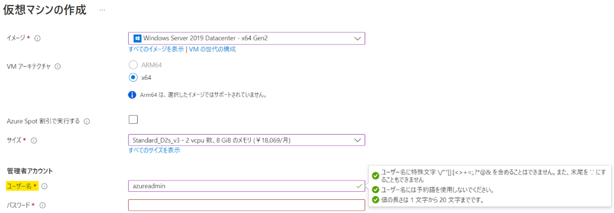
※ Azure VM の管理者アカウントのユーザー名として、azureadmin を指定します。

■ 確認例 - OS 上の画面
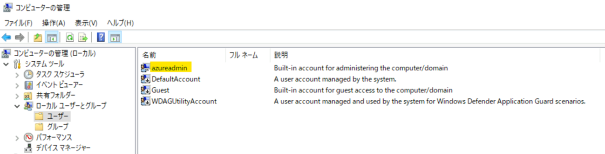
※ Windows OS のビルトイン Administrator として azureadmin のユーザーが生成されます。  
※ こちらのユーザー名の変更に関しまして、以下にご案内いたします。  

## 管理者アカウント ユーザー名を変更する

管理者アカウントのユーザー名は従来の Windows の動作のように Windows の [コンピューターの管理] で変更可能でございます。  
詳細手順に関しましては以下をご確認ください。

## ■ 手順

### 1. 現在の管理者 (ビルドイン Administrator) のユーザー名を確認します。

1-1. 画面左下側の Windows アイコンを右クリックし、[コンピューターの管理] を開きます。


1-2. [ローカル ユーザーとグループ] - [ユーザー] を選択し、"Built-in account for administering the computer" にて 該当するユーザー名を確認します。
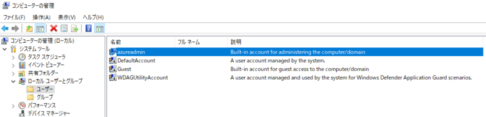
※ この例では、[azureadmin] になります。

### 2. 管理者のユーザー名を変更します。

2-1. 当該名前を右クリックし、[名前の変更] をクリックします。
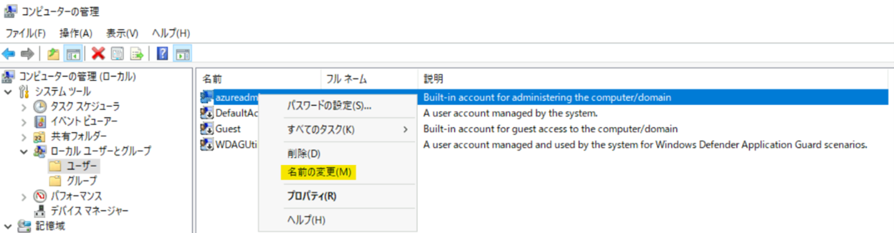

2-2. ご希望のユーザー名を入力し、変更が可能です。

※ この例では、[azureadminnew] に変更しました。

## ユーザー名変更の影響および対処について

Windows OS のユーザーにつきましては、[C:\ユーザー] 配下にユーザー名でフォルダーが作成されますが、上記の手順で管理者のユーザー名をご変更いただいた際に、フォルダーの名前が自動で変更される動作はございません。  
フォルダ名とログオン ユーザー名が異なっていても通常は問題ないためご放念いただく形となりますが、もしアプリケーションが動作しないなどやむを得ない理由があれば以下の手順で変更することは可能です。  
フォルダー名を新しいユーザー名に変更する場合には、手動にてレジストリをご変更いただく必要がございます。  
具体的な手順を下記にご案内いたします。

> [!CAUTION]  
> レジストリを誤って変更すると、深刻な問題が発生することがございます。  
> レジストリを編集する際には十分に注意してください。  
> 万一に備えて、編集の前にはレジストリのバックアップまたは仮想マシンのバックアップ (Azure Backup やディ> スクのスナップショット) をご取得いただきますようお願いします。  
> レジストリのバックアップおよび復元方法の詳細を参照するには、以下のサポート技術情報をご確認ください。  
> ご参考) [Windows でレジストリをバックアップおよび復元する方法](https://support.microsoft.com/ja-jp/help/322756/)

## ■ 手順

※ 仮想マシン作成時に指定した管理者のユーザー名 azureadmin を azureadminnew に変更する場合を例にご説明いたします。

### 1. 新しいローカル管理者アカウント (例 tempaccount) を作成します。

1-1. Windows で、[コントロール パネル] を検索し、開きます。

1-2. [ユーザー アカウント] > [ユーザー アカウント] > [別のアカウントの管理] を選択し、[ユーザー アカウントの追加] から新しいアカウントを作成します。

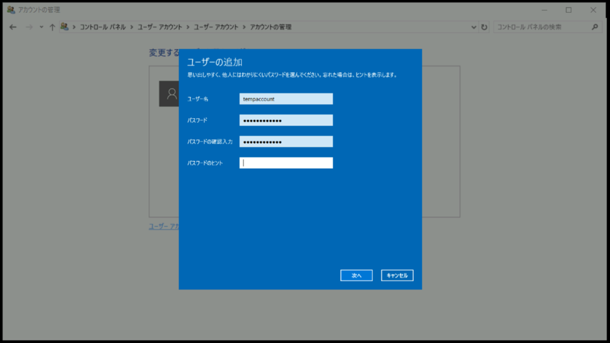
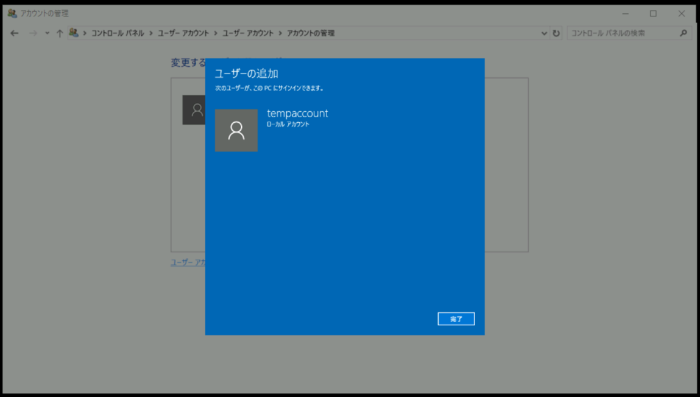

1-3. 新しいローカル アカウントをクリックし、[アカウントの種類の変更] をクリックします。
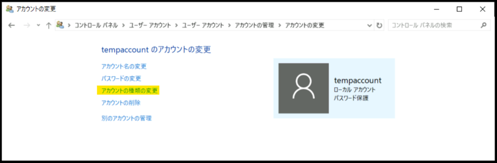

1-4. [管理者] を選択し、[アカウントの種類の変更]をクリックします。


1-5. 新しいローカルアカウントが、[ローカル アカウント Administrator] に表示されることを確認します。


1-6. VMを再起動します。

### 2. Windows ユーザー フォルダーの名前を変更します。

2-1. 対象仮想マシンに、新しいローカル アカウント (例 tempaccount) にてログインします。(コマンド プロンプトの whoami から確認可能です。)
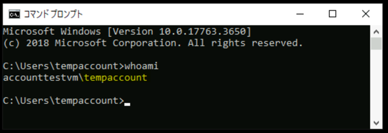

2-2. エクスプローラーを開き、C:\ユーザー から仮想マシン作成時に指定した管理者のユーザー フォルダーを右クリックし、[名前の変更] をクリックします。
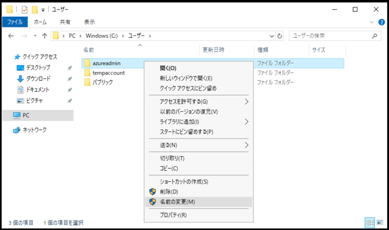

2-3. フォルダー名を変更したユーザー名(例. C:\Users\azureadminnew) に変更します。
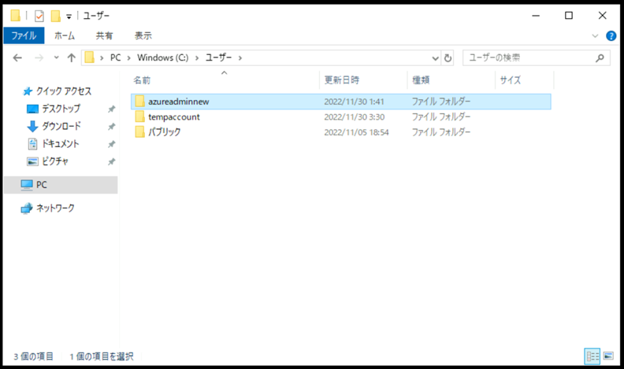

### 3. ユーザーの SID を確認します。

3-1. コマンド プロンプトを開き、以下のコマンドを実行します。

```CMD
WMIC useraccount get name,sid
```

3-2. 出力結果から、仮想マシン作成時に指定したユーザー名の SID を確認します。


### 4. レジストリ エディターを使用して名前を変更したフォルダーをマップします。

4-1. キーボードの Windows キーと R キーを同時に押し、[ファイル名を指定して実行] を開きます。
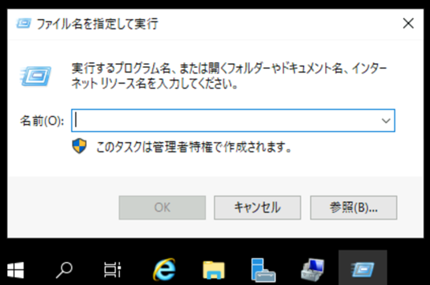

4-2. 「regedit」 を入力し、[OK] を押下します。
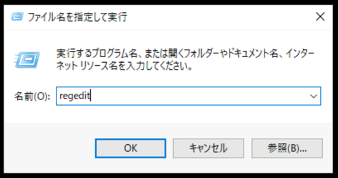

4-3. [レジストリ エディター] にて、下記のパスに移動します。
> HKEY_LOCAL_MACHINE\SOFTWARE\Microsoft\Windows NT\CurrentVersion\ProfileList


4-4. [ProfileList] 配下から、手順 3 で確認した SID を選択します。
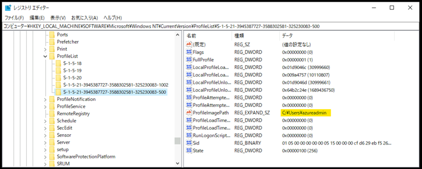

4-5. [ProfileImagePath] をダブル クリックします。


4-6. [値のデータ] へ [C:\Users\<変更したユーザー名>] (例 C:\Users\azureadminnew) を入力し、[OK] をクリックします。
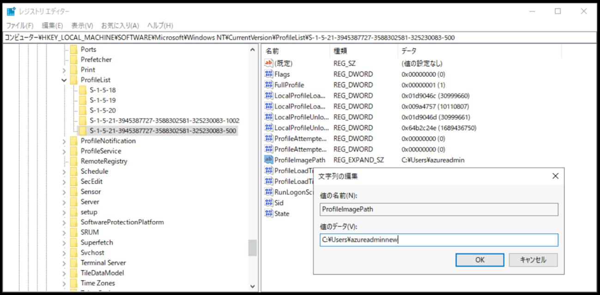
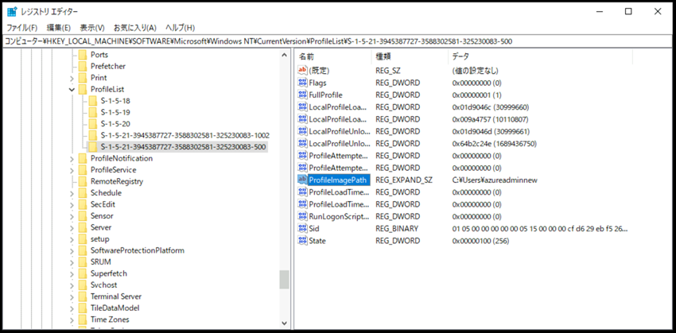

4-7. 当該仮想マシンを再起動します。

### 5. 新しいローカル管理者アカウントを無効にします。

5-1. 対象仮想マシンに、変更後の管理者アカウント(例 azureadminnew) にてログインします。

5-2. 管理者権限にてコマンドプロンプトを開きます。


5-3. 以下のコマンドを入力すると、新しいローカル管理者アカウント (例 tempaccount) が無効になります。

```CMD
net user <新しいローカル管理者アカウント名> /active:no
```

※ 本手順では無効の方法を案内しておりますが、今後ご利用されない場合は削除していただいても問題ございません。

## 管理者アカウント名の注意事項

ユーザー名をご指定いただく際の注意事項に関しましては、以下のドキュメントにてご案内しております。  
詳細内容をご確認いただいた上で、変更する名前をご決定いただけますようお願い申し上げます。

> ご参考) [VM を作成する際のユーザー名の要件は何ですか。](https://learn.microsoft.com/ja-jp/azure/virtual-machines/windows/faq#vm----------------------)  
> ユーザー名は最大 20 文字の長さまで指定できますが、末尾を句点 (".") にすることはできません。  
> 次のユーザー名を指定することはできません。

一方で、VM 作成後にゲスト OS 上の操作でユーザー名を変更した場合には、Azure としての制約が適用されないため、上記の要件以外のユーザー名を指定しても OS の動作は可能です。

ただし、Azure VM 作成時に登録する管理者アカウントは、Azure Portal からそのパスワードをリセットする機能がございますが、ドキュメントに記載のユーザー名の要件に従っていない場合にはその操作が不可になりますため、その点ご留意いただけますようお願いいたします。

## 管理者アカウントの追加

なお、 VM 構築後にゲスト OS 上の操作にて Administrator ユーザーを追加で作成いただくことも Azure としての制約はなく、ご利用いただける方法となります。

ただし、ゲスト OS 上で "Administrator" ユーザーを作成いただいた場合に関しましても、Azure Portal にて当該ユーザーのパスワードリセットの操作は叶いませんので、その点についてご留意いただけますようお願いいたします。

本稿が皆様のお役に立てれば幸いです。
