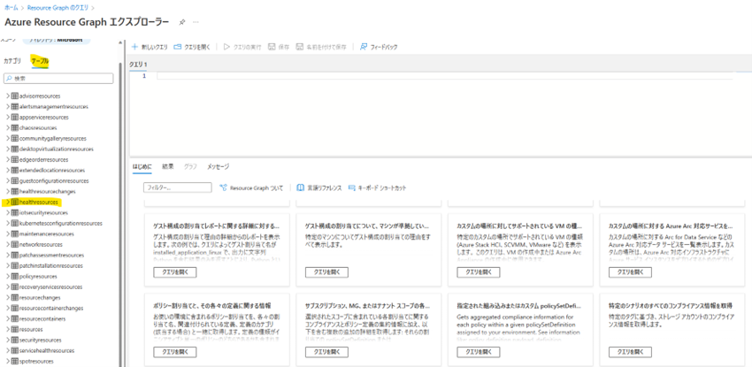
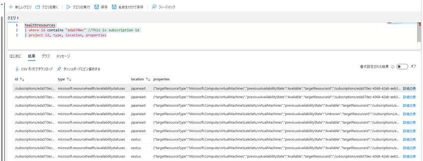
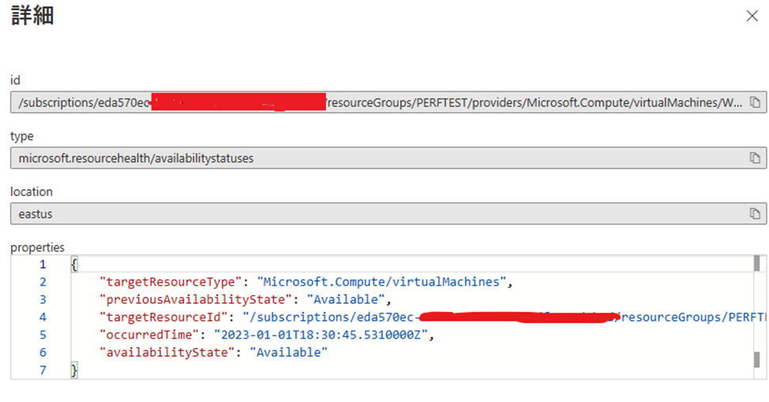
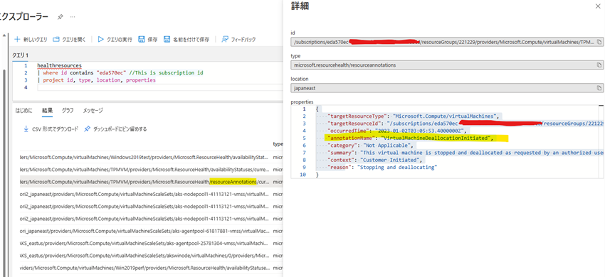
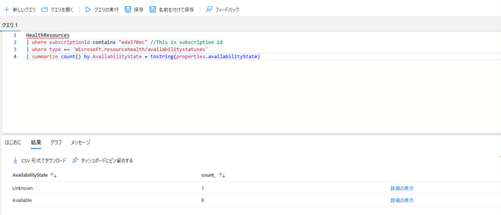
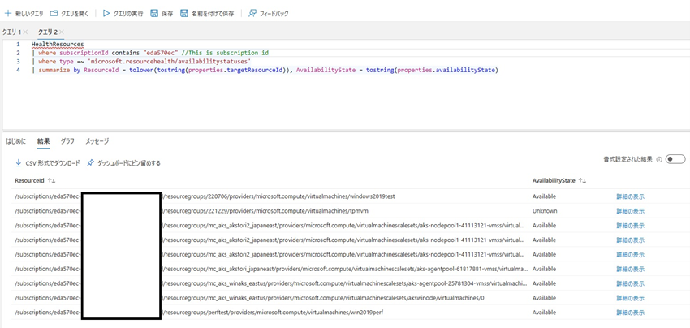
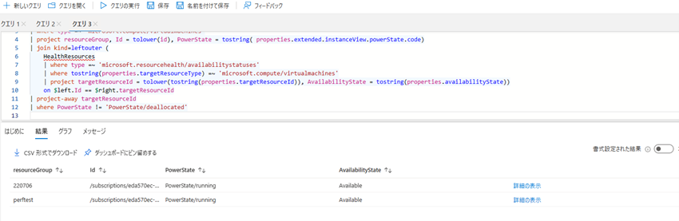
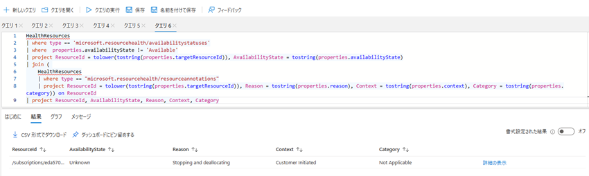
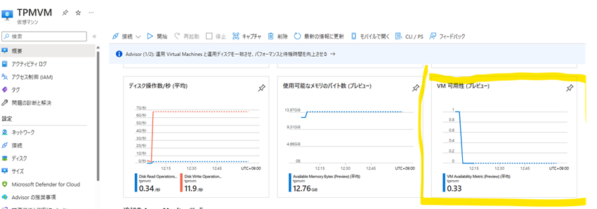
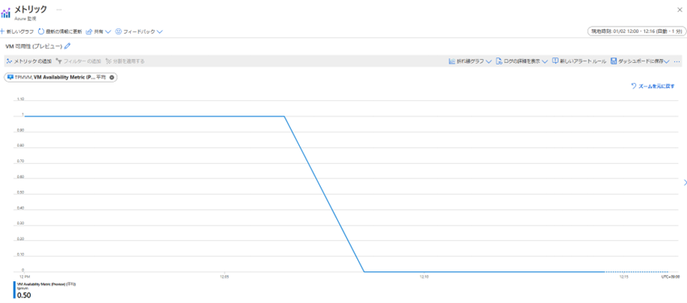

こんにちは。Azure テクニカル サポート チームの鳥越です。

2022年に Azure 仮想マシンの可用性の監視を進化するプロジェクトである Project Flash について、以下のブログで紹介されました。

>  **Project Flash で Azure 仮想マシンの可用性の監視を進化させる**
>  https://azure.microsoft.com/ja-jp/blog/advancing-azure-virtual-machine-availability-monitoring-with-project-flash/

このプロジェクトは Azure 仮想マシンに対して、お客様の可用性監視ニーズを満たすために、次のようなことが行えるように進められております。

- VM の可用性障害 (VM のリブートや再起動のほか、ネットワーク ドライバーの更新によるアプリケーションのフリーズ、30 秒間のホスト OS の更新など) に関する正確で実用的なデータ、および障害の詳細 (プラットフォームのものかユーザー操作によるものか、リブートかフリーズか、計画的か非計画的かなど) を入手する。
- VM の可用性の傾向を分析してアラートを生成し、迅速なデバッグと前月比のレポート作成を実現する。
- データを定期的かつ大規模に監視し、カスタム ダッシュボードを作成して、すべてのリソースの最新の可用性状態について常に最新の情報を提供する。
- 影響を受けた VM、ダウンタイムの原因および期間、結果的な修正などの詳細を示す自動根本原因分析 (RCA) を受け取り、ターゲットを絞った調査および事後分析を行えるようにする。
- VM の可用性に重大な変化があった場合、即座に通知を受け取り、迅速に修復アクションをトリガーし、エンドユーザーへの影響を防止する。
- 刻々と変化するワークロードの感度やフェールオーバーのニーズに基づき、プラットフォームの回復ポリシーを動的に調整し、自動化する。

その中で、上記ブログではプレビューであった [Azure Resource Graph](https://learn.microsoft.com/ja-jp/azure/governance/resource-graph/overview) を用いた VM の可用性情報の監視が GA として公開され、Azure Monitor による VM 可用性メトリックがパブリック プレビューとして公開されました。

>  **New Project Flash Update: Advancing Azure Virtual Machine availability monitoring**
>  https://azure.microsoft.com/en-us/blog/advancing-azure-virtual-machine-availability-monitoring-with-project-flash-update/

このブログでは、Azure Resource Graph を用いた VM の可用性情報がどのように利用できるのかを解説します。
本内容がお客様の VM の監視に少しでもお役に立てられれば幸いです。

<!-- more -->

---

## Azure Resource Graph を用いたVMの可用性情報の監視

Azure Portal より [Azure Resource Graph エクスプローラー](https://learn.microsoft.com/ja-jp/azure/governance/resource-graph/first-query-portal)をご利用いただけます。
Azure Resource Graph エクスプローラーの画面を開き、テーブルから `healthresources` を選択します。



たとえば、次のようなクエリで実行します。

```kusto
healthresources
| where id contains "eda570ec" //This is subscription id
| project id, type, location, properties
```

> [!TIP]
> Azure Resource Graph では、[Kusto Query Language (KQL) クエリ](https://learn.microsoft.com/ja-jp/azure/data-explorer/kusto/query/)を用いて、情報を出力することが可能です。
> 上記は [where 演算子](https://learn.microsoft.com/ja-jp/azure/data-explorer/kusto/query/whereoperator)で `id` の中に `"eba570ec"` があるものに限定して、[project 演算子](https://learn.microsoft.com/ja-jp/azure/data-explorer/kusto/query/projectoperator)で表示される項目を記載しています。  

実行後、次のような結果を得ることができます。



右側の詳細の表示を選択することで値を見やすく見ることが可能となります。



この `healthresources` テーブルには次の項目が存在します。

* `"microsoft.resourcehealth/availabilitystatuses"`
* `"microsoft.resourcehealth/resourceannotations"`

それぞれについて紹介します。

`"microsoft.resourcehealth/availabilitystatuses"` は、Azure プラットフォームによって実行された正常性チェックに基づいて、VM の最新の可用性状態を示します。
VM に対して現在出力されている可用性の状態を次に示します。

* **available**: VM は期待どおりに稼働しています。
* **unavailable**: VM の正常な機能の中断が検出されたため、アプリケーションは期待どおりに実行されません。
* **unknown**: プラットフォームは VM の正常性を正確に検出できません。ユーザーは通常、数分後に更新された状態を確認できます。

> ご参考情報:
> **Resource Health の概要**
> https://learn.microsoft.com/ja-jp/azure/service-health/resource-health-overview
> 　
> **Microsoft.compute/virtualmachines**
> https://learn.microsoft.com/ja-jp/azure/service-health/resource-health-checks-resource-types#microsoftcomputevirtualmachines

`"microsoft.resourcehealth/resourceannotations"`は、VM の可用性に変化があった場合、必要な障害属性を詳細に説明することで、ユーザーが必要に応じて状態を確認調査し、軽減できるようにします。

* **Downtime Annotations**: プラットフォームが VM の可用性が Unavailable に遷移したことを検出すると発行されます。
    * たとえば、予期しないホストのクラッシュ、リブートによる修復操作時など
* **Informational Annotations**: VM の可用性に影響を与えない Azure 基盤に対する処理実施時に発行されます。
    * VM の割り当て / 停止 / 削除 / 開始など
    * 通常、これに対するお客様の追加アクションは必要ありません。
* **Degraded Annotations**: VM の可用性が危険にさらされていることが検出されると発行されます。
    * たとえば、故障予測モデルが、任意の時点で VM を再起動させる可能性のあるハードウェア・コンポーネントの劣化を予測した場合など
    * 予期せぬデータ損失やダウンタイムを避けるため、アノテーション メッセージで指定された期限までに再デプロイするよう強く求めます。

> ご参考情報:
> **Resource Health 仮想マシンの正常性に関する注釈**
> https://learn.microsoft.com/ja-jp/azure/service-health/resource-health-vm-annotation

なお、VM の停止 (割り当て解除) を行った場合には、次のような アノテーション イベントを検知することが可能となります。


 
これらを用いることによりお客様の仮想マシンの可用性の状態を把握することが可能となります。

> [!NOTE]
> 将来的には、この HealthResources データセットに表示されるアノテーション・メタデータについて複数の機能強化が予定されています。
> これらの機能強化により、ユーザーはより豊富な障害属性に確認することができるようになり、障害への対応策を決定的に準備することができるようになります。
> これと並行して、履歴のルックバック期間を最低 30 日間に延長し、ユーザーが VM の可用性の過去の変化を包括的に追跡できるようにすることを目標としています。

## HealthResources に対する便利な クエリ 

### 可用性の状態とサブスクリプション ID 別の仮想マシンの数

各サブスクリプションの可用性の状態で集計された仮想マシン (種類 Microsoft.Compute/virtualMachines) の数を返します。

```kusto
HealthResources
| where type =~ 'microsoft.resourcehealth/availabilitystatuses'
| summarize count() by subscriptionId, AvailabilityState = tostring(properties.availabilityState)
```

実行結果:
Unknown の VM が1台あることが確認できます。


### リソース ID 別の仮想マシンおよび関連する可用性状態の一覧

可用性の状態で集計された仮想マシン (種類 Microsoft.Compute/virtualMachines) の最新の一覧を返します。
また、このクエリでは、デバッグと軽減を容易にするため、properties.targetResourceId に基づいて関連付けられているリソース ID も提供されます。
可用性の状態は、4 つの値、Available、Unavailable、Degraded、Unknown のいずれかです。

```kusto
HealthResources
| where type =~ 'microsoft.resourcehealth/availabilitystatuses'
| summarize by ResourceId = tolower(tostring(properties.targetResourceId)), AvailabilityState = tostring(properties.availabilityState)
```

実行結果:
Unknown の対象 VM は先ほど停止を実施した VM であることが確認できました。


### 可用性状態と電源状態別の仮想マシンの一覧と、そのリソース ID およびリソース グループ

仮想マシンの正常性のまとまりのある状態を提供するために、電源状態と可用性状態で集計された仮想マシン (種類 Microsoft.Compute/virtualMachines) の一覧を返します。
また、このクエリでは、各エントリに関連付けられているリソース グループとリソース ID に関する詳細も提供され、リソースを詳細に表示できます。

```kusto
Resources
| where type =~ 'microsoft.compute/virtualmachines'
| project resourceGroup, Id = tolower(id), PowerState = tostring( properties.extended.instanceView.powerState.code)
| join kind=leftouter (
    HealthResources
    | where type =~ 'microsoft.resourcehealth/availabilitystatuses'
    | where tostring(properties.targetResourceType) =~ 'microsoft.compute/virtualmachines'
    | project targetResourceId = tolower(tostring(properties.targetResourceId)), AvailabilityState = tostring(properties.availabilityState))
    on $left.Id == $right.targetResourceId
| project-away targetResourceId
| where PowerState != 'PowerState/deallocated'
```

実行結果:
停止 (割り当て解除) 状態の VM が除外され表示されます。


### リソース ID 別の使用できない仮想マシンの一覧

可用性の状態で集計された仮想マシン (種類 Microsoft.Compute/virtualMachines) の最新の一覧を返します。
表示された一覧では、可用性の状態が "Available" ではない仮想マシンだけが強調表示され、仮想マシンに関する状態すべてについて確実に認識できます。
すべての仮想マシンが使用可能な場合は、結果が表示されないことが想定できます。

```kusto
HealthResources
| where type =~ 'microsoft.resourcehealth/availabilitystatuses'
| where tostring(properties.availabilityState) != 'Available'
| summarize by ResourceId = tolower(tostring(properties.targetResourceId)), AvailabilityState = tostring(properties.availabilityState)
```

実行結果:
Unavailable や Unknown ステータスの VM が表示されます。


その他、次のようなクエリが利用可能です。

### プラットフォーム主導の計画外の正常性イベントによる影響を受けた可用性状態をもつリソースの一覧

Azure プラットフォームによって予期せず発生した計画外の中断の影響を受けた仮想マシンの最新の一覧を返します。
このクエリは、影響を受けたすべての仮想マシンを ID プロパティで集約し、対応する可用性状態と、特定の中断を要約した関連する注釈 (properties.reason) と共に返します。

```kusto
HealthResources
| where type == "microsoft.resourcehealth/resourceannotations"
| where  properties.category == 'Unplanned' and  properties.context != 'Customer Initiated'
| project ResourceId = tolower(tostring(properties.targetResourceId)), Annotation = tostring(properties.reason)
| join (
    HealthResources
    | where type == 'microsoft.resourcehealth/availabilitystatuses'
    | project ResourceId = tolower(tostring(properties.targetResourceId)), AvailabilityState = tostring(properties.availabilityState))
    on ResourceId
| project ResourceId, AvailabilityState, Annotation
```

### 使用できないリソースとそれぞれの注釈詳細の一覧

現在、使用可能な状態ではない仮想マシンの一覧を、ID プロパティで集約して返します。
また、このクエリによって、仮想マシンの実際の可用性状態と、使用できない理由を含む関連する詳細も示されます。

```kusto
HealthResources
| where type == 'microsoft.resourcehealth/availabilitystatuses'
| where  properties.availabilityState != 'Available'
| project ResourceId = tolower(tostring(properties.targetResourceId)), AvailabilityState = tostring(properties.availabilityState)
| join ( 
     HealthResources
    | where type == "microsoft.resourcehealth/resourceannotations"
    | project ResourceId = tolower(tostring(properties.targetResourceId)), Reason = tostring(properties.reason), Context = tostring(properties.context), Category = tostring(properties.category))
    on ResourceId
| project ResourceId, AvailabilityState, Reason, Context, Category
```

実行結果:


### 可用性の障害による影響を受けたリージョン内のリソースの数と、その影響の種類

現在、使用可能な状態ではない仮想マシンの数を、ID プロパティで集約して返します。
また、クエリによって示される対応する場所と注釈の詳細には、VM が使用可能な状態ではない原因も含まれます。

```kusto
HealthResources
| where type == 'microsoft.resourcehealth/availabilitystatuses'
| where  properties.availabilityState != 'Available'
| project ResourceId = tolower(tostring(properties.targetResourceId)), AvailabilityState = tostring(properties.availabilityState), Location = location
| join (
    HealthResources
    | where type == "microsoft.resourcehealth/resourceannotations"
    | project ResourceId = tolower(tostring(properties.targetResourceId)), Context = tostring(properties.context), Category = tostring(properties.category), Location = location)
    on ResourceId
| summarize NumResources = count(ResourceId) by Location, Context, Category
```

### 特定の正常性イベントによる影響を受けるリソースの一覧と、影響時間、影響の詳細、可用性の状態、リージョン

VirtualMachineHostRebootedForRepair 注釈の影響を受ける仮想マシンの一覧を、その ID プロパティで集約して返します。
また、このクエリは、仮想マシンの対応する可用性状態、中断の時間、影響の原因を含む注釈の詳細を返します。

```kusto
HealthResources
| where type == "microsoft.resourcehealth/resourceannotations"
| where properties.AnnotationName contains 'VirtualMachineHostRebootedForRepair'
| project ResourceId = tolower(tostring(properties.targetResourceId)), Reason = tostring(properties.reason), Context = tostring(properties.context), Category = tostring(properties.category), Location = location, Timestamp = tostring(properties.occurredTime)
| join ( 
    HealthResources
    | where type == 'microsoft.resourcehealth/availabilitystatuses'
    | project ResourceId = tolower(tostring(properties.targetResourceId)), AvailabilityState = tostring(properties.availabilityState), Location = location)
    on ResourceId
| project ResourceId, Reason, Context, Category, AvailabilityState, Timestamp
```

### 計画イベントによる影響を受けたリソースのリージョンごとの一覧

Azure プラットフォームによって実施された計画的なメンテナンスまたは修復操作の影響を受けた仮想マシンの一覧を、ID プロパティで集約して返します。
また、このクエリは、仮想マシンの対応する可用性状態、中断の時間、場所、影響の原因を含む注釈の詳細を返します。

```kusto
HealthResources
| where type == "microsoft.resourcehealth/resourceannotations"
| where properties.category contains 'Planned'
| project ResourceId = tolower(tostring(properties.targetResourceId)), Reason = tostring(properties.reason), Location = location, Timestamp = tostring(properties.occuredTime)
| join ( 
    HealthResources
    | where type == 'microsoft.resourcehealth/availabilitystatuses'
    | project ResourceId = tolower(tostring(properties.targetResourceId)), AvailabilityState = tostring(properties.availabilityState), Location = location)
    on ResourceId
| project ResourceId, Reason, AvailabilityState, Timestamp, Location
```

### 計画外のプラットフォーム中断の影響を受けたリソースの一覧と、可用性、電力状態、場所

Azure プラットフォームによって実施された計画的なメンテナンスまたは修復操作の影響を受けた仮想マシンの一覧を、ID プロパティで集約して返します。
また、このクエリによって、仮想マシンの対応する可用性状態、電力状態、場所の詳細も示されます。

```kusto
HealthResources
| where type =~ 'microsoft.resourcehealth/resourceannotations'
| where tostring(properties.context) == 'Platform Initiated' and tostring(properties.category) == 'Planned'
| project ResourceId = tolower(properties.targetResourceId), Location = location
| join (
    HealthResources
    | where type =~ 'microsoft.resourcehealth/availabilitystatuses'
    | project ResourceId = tolower(properties.targetResourceId), AvailabilityState = tostring(properties.availabilityState), Location = location)
    on ResourceId
| join (
    Resources
    | where type =~ 'microsoft.compute/virtualmachines'
    | project ResourceId = tolower(id), PowerState = properties.extended.instanceView.powerState.code, Location = location)
    on ResourceId
| project ResourceId, AvailabilityState, PowerState, Location
```

次に Azure Monitor による VM の可用性メトリックを紹介します。

## Azure Monitor による VM の可用性メトリック (Preview) 

VM 可用性についてのメトリックが取得できるようになりました。
このメトリックを用いることで、可用性が低下した場合に、しきい値ベースのメトリックアラートを設定し、適切な軽減措置を迅速にトリガーするよう設定することが可能となりました。



 
上記の結果より、VM を停止したことで可用性の低下が発生したことを確認できます。

## 最後に

Azure ではこの Project Flash を通じて、お客様のエクスペリエンスの継続的な改善を目的とし監視プラットフォームの強化を実施してまいります。

以前は Azure 基盤で発生した問題について、何が起こったのかわからず大きな不安を抱えることもあったかと存じます。

Azure 基盤で発生した問題について、お客様の視認性を強化し、可能な限り迅速に情報提供をすることで、お客様への影響とご不安を最小限にするように引き続き信頼性向上に努めてまいります。
