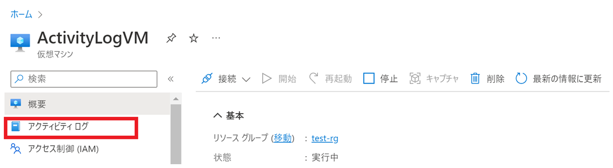
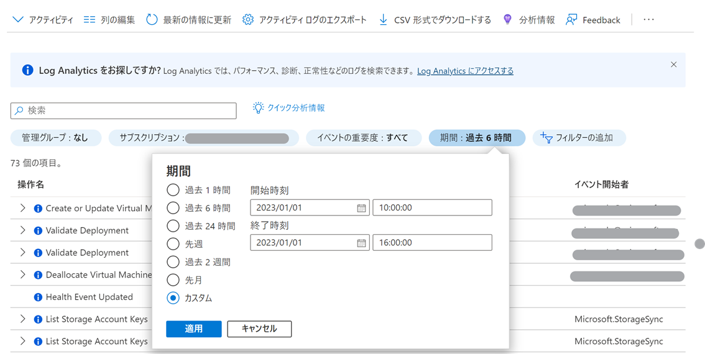
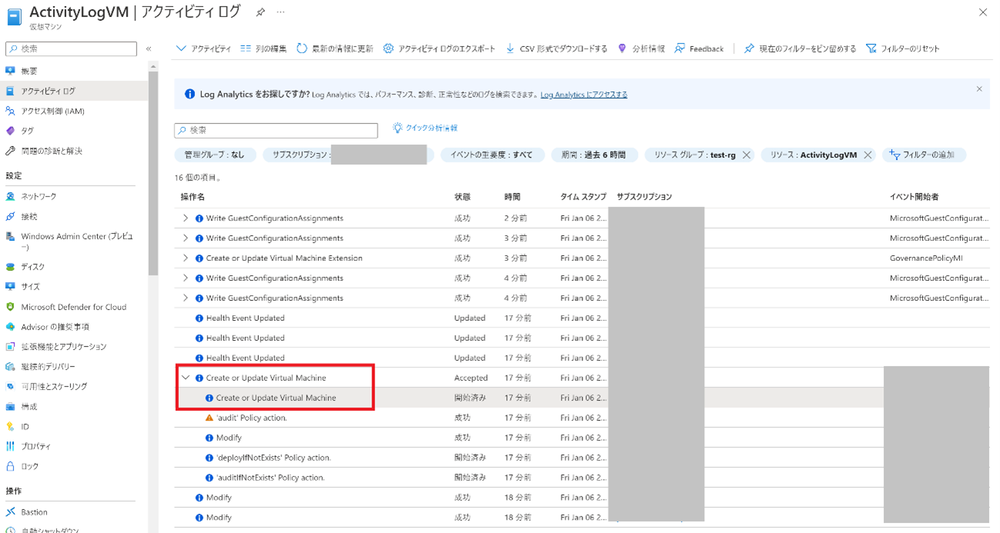
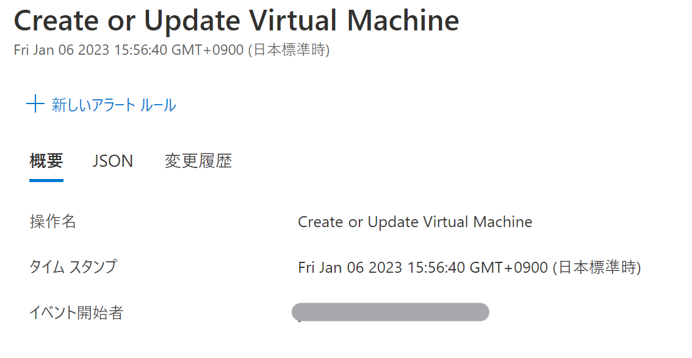
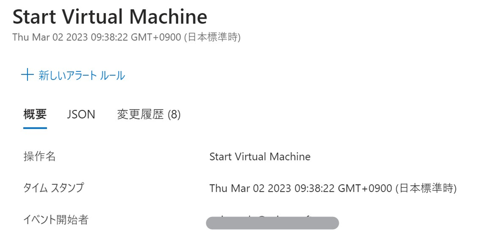
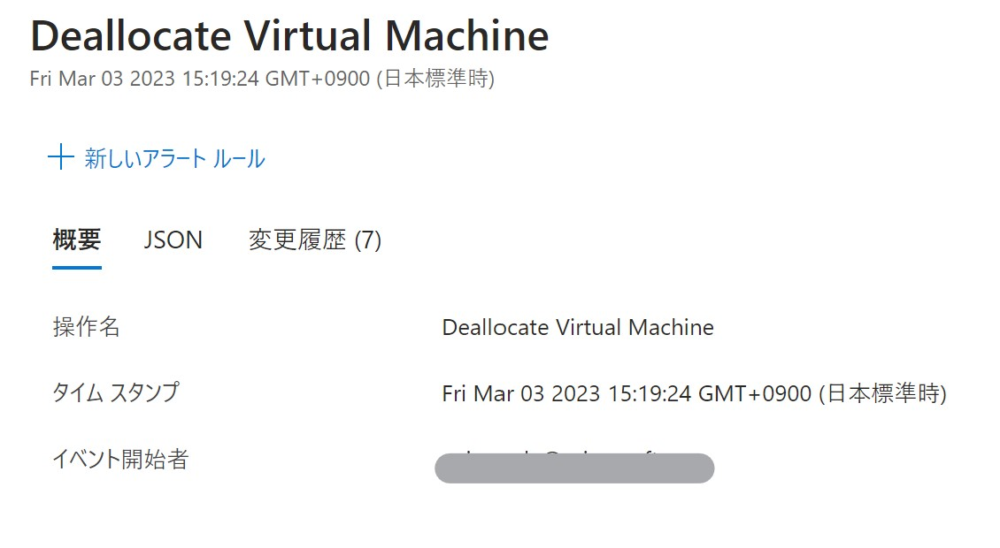

こんにちは。Azure テクニカル サポート チームの前田です。

今回は、よくお問い合わせをいただいております、Azure VM の作成者が不明な場合の確認方法についてご紹介いたします。  
本ブログでは Azure VM を例に紹介いたしますが、ストレージ アカウントなど他のリソースでも応用が可能な内容となりますので、皆様のご参考となりましたら幸いでございます。

---
## 使用する機能について
Azure VM の作成者の特定には、アクティビティ ログを利用いたします。  
アクティビティ ログとは、Azure のプラットフォーム ログであり、様々な操作、イベントに関する情報を記録しております。  
本件でご紹介いたします Azure VM 等リソースの作成の他、VM の起動、停止などの履歴も記録されますので、一度は目にしたことのある方も多い機能かと存じます。
今回は数あるイベントの中から、VM の作成時に記録される内容についてご紹介いたします。

参考) Azure Monitor アクティビティ ログ  
https://learn.microsoft.com/ja-jp/azure/azure-monitor/essentials/activity-log?tabs=powershell

---
## アクティビティ ログの確認方法
では早速、VM 作成時のアクティビティ ログを確認してまいります。  
今回は特定の Azure VM のアクティビティ ログより確認を行いますが、アクティビティ ログはリソース グループおよびサブスクリプション単位での確認も可能でございますので、状況に合わせスコープを選定いただければと存じます。

また、アクティビティ ログは絞り込んだ期間内のログに関し、CSV 形式にてダウンロードすることも可能でございますので、ご都合の良い手法にてご確認をお願いいたします。

[Virtual Machine] より [アクティビティ ログ] を選択します。

検索期間がデフォルトでは直近 6 時間となっているため、VM を作成したおおよその日時で [カスタム] より絞り込みを行います。  
絞り込みが難しい場合、ログの保存期間である 90 日間となるよう日時を指定します。

最も古い [Create or Update Virtual Machine] の項目をクリックします。

 
表示された項目のうち、[イベント開始者] のユーザーが VM の作成者となります。

なお、上記確認方法について注意点が 2 点ございます。

1. アクティビティ ログの保存期間について  
このアクティビティ ログは単独での保存期間が 90 日となりますため、これを超過しており、かつ別の場所へのログの退避を実施していない場合、ご利用いただくことが叶いませんので、予めご了承いただければと存じます。

2. [Create or Update Virtual Machine] の該当項目について  
上記の項目につきましては、VM の作成の他、VM のサイズ変更等の際にも表示されるログとなります。  
このため、上記名称のより古いログがございます場合は、再度ご確認をいただく必要がございます。

---
## その他、よく利用されるアクティビティ ログ
VM の作成者のほか、VM の起動、割り当て解除を実施したユーザーの確認方法につきましても多くお問い合わせをいただきますことから、併せてアクティビティ ログの出力内容についてご紹介いたします。

### ■ VM の起動ユーザー
アクティビティ ログの出力のうち、Start Virtual Machine が該当します。  
イベント開始者が VM を起動したユーザーです。

 

### ■ VM の割り当て解除の実施ユーザー
アクティビティ ログの出力のうち、Deallocate Virtual Machine が該当します。  
イベント開始者が VM の割り当て解除を実施したユーザーです。
 

---
## おわりに
いかがでしたでしょうか。  
以上が Azure VM の作成者をアクティビティ ログから特定する方法でございました。  
この他にも Azure VM のアクティビティ ログには様々な内容が記録されますので、添付いたしました弊社ドキュメントを含めぜひご活用いただければと存じます。  
本記事が皆様のお役に立つ内容となっておりましたら幸いでございます。

