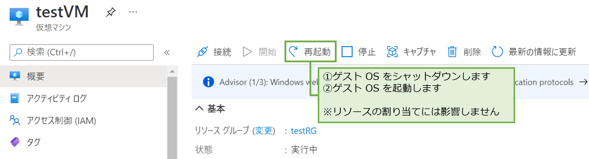
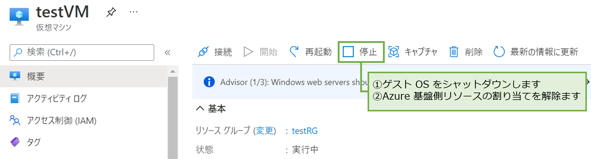
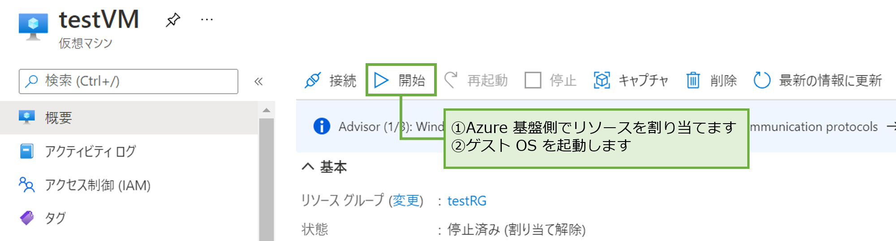
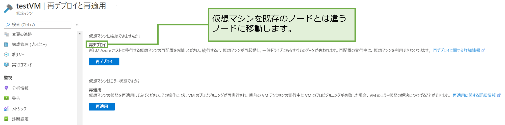
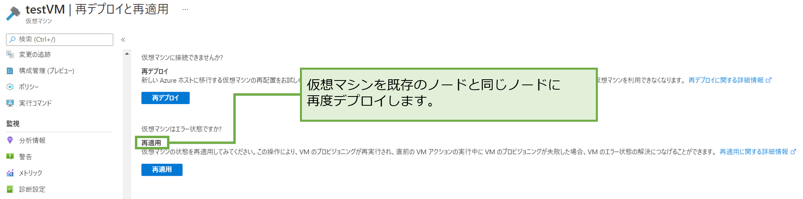

こんにちは。Azure テクニカル サポート チームの洪です。

Azure 仮想マシンで予期せぬ問題が発生した際に、切り分けとして再起動や再デプロイをご案内することがありますが、その際、お客様よりそれぞれの操作の違いや目的についてご質問いただくことがあります。

そこで今回は、 Azure 仮想マシンに対して行う操作として、「再起動」、「停止 (割り当て解除) / 起動」、 「再デプロイ」、「再適用」に関しまして、それぞれの操作の違いに関して説明します。

 

## ■ 各操作に関する概要

各操作をご実施いただいた際に、「ゲスト OS の再起動」や「物理ホストの移動」が発生するか否かについて、下記の表の通りおまとめします。

| 操作 | ゲスト OS の再起動 | 物理ホストの移動 |
|----|----|----|
| 再起動 | 〇 | × |
| 停止 (割り当て解除) / 起動 | 〇 | △ ※1 |
| 再デプロイ | 〇 | 〇 |
| 再適用 | △ ※2 | × |

※1 明示的に物理ホスト サーバーの移動を行うわけではございません。可能性として、停止前と同一の物理ホスト サーバーで起動する場合もございます。
 
※2 仮想マシンの再起動が必須となる操作ではありませんが、目標となるあるべき状態 (Goal State) に実体が追いつこうとした動作の結果、再起動が発生する可能性があります。

 

## ■ 仮想マシンの再起動

再起動は、**ゲスト OS の再起動** を実施する操作です。ゲスト OS として Graceful Shutdown ※1 を実施し、その後起動します。
再起動による物理ホスト サーバーの移動は発生しません。
ゲスト OS 内のプロセスが正常な状態となっていない場合の切り分けとして、再起動の実行をご案内しています。

### Azure Portal での操作画面

>※1 Graceful Shutdown とは、仮想マシンをシャットダウンする際にシステム内部で決められた手順に従い正常に仮想マシンを終了させることを意味します。

## ■ 仮想マシンの停止 (割り当て解除) / 起動

停止 (割り当て解除) は、仮想マシンが稼働する **物理ホスト サーバーから割り当てられているリソースの割り当てを解除** する操作であり、起動は **物理ホスト サーバーからリソースを割り当てる** 操作です。
再デプロイと異なり、明示的に別の物理ホスト サーバーでデプロイを行うための手段ではありませんが、起動時に物理ホスト サーバーが前回と異なる場合がほとんどになります。

停止 (割り当て解除) では、仮想マシンとしての課金はかかりません。(※ ディスクの課金はかかります。)

> ご参考) 仮想マシンの課金の仕組み   [https://docs.microsoft.com/ja-jp/archive/blogs/dsazurejp/23](https://docs.microsoft.com/ja-jp/archive/blogs/dsazurejp/23)

### Azure Portal での操作画面

>※ゲスト OS 上でのみシャットダウンを実行した場合には、ポータルの画面より仮想マシンの状態が **停止済み (割り当て解除)** ではなく、**停止済み** と表記されます。この場合はリソースがまだ割り当てられている状態との意味ですので課金が続けられます。

## ■ 仮想マシンの再デプロイ

再デプロイとは、仮想マシンが稼働する **物理ホスト サーバーを明示的に変更** する操作です。
つまり、仮想マシンへのリソース割り当てを一度解除し、これまで稼働していた物理ホスト サーバーとは別の物理ホスト サーバーにて、仮想マシンに再度リソース割り当てを行います。
割り当ての対象となるリソースとは、vCPU コア、メモリ、NIC、一時ディスクなどの物理リソースです。

物理ホスト サーバー起因の問題が疑われている場合の切り分けとして、再デプロイの実行をご案内しています。

> ご参考) ホスト サーバーの障害   [https://docs.microsoft.com/ja-jp/troubleshoot/azure/virtual-machines/understand-vm-reboot#host-server-faults](https://docs.microsoft.com/ja-jp/troubleshoot/azure/virtual-machines/understand-vm-reboot#host-server-faults)

### 注意事項
再デプロイを行う際は、下記の 2 点を注意する必要があります。

- 一時ディスクがある仮想マシン サイズをご利用の場合は、既存の一時ディスクは破棄され、新しくデプロイ先となった物理ホスト サーバーより再度割り当てられます。
- 仮想マシンに関連付けられた動的な IP アドレスは更新されます。

### Azure Portal での操作画面

## ■ 仮想マシンの再適用

再適用は、同一物理ホスト サーバー内で **リソースの操作自体は行わずに、リソースの GoalState (あるべき状態) の情報を、もう一度流し込む** 操作です。

前回の操作で何らかの理由で GoalState の状態に遷移ができずエラーになってしまった設定変更処理に対して、もう一度同じ GoalState の情報を流し込むことで、前回の設定変更処理をやり直す操作となります。再適用を実施しますと、本来想定していた GoalState に到達するために必要となる操作 (再プロビジョニングなど) が行われます。

VM プロビジョニング起因の問題が疑われている場合の切り分けとして、再適用の実行をご案内しています。

### Azure Portal での操作画面

本情報の内容（添付文書、リンク先などを含む）は、作成日時点でのものであり、予告なく変更される場合があります。

本稿が皆様のお役に立てれば幸いです。
