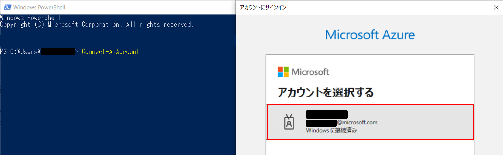
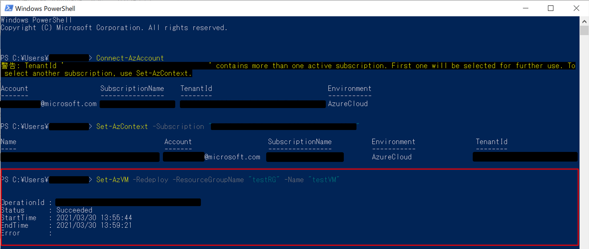

こんにちは。Azure テクニカル サポート チームの洪です。

Azure 仮想マシンで接続不可などの問題が発生した際に、切り分けとして再起動や再デプロイをご案内することがあります。

今回は Azure 仮想マシンの再デプロイに関しましてご説明させていただき、その実施方法（Azure ポータル、Azure Powershell）に関しましてもお伝えさせていただきます。

<hr>

## ■ 再デプロイ
再デプロイとは、仮想マシンが稼働する**物理ホストサーバーを変更**することを指します。
つまり、仮想マシンが稼働する物理ホストサーバー(＝ノード)を移動して再度同じ内容のマシンを他の場所に展開ことを意味します。
<br>既存で使っていたリソースの割り当てを解除した後、新しいリソースに再度割り当てを実施する、とも表現します。
<br>割り当ての対象となるリソースとは、vCPU コア、メモリ、NIC、一時ディスクなどの物理リソースを示します。


仮想マシンへの接続ができない (RDP/SSH) 等の問題が発生した場合に、リソースの再割り当て（再デプロイ）を実行することで、接続障害が解消されることがあります。

再デプロイを行う際は、下記の2点を注意する必要があります。

- 一時的なディスクのデータが失われるということ
- 仮想マシンに関連付けられた動的な IP アドレスが更新されるということ

<hr>

## ■ 仮想マシンを新しいノードへ再デプロイする

### ■ Azure ポータルを使用する
1. 再デプロイする仮想マシンを選択し、 [ サポート＋トラブルシューティング ] ブレードの [ 再展開と再適用 ] ボタンをクリックします。
<br>※再デプロイは、リソースの再割り当てを実施する作業であるため、既存VMが割り当て解除中ですと実施できません。VMが実行中か、停止中であれば割り当てが解除されていないかを確認して実施する必要があります。再デプロイ後もこの状態が維持されます。


2. [ 再デプロイ ] ボタンをクリックします。


3. "仮想マシンが正常に再デプロイされました" との通知が表示されましたら再デプロイ完了となります。


<br>

### ■ Azure PowerShellを利用して再デプロイを実施する
>こちらの手順では下記の PowerShell モジュールを使用しています。最新のモジュールに関しましては各リンクを参考してください。
>- PowerShell 7.1 
>([PowerShell をインストールする](https://docs.microsoft.com/ja-jp/powershell/scripting/install/installing-powershell))
>- AzPowerShell 5.7.0
>([Azure PowerShell をインストールする](https://docs.microsoft.com/ja-jp/powershell/azure/install-az-ps))
>　<br>　

1. ポータル上で対象仮想マシンの状態が '進行中' または '停止済み' であることを確認します。


2. PowerShellを開き、下記の Azure ログインコマンドを実行します。ポップアップウィンドウが表示されましたら Azure の資格情報を入力します。


```PowerShell
Connect-AzAccount
```


3. 資格情報入力後、ログインが成功したら、サブスクリプション情報が表示されます。


4. 1つのアカウントに複数のサブスクリプション情報が含まれる場合は一番最初のサブスクリプションが選択されますので、ここでは下記のコマンドで今回作業するサブスクリプションを指定します。

```PowerShell
Set-AzContext -Subscription <サブスクリプションID>
```

5. 下記コマンドで仮想マシンを再デプロイします。

```PowerShell
Set-AzVM -Redeploy -ResourceGroupName <リソースグループ名> -Name <仮想マシン名>
```

6. ポータル上で仮想マシンの状態が'更新中'となっていることが確認できます。


7. しばらく時間がたつと、PowerShell コマンドが成功していることが確認できます。


8. ポータル上でも対象仮想マシンの状態が '実行中' に戻っていることが確認できます。


<hr>

本情報の内容（添付文書、リンク先などを含む）は、作成日時点でのものであり、予告なく変更される場合があります。

また、本記事は下記の公式ドキュメントを参考しております。

- [Windows 仮想マシンを新しい Azure ノードに再展開する](https://docs.microsoft.com/ja-jp/troubleshoot/azure/virtual-machines/redeploy-to-new-node-windows)

本稿が皆様のお役に立てれば幸いです。
