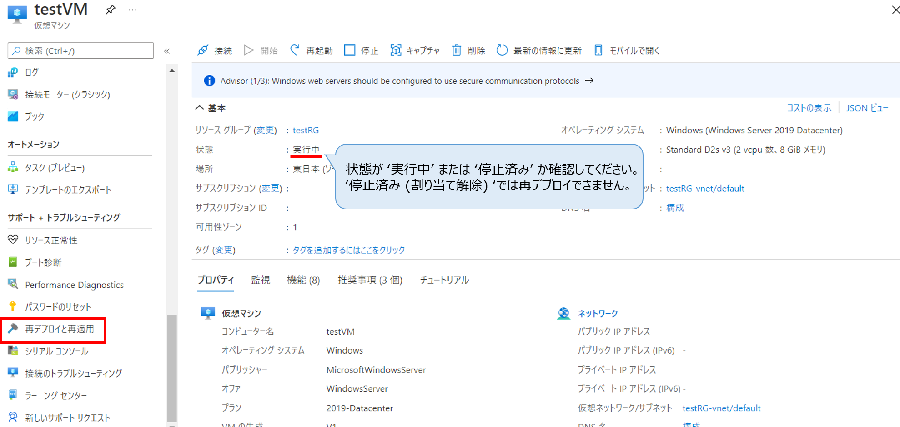
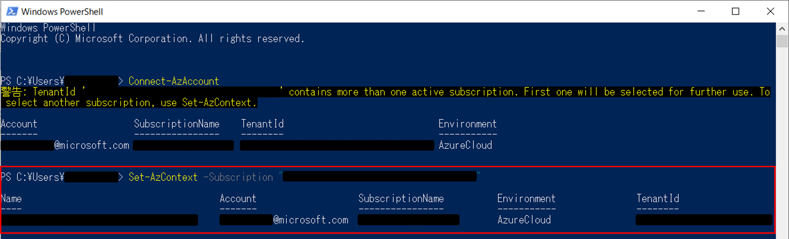

こんにちは。Azure テクニカル サポート チームの洪です。

Azure 仮想マシンで接続不可などの問題が発生した際に、Azure 仮想マシンがデプロイされている物理ホスト サーバー起因の問題の切り分けとして再デプロイをご案内することがあります。

今回は、当サポート チームの旧ブログでご紹介しておりました再デプロイに関する情報を更新した上で、改めて Azure 仮想マシンの再デプロイの概要と、その実施方法（Azure ポータル、Azure Powershell）をご紹介いたします。

更新元の記事：[仮想マシンを新しいノードへ再デプロイする](https://jpaztech1.z11.web.core.windows.net/%E4%BB%AE%E6%83%B3%E3%83%9E%E3%82%B7%E3%83%B3%E3%82%92%E6%96%B0%E3%81%97%E3%81%84%E3%83%8E%E3%83%BC%E3%83%89%E3%81%B8%E5%86%8D%E3%83%87%E3%83%97%E3%83%AD%E3%82%A4%E3%81%99%E3%82%8B.html)

<!--more-->

<hr>

## ■ 再デプロイ
再デプロイとは、仮想マシンが稼働する**物理ホスト サーバーを明示的に移動させる (変更する)** 操作です。
仮想マシンが稼働する物理ホスト サーバーからリソースの割り当てを解除し、同じ内容の仮想マシンを他の場所 (前回とは別の物理ホスト サーバー)で展開することを意味します。
割り当ての対象となるリソースとは、vCPU コア、メモリ、NIC、一時ディスクなどの物理リソースを示します。


仮想マシンへの接続ができない (RDP/SSH) 等の問題が発生した際に、Azure プラットフォームや Azureネットワークの根底にある問題起因である場合、リソースの再割り当て（再デプロイ）を実行することで接続障害が解消されることがあります。

再デプロイを行う際は、下記の2点を注意する必要があります。

- 一時的なディスクのデータが失われるということ
- 仮想マシンに関連付けられた動的な IP アドレスが更新されるということ

<hr>

## ■ 仮想マシンを新しい物理ホスト サーバーへ再デプロイする

### ■ Azure ポータルを使用する

1. 再デプロイする仮想マシンを選択し、 [ サポート＋トラブルシューティング ] ブレードの [ 再展開と再適用 ] ボタンをクリックします。
なお、再デプロイは、リソースの再割り当てを実施する作業であるため、仮想マシンが割り当て解除済みの状態ですと実施することができません。
仮想マシンが実行中か、停止中 (ゲスト OS のシャットダウンのみ) であることを確認してご実施ください。



2. [ 再デプロイ ] ボタンをクリックします。


3. "仮想マシンが正常に再デプロイされました" との通知が表示されましたら再デプロイ完了となります。


### ■ Azure PowerShell を利用して再デプロイを実施する
こちらの手順では下記の PowerShell モジュールを使用しています。最新のモジュールについては各リンクをご確認ください。

>- PowerShell 7.1 
>([PowerShell をインストールする](https://docs.microsoft.com/ja-jp/powershell/scripting/install/installing-powershell))
>- AzPowerShell 5.9.0
>([Azure PowerShell をインストールする](https://docs.microsoft.com/ja-jp/powershell/azure/install-az-ps))


1. ポータル上で対象仮想マシンの状態が '実行中' または '停止済み' であることを確認します。


2. PowerShell を開き、下記の Azure ログイン コマンド ([Connect-AzAccount](https://docs.microsoft.com/en-us/powershell/module/az.accounts/Connect-AzAccount?view=azps-5.9.0)) を実行します。

```PowerShell
Connect-AzAccount
```

表示例 :


3. ログインが成功したら、サブスクリプション情報が表示されます。


4. 1 つのアカウントに複数のサブスクリプション情報が含まれる場合は、一番最初のサブスクリプションが選択されます。そのため、必要に応じて作業するサブスクリプションを指定 ([Set-AzContext](https://docs.microsoft.com/en-us/powershell/module/az.accounts/Set-AzContext?view=azps-5.9.0)) します。

```PowerShell
Set-AzContext -Subscription <サブスクリプションID>
```



5. 下記コマンド ([Set-AzVM](https://docs.microsoft.com/en-us/powershell/module/az.compute/set-azvm?view=azps-5.9.0#:~:text=The%20Set-AzVM%20cmdlet%20marks%20a%20virtual%20machine%20as,and%20use%20Sysprep%20to%20prepare%20the%20hard%20disk.)) で仮想マシンを再デプロイします。

```PowerShell
Set-AzVM -Redeploy -ResourceGroupName <リソースグループ名> -Name <仮想マシン名>
```

  


6. ポータル上で仮想マシンの状態が **'更新中'** となっていることが確認できます。


7. しばらく時間がたつと、PowerShell コマンドが成功していることが確認できます。


8. ポータル上でも対象仮想マシンの状態が **'実行中'** に戻っていることが確認できます。


<hr>

また、本記事は下記の公式ドキュメントを参考しております。

- [新しい Azure ノードへの Windows 仮想マシンの再デプロイ](https://docs.microsoft.com/ja-jp/troubleshoot/azure/virtual-machines/redeploy-to-new-node-windows)
- [新しい Azure ノードへの Linux 仮想マシンの再デプロイ](https://docs.microsoft.com/ja-jp/troubleshoot/azure/virtual-machines/redeploy-to-new-node-linux)

本稿が皆様のお役に立てれば幸いです。
