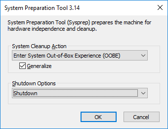
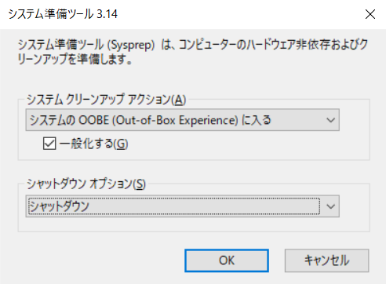
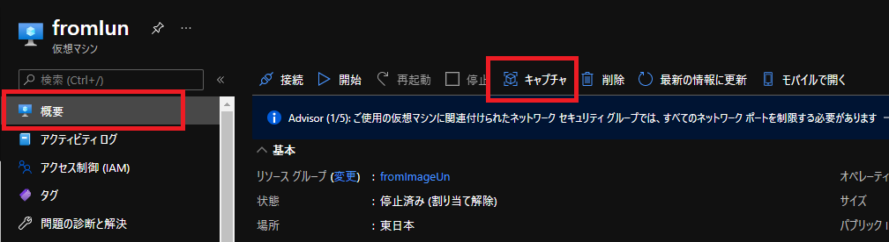
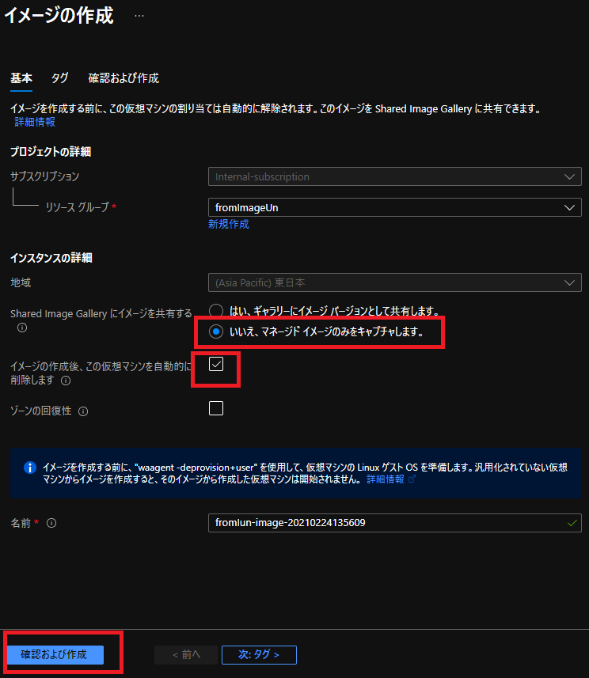
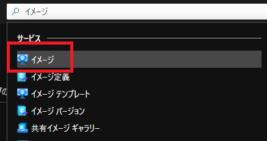
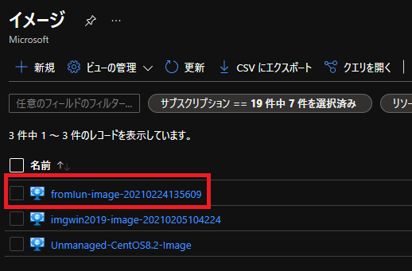
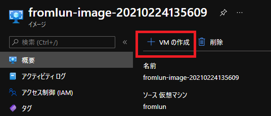
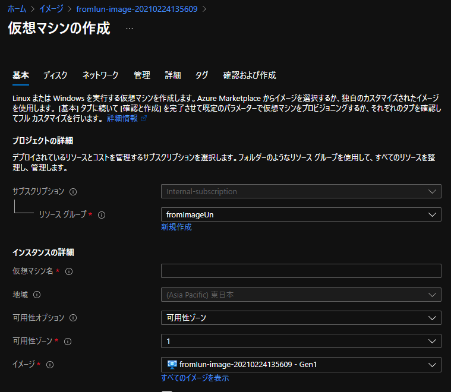

こんにちは、Azure テクニカル サポート チームの富田です。  
今回は一般化したイメージから VM を複製する手順について、Azure ポータル上での手順をスクリーンショット付きで詳細に説明したいと思います。  

本記事は 3 部作の 2 記事目です。
 1. [VM 複製方法について 2 つの方法の紹介](https://jpaztech.github.io/blog/vm/vm-replica-1)
 2. [一般化したイメージから VM を複製する手順](https://jpaztech.github.io/blog/vm/vm-replica-2)
 3. [OS ディスクのスナップショットから VM を複製する手順](https://jpaztech.github.io/blog/vm/vm-replica-3)

そのため 1 記事目の [VM 複製方法について 2 つの方法の紹介](https://jpaztech.github.io/blog/vm/vm-replica-1) をご覧いただいている前提で記載させていただきます。  

本記事では Azure ポータルで、一般化したイメージを使用し、VM を複製する詳細な方法をご紹介します。
また、マネージド ディスクの使用を前提とさせていただきますので、アンマネージド ディスクをご利用いただいている場合は、下記手順より VM をマネージドディスクに変換をお願いいたします。

- Azure VM を Azure Managed Disks に移行する  
[https://docs.microsoft.com/ja-jp/azure/virtual-machines/windows/migrate-to-managed-disks](https://docs.microsoft.com/ja-jp/azure/virtual-machines/windows/migrate-to-managed-disks)

一般化をするにあたり、下記の点についてはバックアップが無い場合取り返しがつきませんのでご注意ください。
念のため、バックアップをご取得いただいてからご実施いただくことをお勧めいたします。
 - 一般化を行うとマシン固有のファイルとデータは削除されます
 - 一般化を行ったVMは起動できなくなります

## 大まかな流れ

1. 複製元となる VM を作成する
2. 作成した VM で必要なソフトウェアのインストールや設定を行う
3. VM を一般化（マシン固有のファイルとデータを削除）する
4. 一般化した VM より [イメージ] を作成する
5. 作成した [イメージ] より新規 VM を必要な数だけ作成する

## 実際の手順

それでは、上記の大まかな流れに沿って実際の手順をやってみましょう。   

---
### 1. 複製元となる VM を作成する

複製元となる VM を作成します。詳細な手順は下記公開情報を確認いただき、ご実施ください。

- 参考: クイック スタート:Azure Portal で Windows 仮想マシンを作成する  
[https://docs.microsoft.com/ja-jp/azure/virtual-machines/windows/quick-create-portal](https://docs.microsoft.com/ja-jp/azure/virtual-machines/windows/quick-create-portal)

- 参考: クイック スタート:Azure portal で Linux 仮想マシンを作成する  
[https://docs.microsoft.com/ja-jp/azure/virtual-machines/linux/quick-create-portal](https://docs.microsoft.com/ja-jp/azure/virtual-machines/linux/quick-create-portal)

---
### 2. 作成したVMで必要なソフトウェアのインストールや各種設定を行う

VM を作成した後に、必要なソフトウェアをインストールしたり、各種設定を行います。こちらは、個々の要件に沿って実施してください。

---
### 3. VM を一般化 (マシン固有のファイルとデータを削除) する

一般化はゲスト OS 内部の操作で行うものとなります。  
一般化の手順は Windows / Linux 両方とも公開情報にまとまっておりますので、下記をご参照の上、一般化を行い VM をシャットダウンします。  

---
#### 3-1. Windows VM で一般化を行う方法

- 参考: Sysprep を使用して Windows VM を一般化する  
[https://docs.microsoft.com/ja-jp/azure/virtual-machines/windows/capture-image-resource#generalize-the-windows-vm-using-sysprep](https://docs.microsoft.com/ja-jp/azure/virtual-machines/windows/capture-image-resource#generalize-the-windows-vm-using-sysprep)

---
#### 注意事項: Windows の Sysprep の設定を間違えないこと！

Windows OS では sysprep.exe を使って一般化を行いますが、最後の設定を間違えて、一般化したにもかかわらずその後複製した VM が正常に起動しないということがあります。

Sysprep.exe の画面は既定値ではなく、必ず下記スクリーンショットの設定になっていることを確認します。  
Generalize（一般化）のチェック ボックスにチェックが入っており、  
シャットダウン オプションが Shutdown（シャットダウン）となっている必要がありますのでご注意ください。

英語の場合:   
 

日本語の場合:   
 

---
#### 3-2. Linux VM で一般化を行う方法

参考: 手順 1:VM のプロビジョニングを解除する  
https://docs.microsoft.com/ja-jp/azure/virtual-machines/linux/capture-image#step-1-deprovision-the-vm

今回はポータルからイメージを作成しますので、[手順 1:VM のプロビジョニングを解除する] が完了したら VM を停止しましょう。

---
### 4. 一般化したVMより [イメージ] を作成する

ここまでの操作により、ゲスト OS 上で一般化が完了して VM は停止状態になりますので、[イメージ] を Azure ポータル上で作成します。  

まずは Azure ポータルにて、対象の VM の概要ブレードを開きます。概要ブレード上部の [キャプチャ] を選択します。

 

[キャプチャ] を選択すると、イメージを作成する画面が表示されます。
下記例では、ミニマムな設定にしているため、共有イメージ ギャラリーでのイメージ共有はしない設定にしています。  
また、ゾーンの回復性についても、設定はしていません。

なお、一般化を行った VM は起動できなくなるため、[この仮想マシンを自動的に削除] にチェックを入れて一般化を行った VM は削除します。

 

各種オプションは、要件に合わせて変更してお使いください。
各種設定が完了したら、[確認および作成] - [作成] をクリックします。

---
### 5.作成した [イメージ] より新規VMを必要な数だけ作成する

ここまでの操作により [イメージ] が作成されましたので、この [イメージ] を用いて VM を作成（複製）します。  

まずは、Azure ポータル上部の検索ボックスよりイメージを検索します。

 

先ほど作成したイメージが表示されますので、これを選択します。

 

次に、上部に [VM の作成] がありますので、これを選択します。

 

すると、VM 作成画面が表示されますので、新規 VM を作成するのと同じ要領で VM を作成します。

 

以上が、Azure ポータルでのイメージを用いた VM 複製方法となります。  
今回は説明のため、Azure ポータルを用いたミニマムな設定での説明となりましたが、もちろん PowerShell を用いた展開やイメージ作成時にイメージ共有などの設定も可能です。
本記事が、基本的な手順としてお役に立てれば幸いです。
