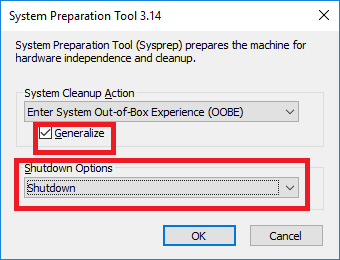
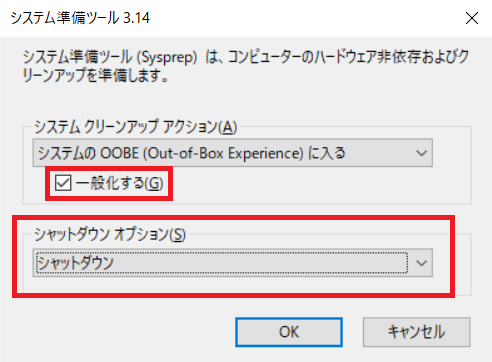

こんにちは、Azure テクニカル サポート チームの富田です。  
今回は一般化したイメージからVMを複製する手順について、  
Azureポータル上での手順をスクリーンショット付きで詳細に説明したいと思います。  

本記事は3部作の2記事目です。  
 1. <a href="../vm-replica-1">VM複製方法について 2つの方法の紹介</a>
 2. <a href="../vm-replica-2">一般化したイメージからVMを複製する手順</a>
 3. <a href="../vm-replica-3">OSディスクのスナップショットからVMを複製する手順</a>

そのため1記事目の <a href="../vm-replica-1">VM複製方法について</a> をご覧いただいている前提で記載させていただきます。  

本記事ではAzureポータルで、一般化したイメージを使用し、VMを複製する方法を詳細に記載します。

こちらの記事ではマネージドディスクの使用を前提とさせていただきますので、  
アンマネージドディスクをご利用いただいている場合は、  
はじめに、下記手順でVMをマネージドディスクに変換をお願いいたします。

- Azure VM を Azure Managed Disks に移行する  
https://docs.microsoft.com/ja-jp/azure/virtual-machines/windows/migrate-to-managed-disks

一般化をするにあたり、下記の点についてはバックアップが無い場合取り返しがつきませんのでご注意ください。
 - 一般化を行うとマシン固有のファイルとデータは削除されます
 - 一般化を行ったVMは起動できなくなります

# 大まかな流れ

1. 複製元となるVMを作成する
2. 作成したVMで必要なソフトウェアのインストールや設定を行う
3. VMを一般化（マシン固有のファイルとデータを削除）する
4. 一般化したVMより [イメージ] を作成する
5. 作成した [イメージ] より新規VMを必要な数だけ作成する

# 実際の手順

それでは、上記の大まかな流れに沿って実際の手順をやってみましょう。   

---
## 1.複製元となるVMを作成する

複製元となる仮想マシンを作成します。  
こちらは詳細な手順は割愛させていただきますので、下記資料をご参考にVMを作成ください。  

- 参考: クイック スタート:Azure Portal で Windows 仮想マシンを作成する  
https://docs.microsoft.com/ja-jp/azure/virtual-machines/windows/quick-create-portal

- 参考: クイック スタート:Azure portal で Linux 仮想マシンを作成する  
https://docs.microsoft.com/ja-jp/azure/virtual-machines/linux/quick-create-portal

---
## 2.作成したVMで必要なソフトウェアのインストールや各種設定を行う

VMを作成した後に、必要なソフトウェアをインストールしたり、各種設定を行ってください。  
こちらは個々の要件によって変わってくるものとなりますので、お好みの形で実施いただくこととなります。

---
## 3.VMを一般化（マシン固有のファイルとデータを削除）する

ここからいよいよ本手順の肝となる、一般化を行います。  
こちらはゲストOS内部の操作で行うものとなります。  
一般化の手順は Windows / Linux 両方とも公開情報で綺麗にまとまっておりますので、  
下記の通り一般化を行いVMをシャットダウンするところまで行いましょう。  

---
### 3-1.Windows VM で一般化を行う方法はこちら。

- 参考: Sysprep を使用して Windows VM を一般化する  
https://docs.microsoft.com/ja-jp/azure/virtual-machines/windows/capture-image-resource#generalize-the-windows-vm-using-sysprep

こちらの手順を参考に、VMをシャットダウンする所まで実施しましょう。

---
### 注意事項: WindowsのSysprep の設定を間違えないこと！

Windowsの場合ですが、sysprep.exe を使って一般化を行いますが、  
よく最後の設定を間違えて、一般化したのにその後複製したVMがうまく起動しないということがあります。

必ず下記スクリーンショットの設定になっていることを確認してください！  
チェックボックスにチェックが入っていなかったり、再起動になっていると失敗します。  

英語の場合:   
 

日本語の場合:   
 

---
### 3-2.Linux VM で一般化を行う方法はこちら。

参考: 手順 1:VM のプロビジョニングを解除する  
https://docs.microsoft.com/ja-jp/azure/virtual-machines/linux/capture-image#step-1-deprovision-the-vm

今回はポータルからイメージを作成しますので、
[手順 1:VM のプロビジョニングを解除する] が完了したらVMを停止しましょう。

---
## 4.一般化したVMより [イメージ] を作成する

それでは、ゲストOS上で一般化が完了して、VMは停止状態になりましたので、  
[イメージ] をAzure ポータル上で作成しましょう。  

まずはポータルにて、対象のVMの概要ブレードを開きます。  
概要ブレード上部の、[キャプチャ] を選択します。

 

すると、イメージを作成する画面が表示されます。下記例では、ミニマムな設定にしています。  
そのため、共有イメージ ギャラリー でのイメージ共有はしない設定にしています。  
またゾーンの回復性についても、設定はしていません。

また、既にお伝えしております通り、一般化を行ったVMは起動できなくなります。  
そのため、VMは使えなくなりますので [この仮想マシンを自動的に削除] にチェックを入れてVMを削除しています。

 

各種オプションは、要件に合わせて変更してお使いください。  
準備ができたら、[確認および作成] からイメージを作成しましょう！

---
## 5.作成した [イメージ] より新規VMを必要な数だけ作成する

無事に [イメージ] が作成されましたので、
この [イメージ] を用いてVMを作成（複製）しましょう。  

まずは、Azure ポータル上部の検索ボックスよりイメージを検索します。

 

すると、先ほど作成したイメージが表示されますので、これを選択します。

 

次に、上部に [VMの作成] がありますので、これを選択します。

 

すると、見慣れたVM作成画面が表示されますので、  
新規VMを作成するのと同じ要領でVMを作成します。

 

以上が、ポータルでのイメージを用いたVM複製方法でした。  
今回は説明のため、ミニマムな状態での説明となりましたが、もちろんPowerShellを用いた展開なども可能です。  
慣れてきたら色々なパターンに挑戦してみましょう！
