こんにちは、Azure テクニカル サポート チームの富田です。  
今回は OS ディスクのスナップショットから VM を複製する手順について、Azure ポータル上での手順をスクリーンショット付きで詳細に説明したいと思います。  

本記事は 3 部作の 3 記事目です。
 1. [VM 複製方法について 2 つの方法の紹介](https://jpaztech.github.io/blog/vm/vm-replica-1)
 2. [一般化したイメージから VM を複製する手順](https://jpaztech.github.io/blog/vm/vm-replica-2)
 3. [OS ディスクのスナップショットから VM を複製する手順](https://jpaztech.github.io/blog/vm/vm-replica-3)

そのため 1 記事目の [VM 複製方法について 2 つの方法の紹介](https://jpaztech.github.io/blog/vm/vm-replica-1) をご覧いただいている前提で記載させていただきます。  

本記事では Azure ポータルで、OS ディスクのスナップショットから複製する手順について詳細に記載します。
また、マネージド ディスクの使用を前提とさせていただきますので、アンマネージド ディスクをご利用いただいている場合は、下記手順より VM をマネージドディスクに変換をお願いいたします。

- Azure VM を Azure Managed Disks に移行する  
[https://docs.microsoft.com/ja-jp/azure/virtual-machines/windows/migrate-to-managed-disks](https://docs.microsoft.com/ja-jp/azure/virtual-machines/windows/migrate-to-managed-disks)

## 注意事項

Windows VM を複製しそれをご利用いただく場合、基本的には本手順はご利用いただけません。  
詳細は [Windows-VM を複製しようとしている方への注意喚起](https://jpaztech.github.io/blog/vm/vm-replica-1/#Windows-VMを複製しようとしている方への注意喚起) をご参照ください。  

また、スナップショットからの複製でご注意いただきたい点として、**スナップショットは VM 固有のファイルとデータは保持される** 、**OS ディスクの完全読み取りコピーである** ということがあります。  
つまり、複製した VM は SID やホスト名が複製元と同一になります。 

そのため、完全複製による意図しない動作を防止するため、同一 VNET 上で元 VM と複製 VM を同時に起動しないようにしてください。
スナップショットからの複製する場合は **必ず別の VNET 上にデプロイするようにお願いいたします。**    

なお、本記事では扱いませんが、Azure Backup をご利用いただいた場合も、複製 VM はバックアップ取得元の VM の完全複製となります。

## 大まかな流れ

1. 複製元となる VM を用意する
2. VM を停止 (割り当て解除) し、OS ディスクの [スナップショット] を取得
3. 作成した [スナップショット] より必要な数だけ [ディスク] を作成
4. 作成した [ディスク] よりVM作成する

## 実際の手順

それでは、上記の大まかな流れに沿って実際の手順をやってみましょう。  

---
### 1. 複製元となる VM を作成する

複製元 (スナップショット取得元) となる仮想マシンを作成します。  
詳細な手順は割愛させていただきますので、下記資料をご参照いただき VM を作成します。  

参考: クイック スタート:Azure Portal で Windows 仮想マシンを作成する  
https://docs.microsoft.com/ja-jp/azure/virtual-machines/windows/quick-create-portal

参考: クイック スタート:Azure portal で Linux 仮想マシンを作成する  
https://docs.microsoft.com/ja-jp/azure/virtual-machines/linux/quick-create-portal

---
### 2. VM を停止 (割り当て解除) し、OS ディスクの [スナップショット] を取得

Azure ポータルから、VM を停止 (割り当て解除) します。

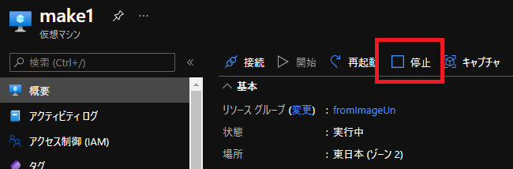 

VM の [ディスク] ブレードより、OS ディスクを選択します。

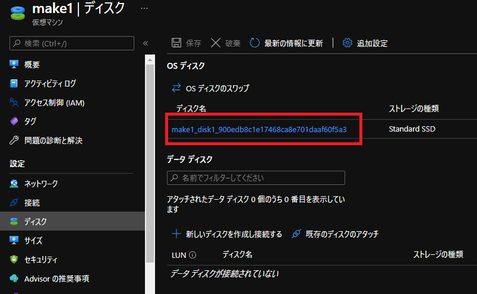 

上部にある [スナップショットの作成] を選択します。

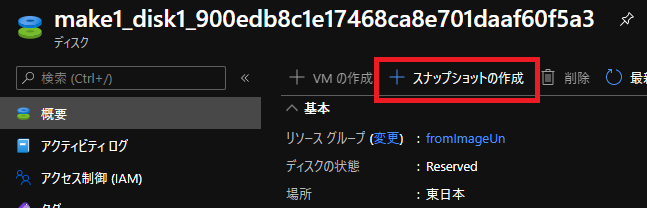 

スナップショット作成のオプションを選択します。  
下記は一例とはなりますが、今回はスナップショットの種類は [フル] とし、記憶域の種類は [Standard HDD] としています。  
設定が完了したら、[レビュー] を選択し、スナップショットを作成します。

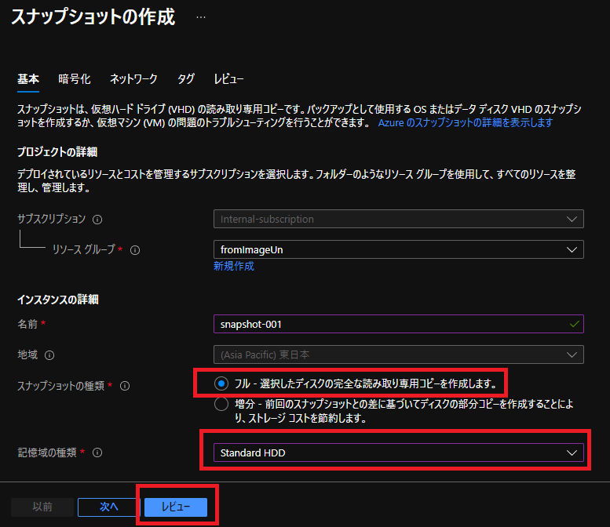 

---
### 3.作成した [スナップショット] より必要な数だけ [ディスク] を作成

スナップショットからディスクを作成します。  
なお、スナップショットからディスクは複数作成することができますが、ディスクから VM は 1 つしか作成できません。  
そのため、Azure ポータルを用いて複数 VM を作成する場合はこの手順を繰り返し行うこととなります。

まずは、ポータル上部の検索ボックスで [スナップショット] を検索し、選択します。

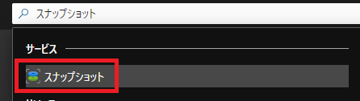

先ほど取得したスナップショットを一覧より選択します。

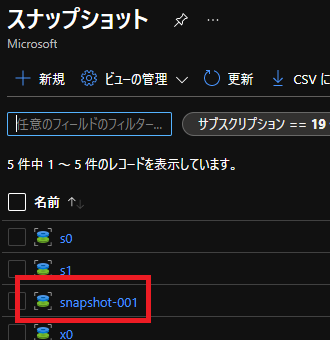 

上部に表示される [ディスクの作成] を選択します。 

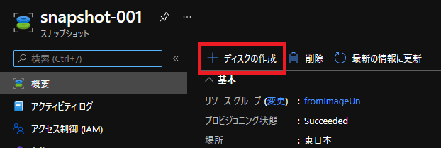

マネージドディスクを作成します。
基本的には、デフォルトの設定で問題無いかと思いますが、下記例ではサイズにて [Standard HDD] のディスクを作成するように設定しています。  

設定が完了したら [確認および作成] を選択し、マネージドディスクを作成します。

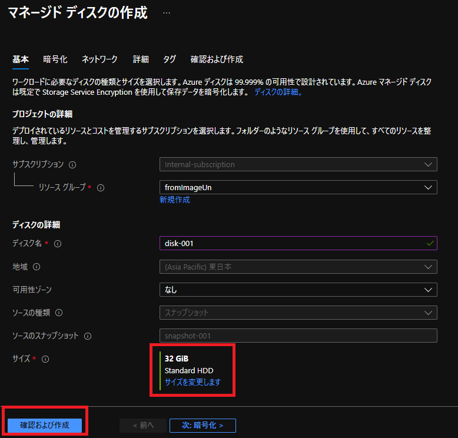 

### 4.作成した [ディスク] より VM 作成する

最後に作成したマネージド ディスクから VM を作成します。  
まずはじめに、Azure ポータル上部の検索ボックスで [ディスク] を検索し、選択します。

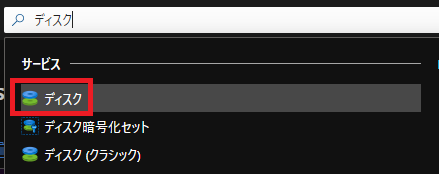 

先ほど作成したディスクを一覧より選択します。

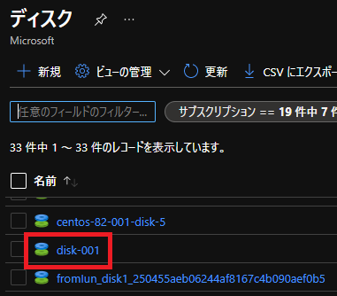 

上部に表示される [VM の作成] を選択します。

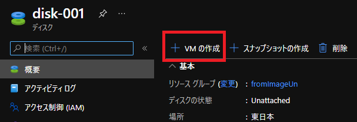 

すると、VM 作成画面が表示されますので、新規 VM を作成するのと同じ要領で VM を作成します。

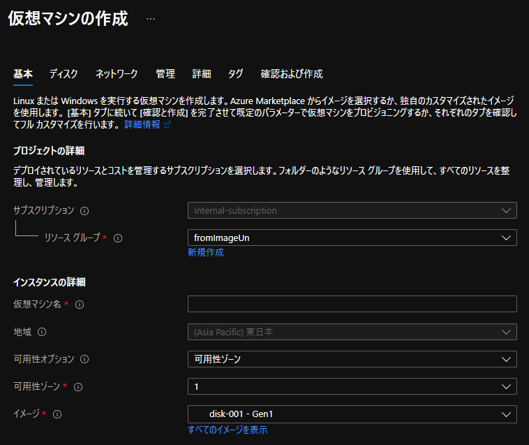 

以上が、Azure ポータルでのイメージを用いたスナップショットから VM を複製する手順となります。  
もちろん PowerShell を用いた展開なども可能です。本記事が、基本的な手順としてお役に立てれば幸いです。
