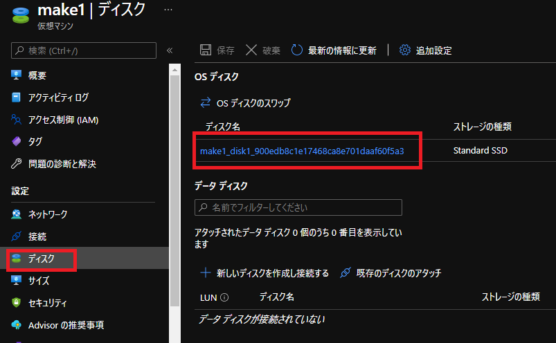

本記事は3部作の2記事目です。  
 1. <a href="../vm-replica-1">VM複製方法について 2つの方法の紹介</a>
 2. <a href="../vm-replica-2">一般化したイメージからVMを複製する手順</a>
 3. <a href="../vm-replica-3">OSディスクのスナップショットからVMを複製する手順</a>

そのため1記事目の <a href="../vm-replica-1">VM複製方法について</a> をご覧いただいている前提で記載させていただきます。  

本記事ではAzureポータルで、OSディスクのスナップショットから複製する手順について詳細に記載します。

こちらの記事ではマネージドディスクの使用を前提とさせていただきますので、  
アンマネージドディスクをご利用いただいている場合は、  
はじめに、下記手順でVMをマネージドディスクに変換をお願いいたします。

- Azure VM を Azure Managed Disks に移行する  
https://docs.microsoft.com/ja-jp/azure/virtual-machines/windows/migrate-to-managed-disks

# 注意事項

なお、Windows VMを複製しそれをご利用いただく場合、基本的には本手順はご利用いただけません。  
詳細は、<a href="../vm-replica-1/#Windows-VMを複製しようとしている方への注意喚起">Windows-VMを複製しようとしている方への注意喚起</a>をご参考ください。  

また、スナップショットからの複製でご注意いただきたい点として、  
スナップショットはVM固有のファイルとデータは保持される、OSディスクの完全読み取りコピーであるということです。  
つまり、**複製したVMはSIDやホスト名が複製元と同じになります。**   

そのため、意図しない動作を防止するため、同一VNET上で元VMと複製VMを同時に起動しないようにしてください。  
スナップショットからの複製する場合は別のVNET上にデプロイするようにお願いいたします。  

# 大まかな流れ

1. 複製元となるVMを用意する
2. VMを停止 (割り当て解除) し、OSディスクの [スナップショット] を取得
3. 作成した [スナップショット] より必要な数だけ [ディスク] を作成
4. 作成した [ディスク] よりVM作成する

# 実際の手順

それでは、上記の大まかな流れに沿って実際の手順をやってみましょう。  

## 1.複製元となるVMを作成する

複製元となる仮想マシンを作成します。  
こちらは詳細な手順は割愛させていただきますので、下記資料をご参考にVMを作成します。  

参考: クイック スタート:Azure Portal で Windows 仮想マシンを作成する  
https://docs.microsoft.com/ja-jp/azure/virtual-machines/windows/quick-create-portal

参考: クイック スタート:Azure portal で Linux 仮想マシンを作成する  
https://docs.microsoft.com/ja-jp/azure/virtual-machines/linux/quick-create-portal

## 2.VMを停止 (割り当て解除) し、OSディスクの [スナップショット] を取得

 

 

 

 

## 3.作成した [スナップショット] より必要な数だけ [ディスク] を作成

 

 

## 4.作成した [ディスク] よりVM作成する

 

 

 

 
