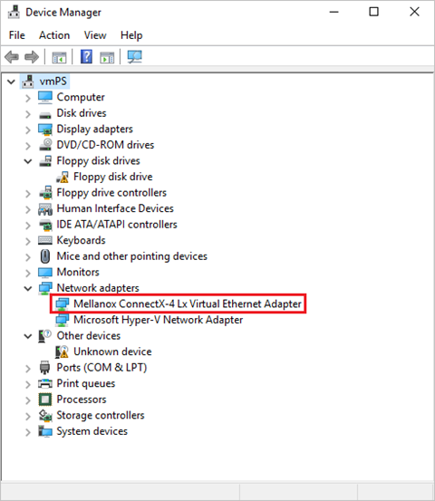

こんにちは、Azure テクニカル サポート チームの富田です。  
今年も日本マイクロソフトの社員がお届けする、 [Microsoft Azure Tech Advent Calendar 2024](https://qiita.com/advent-calendar/2024/microsoft-azure-tech) が始まりました！  
本記事は 2 日目の記事となります。 

Advent Calendar には他にも多くの Azure に関する有益な記事が公開されますので、是非ご参照くださいませ！   
今回は、お問い合わせいただくことも多い高速ネットワーク未対応・対応済・必須の VM サイズについて解説します。  
 
---
# 高速ネットワークと VM サイズについて
 
高速ネットワークはその名の通り、Azure VM のネットワークパフォーマンスを向上させるオプションです。  
具体的なメリットや対応 OS 等の情報は以下の公式ドキュメントをご参照ください。
 
■ご参考：高速ネットワークの概要  
https://learn.microsoft.com/ja-jp/azure/virtual-network/accelerated-networking-overview  
 
Azure VM はお客様のニーズに応える様々な VM サイズをご用意しています。
高速ネットワークについては VM サイズによって、以下の 3 パターンのサポート状況となります。　　
 - 高速ネットワーク未対応
 - 高速ネットワーク対応済み
 - 高速ネットワーク必須
 
各 VM サイズが高速ネットワークに対応しているか、必須であるかといった点については、各 VM サイズの公式ドキュメント内に記載の記載をご参照ください。  

■ご参考：Azure の仮想マシンのサイズ  
https://learn.microsoft.com/ja-jp/azure/virtual-machines/sizes/overview  
 
以下にそれぞれ詳細について解説します。  
 
---
# 高速ネットワーク未対応の VM サイズについて
 
一部の古い VM サイズでは高速ネットワークに対応していないサイズがございます。  
そのような古い VM サイズをご利用の場合は、是非高速ネットワークに対応している新しい VM サイズへの変更もご検討いただけますと幸いです。  
 
■ご参考：仮想マシンのサイズの変更  
https://learn.microsoft.com/ja-jp/azure/virtual-machines/sizes/resize-vm  
 
なお、高速ネットワークを有効にした状態の別の VM サイズから、高速ネットワーク未対応の VM サイズに変更をしようとした場合、以下のように互角性が無いといった表示となります。  
高速ネットワーク未対応の VM サイズに変更する場合は、一旦高速ネットワークに対応を無効にする必要がありますので、その点ご注意ください。  

  
 
---
# 高速ネットワーク対応済みの VM サイズについて
 
記事公開時点で、多くの VM サイズは高速ネットワークに対応済みとなっています。  
これは、高速ネットワークを無効で使っていただくことも、有効にして使っていただくことも可能な VM サイズです。  

---
# 高速ネットワーク必須の VM サイズについて
 
一部の新しい VM サイズでは、高速ネットワークが「必須」として記載されているものがあります。  
これは自動的に高速ネットワークが有効となるサイズです。  
 
高速ネットワーク必須の VM サイズをご利用の場合、Azure ポータル等で高速ネットワークを無効と設定したとしても、実際は高速ネットワークが有効の状態となります。  
※Azure ポータル等では「高速ネットワーク：無効」の表示になっていたとしても、実際は有効な状態になっています。  
 
すなわち、高速ネットワーク無効の状態の別の VM サイズから、高速ネットワーク必須の VM サイズに変更いただくことも可能です。  
 
---
# 高速ネットワークと VM サイズのまとめ
 
上記の内容をまとめると、以下のような形となります。  
 
| |高速ネットワークを無効に設定|高速ネットワークを有効に設定|
|-|-|-|
|高速ネットワーク未対応の VM サイズ|高速ネットワークは無効となる|そもそも設定不可|
|高速ネットワーク対応済みの VM サイズ|高速ネットワークは無効となる|高速ネットワークは有効となる|
|高速ネットワーク必須の VM サイズ|高速ネットワークは自動的に有効となる|高速ネットワークは有効となる|
 
---
# 高速ネットワークが有効になっているかゲスト OS 内から確認を行う
 
高速ネットワークが有効になっているかゲスト OS 内から確認を行う手順について記載させていただきます。  
詳細は以下のドキュメントをご確認いただきたく存じますが、簡単な確認方法としては Mellanox の NIC が増えている場合は、高速ネットワークが有効になっていると判断できます。  
 
■ご参考：高速ネットワークが有効になっていることを確認します。（Windows）  
https://learn.microsoft.com/ja-jp/azure/virtual-network/create-vm-accelerated-networking-cli?tabs=windows#confirm-that-accelerated-networking-is-enabled  
 
■ご参考：高速ネットワークが有効になっていることを確認します。（Linux）  
https://learn.microsoft.com/ja-jp/azure/virtual-network/create-vm-accelerated-networking-cli?tabs=linux#confirm-that-accelerated-networking-is-enabled  
 
高速ネットワークが正常に有効になっている Windows の場合はデバイス マネージャーにて以下の例のように、Mellanox の NIC があることが確認できます。  
なお、Mellanox の名前が ConnectX-4 Lx 以外の場合もあります。  
 
  
 
高速ネットワークが正常に有効になっている Linux の場合は、「ip a」コマンドで NIC を表示すると、IP アドレスが付与されていない NIC があることが確認できます。
 
  
 
---

今回の内容は以上となります。  
上記の記事が皆様のお役に立てますと幸いでございます。  

