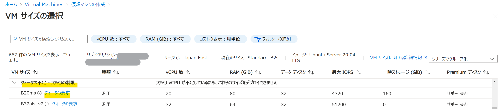

<!-- more -->

こんにちは、Azure テクニカル サポート チームの前田です。  
Azure テクニカル サポート窓口におきまして、Azure VM のサイズに関するお問い合わせをいただくことがあります。  
しかしながら、弊サポート窓口にお問い合わせいただいた場合であっても、原則としてサポートより具体的な VM サイズを直接ご提案することは叶わず、最終的にはお客様にご判断いただく必要が生じます。  
このため、お客様のお手元にて VM サイズの選定にあたり適切な内容をご確認いただけるよう、また変更時のトラブルについて初動対処が可能となるよう、本記事を公開させていただきます。
各項目に添付の弊社公開情報と併せまして、少しでもご参考になりましたら幸いに存じます。  
## 目次  <!-- omit in toc -->

- [VM サイズの選び方](#vm-%E3%82%B5%E3%82%A4%E3%82%BA%E3%81%AE%E9%81%B8%E3%81%B3%E6%96%B9)
  - [サイズ選定時に一般に考慮すべき項目](./%E3%82%B5%E3%82%A4%E3%82%BA%E9%81%B8%E5%AE%9A%E6%99%82%E3%81%AB%E4%B8%80%E8%88%AC%E3%81%AB%E8%80%83%E6%85%AE%E3%81%99%E3%81%B9%E3%81%8D%E9%A0%85%E7%9B%AE)
  - [仮想マシン セレクターについて](./%E4%BB%AE%E6%83%B3%E3%83%9E%E3%82%B7%E3%83%B3-%E3%82%BB%E3%83%AC%E3%82%AF%E3%82%BF%E3%83%BC%E3%81%AB%E3%81%A4%E3%81%84%E3%81%A6)
- [VM サイズの選択・変更ができない場合のトラブルシューティング](./vm-%E3%82%B5%E3%82%A4%E3%82%BA%E3%81%AE%E9%81%B8%E6%8A%9E%E5%A4%89%E6%9B%B4%E3%81%8C%E3%81%A7%E3%81%8D%E3%81%AA%E3%81%84%E5%A0%B4%E5%90%88%E3%81%AE%E3%83%88%E3%83%A9%E3%83%96%E3%83%AB%E3%82%B7%E3%83%A5%E3%83%BC%E3%83%86%E3%82%A3%E3%83%B3%E3%82%B0)
  - [当該リージョン、ゾーンにて変更先のサイズが提供されているか](./%E5%BD%93%E8%A9%B2%E3%83%AA%E3%83%BC%E3%82%B8%E3%83%A7%E3%83%B3%E3%82%BE%E3%83%BC%E3%83%B3%E3%81%AB%E3%81%A6%E5%A4%89%E6%9B%B4%E5%85%88%E3%81%AE%E3%82%B5%E3%82%A4%E3%82%BA%E3%81%8C%E6%8F%90%E4%BE%9B%E3%81%95%E3%82%8C%E3%81%A6%E3%81%84%E3%82%8B%E3%81%8B)
  - [ローカル一時ディスクの有無](#ローカル一時ディスクの有無)
  - [割り当て解除を行うことで VM サイズの選択肢が増える場合](#割り当て解除を行うことで-vm-サイズの選択肢が増える場合)
  - [可用性セット利用時の注意](#可用性セット利用時の注意)
- [注意事項](#注意事項)
  - [クォータの不足による VM サイズの選択不能事例](#クォータの不足による-vm-サイズの選択不能事例)
  - [仮想マシン サイズの変更により再起動が発生する](#仮想マシン-サイズの変更により再起動が発生する)
- [おわりに](#おわりに)

 
## VM サイズの選び方 
### サイズ選定時に一般に考慮すべき項目
 
まず VM サイズを選定いただくにあたり、一般に考慮すべき項目としては下記内容が挙げられるかと存じます。  
ご要件によりこの他にも必要な要件があるかと存じますため、一例としてご参考になりましたら幸いでございます。  
 
- CPU、メモリ、ネットワーク帯域といった基本スペック
- Intel 社、AMD 社の CPU の差異 
- ディスクの最大アタッチ数
- Premium Storage の利用可否
- 一時ディスクの有無
 
Azure におきましては、CPU 対メモリ比のバランスのとれた汎用サイズの他、メモリ比率の高いメモリの最適化サイズなど、特徴ごとに様々な VM サイズのシリーズをご用意しております。  
各シリーズの詳細につきましては、下記公開情報にてご紹介しておりますのでご参考ください。  
 
ご参考：[VM サイズ - Azure Virtual Machines | Microsoft Learn](https://learn.microsoft.com/ja-jp/azure/virtual-machines/sizes)  

---
### 仮想マシン セレクターについて
 
ご利用の環境において CPU やメモリの必要な容量などの要件が既に明確な場合、仮想マシン セレクターにてご希望に応じた VM サイズを自動でご提案します。  
その他、リージョンの指定やプレミアム ストレージの利用可否など、細かな設定が可能ですので、VM サイズの選定の第一歩として有効活用いただければと存じます。  

ご参考：[Microsoft Azure VM セレクター](https://azure.microsoft.com/ja-jp/pricing/vm-selector/)  
 
---
## VM サイズの選択・変更ができない場合のトラブルシューティング
 
続いて、VM サイズの変更ができない場合のトラブルシューティングについてご紹介します。

### 当該リージョン、ゾーンにて変更先のサイズが提供されているか
 
GPU 搭載の VM サイズや、提供開始が比較的直近の VM サイズをご利用いただく場合、ご利用可能なリージョンや可用性ゾーンに制限が生じている場合があります。  
リージョンおよび可用性ゾーンそれぞれの制限につきましては、下記の手順にてご確認いただくことが可能です。
 
- 各リージョンでの提供状況  
下記公開情報内「製品」項目にて「Virtual Machines」を検索いただき、「リージョン」にてご利用予定のリージョンをご選択ください。  
ご参考：[リージョン別の Azure 製品 | Microsoft Azure](https://azure.microsoft.com/ja-jp/explore/global-infrastructure/products-by-region/?products=virtual-machines)

- 各可用性ゾーンでの提供状況  
各可用性ゾーンでの VM サイズのご提供状況につきましては、VM をご利用いただくサブスクリプションにて、下記コマンド例をご参考に Azure CLI または Azure PowerShell コマンドよりご確認ください。  
なお、各可用性ゾーンでのご提供状況につきましては、サブスクリプションごとにご確認いただく必要がございます点、ご留意のほどお願いいたします。  

JapanEast リージョンでの確認コマンド例  
Azure CLI の場合：
```CMD
az vm list-skus --location japaneast --output table  
```
Azure PowerShell の場合：
```CMD
Get-AzComputeResourceSku | where {$_.Locations.Contains("japaneast")};  
```

出力例について、一部表記が異なりますが概ね同じ内容となるため、統合してご紹介いたします。  

出力例：  
下記例の場合、Japan East リージョンの Standard_D2s_v5 サイズは、当該サブスクリプションにて、可用性ゾーン 1,2,3 いずれでも利用可能であり、クォータ制限 (後述) がない状況となります。

```CMD
ResourceType      Locations    Name                      Zones    Restrictions
----------------  -----------  ------------------------  -------  ------------
virtualMachines   japaneast    Standard_D2s_v5           1,2,3    None
```


下記例の場合、Japan East リージョンの Standard_B16as_v2 サイズは、当該サブスクリプションにて、可用性ゾーン 1,2 のみで提供されており、クォータ制限 (後述) がない状況となります。

```CMD
ResourceType      Locations    Name                      Zones    Restrictions
----------------  -----------  ------------------------  -------  ------------
virtualMachines   japaneast    Standard_B16as_v2         1,2      None
``` 

ご参考：[Azure CLI を使用してゾーン VM を作成する - Azure Virtual Machines | Microsoft Learn](https://learn.microsoft.com/ja-jp/azure/virtual-machines/linux/create-cli-availability-zone#check-vm-sku-availability)  
ご参考：[Azure PowerShell を使用したゾーン VM の作成 - Azure Virtual Machines | Microsoft Learn](https://learn.microsoft.com/ja-jp/azure/virtual-machines/windows/create-powershell-availability-zone#check-vm-sku-availability)  

---
### ローカル一時ディスクの有無  
ローカル一時ディスクの有無が異なるサイズへ変更する場合、VM の再作成が必要となります。  
ゲスト OS 上での事前作業等が必要となりますので、詳細な手順につきましては下記の公式ドキュメントをご参照ください。  

ご参考：[FAQ - ローカル一時ディスクを持たない Azure VM のサイズ - Azure Virtual Machines | Microsoft Learn](https://learn.microsoft.com/ja-jp/azure/virtual-machines/azure-vms-no-temp-disk)  

---
### 割り当て解除を行うことで VM サイズの選択肢が増える場合   
シリーズ違いなど大きく異なる VM サイズへの変更を行う際、割り当て解除を行うことで Azure Portal から確認可能な変更先の VM サイズの種類が増える場合があります。  
これは仮想マシンが割り当てられる物理ホストごとに利用可能な VM サイズが決まっていることから、この制限を撤廃する割り当て解除を実施することで選択肢が増えるものとなります。  
リージョン・可用性ゾーンでの提供、および後述のクォータ等に問題がないにもかかわらず変更先の VM サイズが表示されない場合、VM の割り当て解除をご検討ください。  
 
---
### 可用性セット利用時の注意  
可用性セットをご利用の場合、通常の VM と比較し VM の割り当てを行う物理ホストに一定の制限が生じますため、サイズ変更の際に割り当てのエラーが発生する場合があります。  
当該事象の発生時には、可用性セットに含まれる全ての VM を割り当て解除いただくことで、より最適な物理ホストへの配置が可能となりますので、お試しください。  

ご参考：[Azure VM の割り当てエラーのトラブルシューティング - Virtual Machines | Microsoft Learn](https://learn.microsoft.com/ja-jp/troubleshoot/azure/virtual-machines/allocation-failure)  
 
---
## 注意事項
### クォータの不足による VM サイズの選択不能事例  
Azure のサブスクリプションでは各機能に対しクォータに制限があり、VM サイズにも同様にクォータが設定されています。  
Azure Portal 上で仮想マシンの作成時や変更時に VM サイズの選択を行う際、下記画面例のように「クォータの要求」が表示される場合、当該サブスクリプションにて適切なカテゴリでのクォータの引き上げが必要となります。  

画面例：


特に、GPU を利用する VM サイズでは、クォータに制限が生じている場合が散見されますので、ご注意いただければと存じます。  
下記公開情報をご参考に、事象に該当する場合はクォータの引き上げについてもご検討いただけますと幸いです。  

ご参考：[VM ファミリの vCPU クォータの増加 - Azure Quotas | Microsoft Learn](https://learn.microsoft.com/ja-jp/azure/quotas/per-vm-quota-requests)  

・クォータの制限について、コマンドから確認する方法  
先にご案内いたしました Azure CLI または Azure PowerShell のコマンド実行結果より、「Restriction」に「None」以外の出力がある場合、クォータの制限が生じている可能性がございます。  
下記の出力例は、Standard_D3 サイズに対し、サブスクリプション単位で Japan East リージョンへのクォータの制限が生じている例となります。  

```CMD
az vm list-skus --location japaneast --output table  

ResourceType      Locations    Name                      Zones    Restrictions
----------------  -----------  ------------------------  -------  ------------
virtualMachines  japaneast     Standard_D3               3        NotAvailableForSubscription, type: Location, locations: japaneast
```

---
### 仮想マシン サイズの変更により再起動が発生する  
仮想マシン サイズの変更時は、いずれのサイズの場合であっても再起動が発生します。  
現時点での仕様としてご理解いただき、ユーザー影響の少ない時間帯での実施をご検討いただきますようお願いいたします。  

ご参考：[仮想マシンのサイズ変更 - Azure Virtual Machines | Microsoft Learn](https://learn.microsoft.com/ja-jp/azure/virtual-machines/resize-vm?tabs=portal)  
 
---
## おわりに
VM サイズの選定・変更に際し、弊サポートへよくお問い合わせいただく事例をご紹介いたしました。  
Azure VM では VM サイズの変更が容易でございますので、VM サイズの選定の際はお手元にて負荷テスト等を検証の上でご判断をいただければと存じます。  
お手元での VM サイズの選定に際し、本記事の内容がご参考となりましたら幸いでございます。  