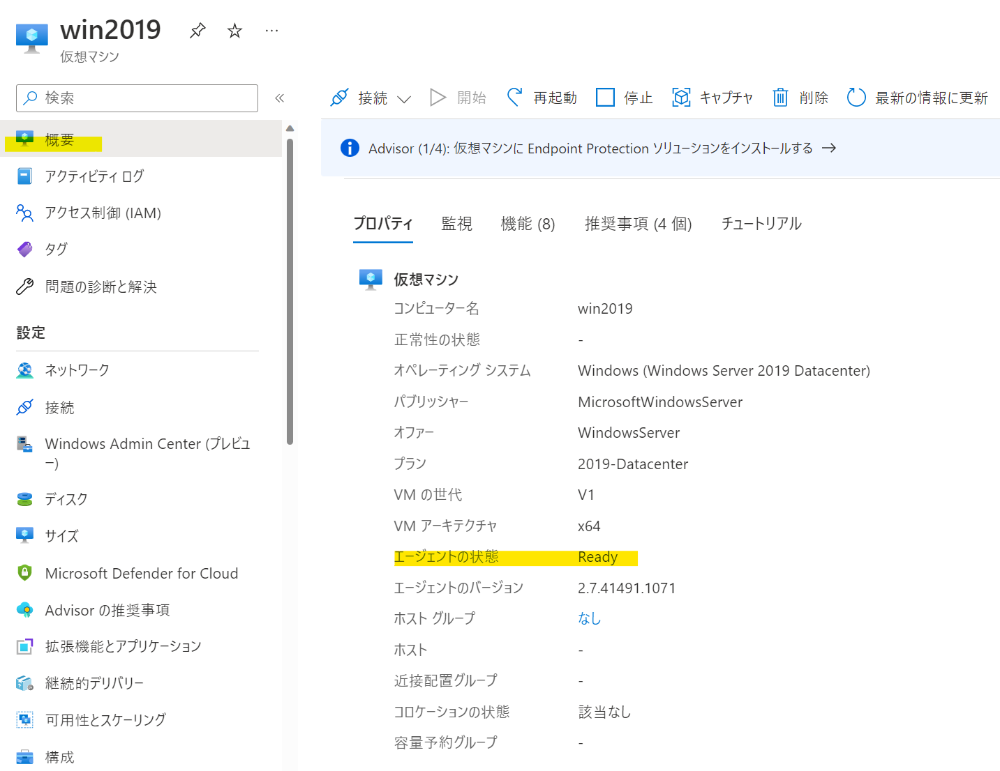

こんにちは、Azure テクニカル サポートの木下です。 
今回は、よくお問い合わせいただきます、Azure Linux エージェント (waagent) に出力されるメッセージについてご紹介いたします。 

<!-- more --> 

Azure Linux VM の /var/log/messages において、以下のような Error 句を含むメッセージが出力されたため、原因を知りたいというお問い合わせをいただくことがございます。 

メッセージ例） 
```sh 
Dec 11 06:16:46 testvm python: 2022-12-15T21:16:46.414141Z ERROR MonitorHandler ExtHandler An error occurred in the monitor thread main loop; will skip the current iteration. 
Dec 11 06:16:46 testvm python: [ProtocolError] Error fetching goal state 
Dec 11 06:16:46 testvm python: Inner error: [ResourceGoneError] [HTTP Failed] [410: Gone] The page you requested was removed. 
``` 

## 1. Error 句を含むメッセージの内容について 

Azure Linux エージェントは新しい更新情報などがないかの確認のため、VM と拡張機能の状態を物理ホストへ報告し、定期的に目標状態 (Goal State) の取得を行っております。 
上記のような Error 句を含むメッセージは、この目標状態の取得に失敗した場合に出力されるエラーならびに関連のメッセージとなります。 
目標状態の取得は、Azure 基盤内部の専用のエンドポイントとのやり取りで行われておりますが、このエンドポイントについては、稼働率が 100 % とすることは叶わず、拡張機能などの動作に支障がない範囲でメンテナンスが行われております。 

そのため、これらの Error 句を含むメッセージは、エンドポイントまでの通信経路で何らかの一時的な接続断やエンドポイント側のメンテナンスなどが発生し、目標状態の取得に失敗した際に発生することが想定となります。 

Azure Linux エージェント (waagent) については、以下公開情報におまとめしておりますので、詳細については、こちらをご参照ください。 

> 参考） 
> - [Azure Linux エージェントの理解と使用]( https://learn.microsoft.com/ja-jp/azure/virtual-machines/extensions/agent-linux ) 

## 2. 影響の有無について 

Azure Linux エージェントの更新情報の確認は、数秒間隔で常に行われております。一時的に失敗していた期間が存在していたとしても、VM の動作へ影響を与えるものではないため、その後成功 (=Error 句を含むメッセージの出力が停止) していれば問題のないものと判断いただくことが可能です。 
従いまして、このメッセージの出力が一時的なものであれば、基本的にはご放念いただいて問題なく、また、お客様側で何らかの対処をいただく必要はございません。 

一方で、Azure Linux エージェント自体が何らかの動作不具合となってしまった等が原因で恒常的にエンドポイントとの通信に失敗している場合、Azure 基盤側が「Azure Linux エージェント (waagent) と通信ができない状態」とみなし、エージェントが管理している拡張機能の動作 、例えば、Azure Backup の取得等に失敗してしまうケースがあります。この場合は、是正を行う必要がある状態となります。 

まずは、Error 句を含むメッセージが出力された VM のエージェントの状態が Ready なのか、Not Ready となってしまっているのかを Azure ポータル や Azure PowerShell / Azure CLI のコマンドの実行結果よりご確認ください。 

## 3. エージェントの状態の確認方法について 

### ▼Azure ポータルの場合 

 

### ▼Azure PowerShell の場合 

```sh 
# VM の状態情報を取得 
PS > $vm = Get-AzVm -ResourceGroupName <RGName> -Name <VMName> -Status 

# エージェントの状態表示 (DisplayStatus が Ready であるかを確認) 
PS > $vm.VMAgent.Statuses[0] 

Code          : ProvisioningState/succeeded 
Level         : Info 
DisplayStatus : Ready 
Message       : GuestAgent is running and processing the extensions. 
Time          : 11/28/2022 3:53:17 AM 
``` 

### ▼Azure CLI の場合 

```sh 
# VM の状態情報を取得し、エージェントの状態を抽出して表示 (displayStatus が Ready であるかを確認) 
az vm get-instance-view -g <RGName> -n <VMName> --query '{AgentStatus:instanceView.vmAgent.statuses}' 
{ 
  "AgentStatus": [ 
    { 
      "code": "ProvisioningState/succeeded", 
      "displayStatus": "Ready", 
      "level": "Info", 
      "message": "GuestAgent is running and processing the extensions.", 
      "time": "2022-11-28T03:56:17.923000+00:00" 
    } 
  ] 
} 

``` 

Not Readyの状態が継続して発生している場合の想定されるシナリオと対処策をおまとめしたブログ記事もございますので、想定されるシナリオに該当するかの切り分け方法としてご参照くださいませ。 

> 参考） 
> - [「仮想マシン エージェントの状態が準備できていません」について]( https://jpaztech.github.io/blog/vm/vmagent-notready/) 

 
