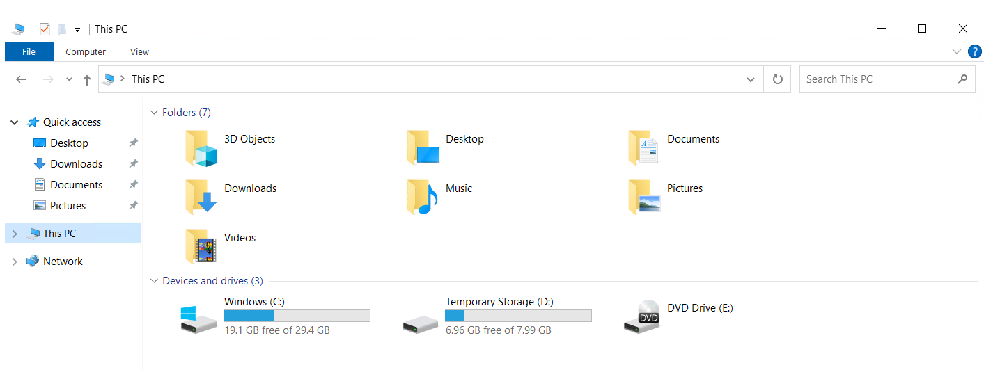

こんにちは、Azure テクニカル サポート チームの富田です。  
**Azure 上でデプロイした Windows の VM に D ドライブ や E ドライブとして CD / DVD ドライブが表示される**  
というお問い合わせをいただくことがあるため、これについて解説させていただきます。  

 

結論から申し上げますと、 **これは初回起動時での予期された動作であり、VM を割り当て解除することで消えます。**  
以下に解説させていただきます。  

Azure の Marketplace から Windows の仮想マシンを作成した場合、初回起動の際に DVD ドライブ がマウントされる動作となります。  

このドライブは、Windows 環境をデプロイする際にセットアップに必要な情報を読み込むためにマウントされますが、  
お客様が仮想マシンを停止 (割り当て解除) された場合や、Azure 側のメンテナンスなどに伴ってホスト サーバーの変更が発生した際に切断されます。  

仮想マシンを停止 (割り当て解除) 頂いてから、起動を行うことでこの DVD ドライブ は削除されます。  
なおこの際、再起動や OS からのシャットダウンの場合は割り当て解除が行われませんので、  
Azure Portal 等で停止 (割り当て解除) を行うようにお願いいたします。  

