こんにちは、Azure サポートチームです。

今回は Azure 環境における Windows Server 2019 の日本語の言語パック適用手順についてご紹介させていただきます。
Azure Marketplace における Windows Server イメージは、基本的に英語版をベースとしたものが公開されておりますが、言語パックをインストールいただくことで、表示言語を日本語に変更してご利用いただくことが可能でございます。
Windows Server 2016 以前の手順については、以下の Blog 記事をご参照いただけますと幸いです。
>Azure 環境における Windows Server の日本語環境化について
>[https://docs.microsoft.com/ja-jp/archive/blogs/jpaztech/japanese_langpack_etc](https://docs.microsoft.com/ja-jp/archive/blogs/jpaztech/japanese_langpack_etc)

## 注意事項
言語パックのインストールは、更新プログラムやアプリをインストールする前に実施いただく必要があります。詳細は以下の弊社公開情報をご確認くださいますと幸いです。
> Windows イメージへの言語の追加 - 考慮事項
> [https://docs.microsoft.com/ja-jp/windows-hardware/manufacture/desktop/add-language-packs-to-windows#considerations](https://docs.microsoft.com/ja-jp/windows-hardware/manufacture/desktop/add-language-packs-to-windows#considerations)
>> 言語をインストールしてから、更新プログラムとアプリをインストールします。 アプリまたは更新プログラム (サービス スタック更新プログラム (SSU) または累積更新プログラム (CU) など) を既に含むイメージに言語を追加する場合は、アプリと更新プログラムを再インストールします。

## 適用手順
以下の操作は Windows Server 2019 の Azure VM 上で行います。

1. 下記より言語パックの iso ファイルをダウンロードします。  
※ 方法 2: LPKSetupを使用 の手順 1 の [ここ] をクリックすることでダウンロードが可能です。  
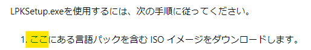  
>Windows Server 2019 デスクトップ エクスペリエンスの言語パックを構成できない
>[https://support.microsoft.com/ja-jp/help/4466511/cannot-configure-language-pack-for-windows-server-2019](https://support.microsoft.com/ja-jp/help/4466511/cannot-configure-language-pack-for-windows-server-2019)

2. ダウンロードした言語パックをマウントします。下記画像では、E ドライブにマウントしています。  
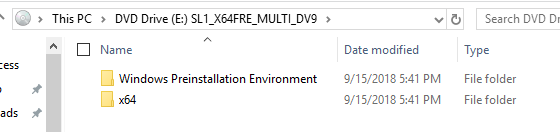

1. Windows キー を押下し、"lpksetup.exe" と入力し、検索結果から lpksetup を起動します。  

1. "Install display languages" をクリックします。  
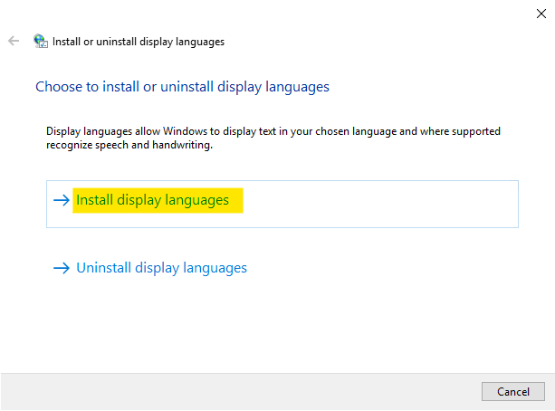

1. [Browse...] をクリックします。  
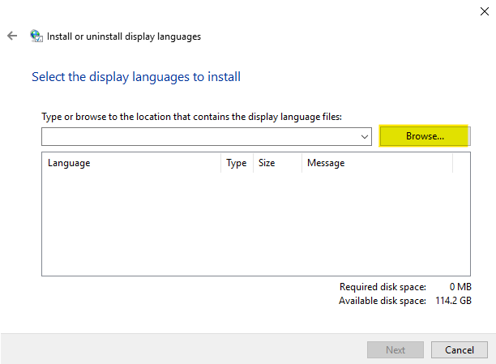

1. "マウントされている言語パックのドライブ" > "x64" >  "langpacks" > "Microsoft-Windows-Server-LanguagePack_x64_ja-jp" を選択し、[OK] をクリックします。  
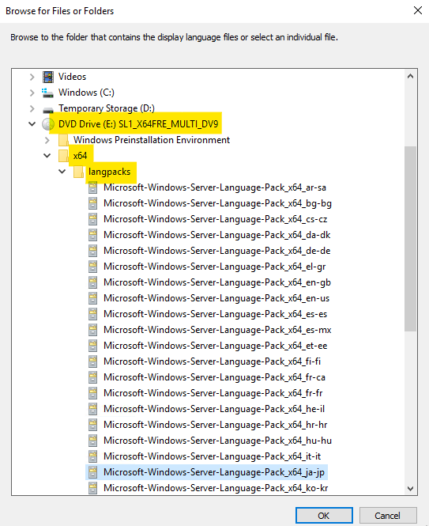

1. Language 欄に「Japanese(日本語)」が表示されたことを確認し、[Next] をクリックします。  
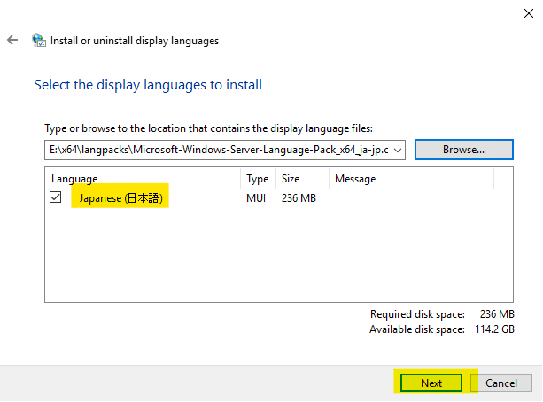

1. 「マイクロソフト ソフトウェア追加ライセンス契約」の内容をご確認いただき、問題がなければ、"I accept the license terms. (同意する)" ラジオボタンにチェックを入れ、[Next] をクリックします。  

1. 「Japanese(日本語)」のインストールが完了しましたら、[Close] をクリックします。  
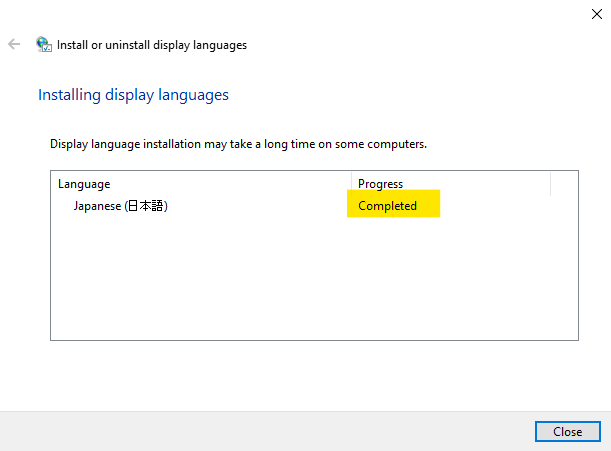

1. "Setting"  > ”Time & Language” > "Language" を開き、[Add a language] をクリックします。  
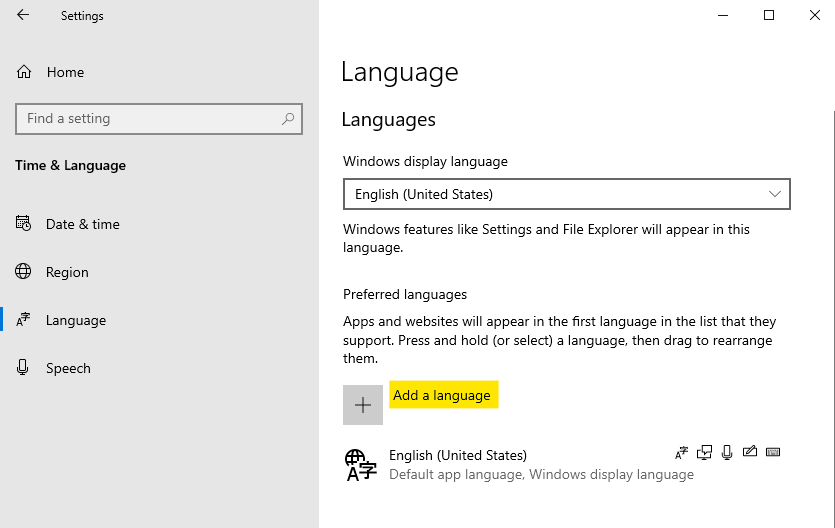

1. 日本語を選択し [Next] をクリックします。  
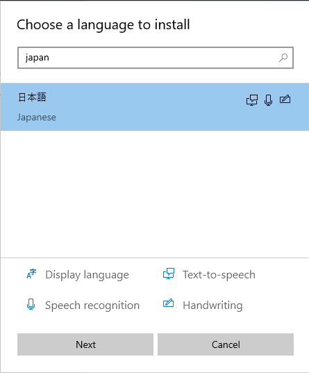

1. 画面上部に [Install language pack and set as my Windows display language] が表示されていることを確認し、[Install] をクリックします。  
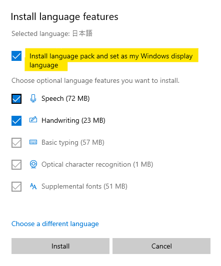

1. Windows display language に [日本語] が表示され、次回サインイン時に表示言語が切り替わることを示す [Will be display language after next sign-in] が表示されていることを確認し、一度サインアウトします。  
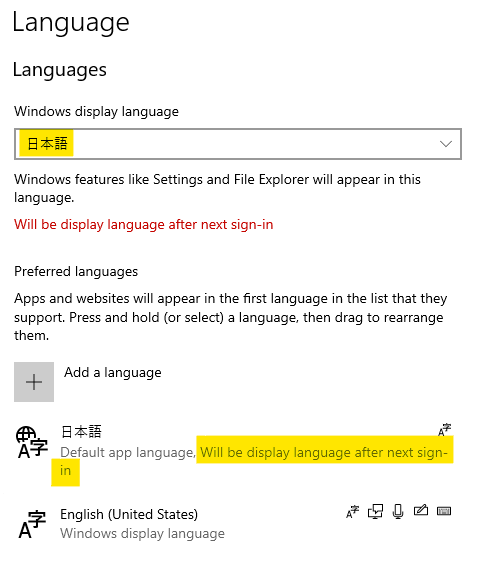

1. サインインしなおすことで、表示言語が日本語になったことをご確認ください。  
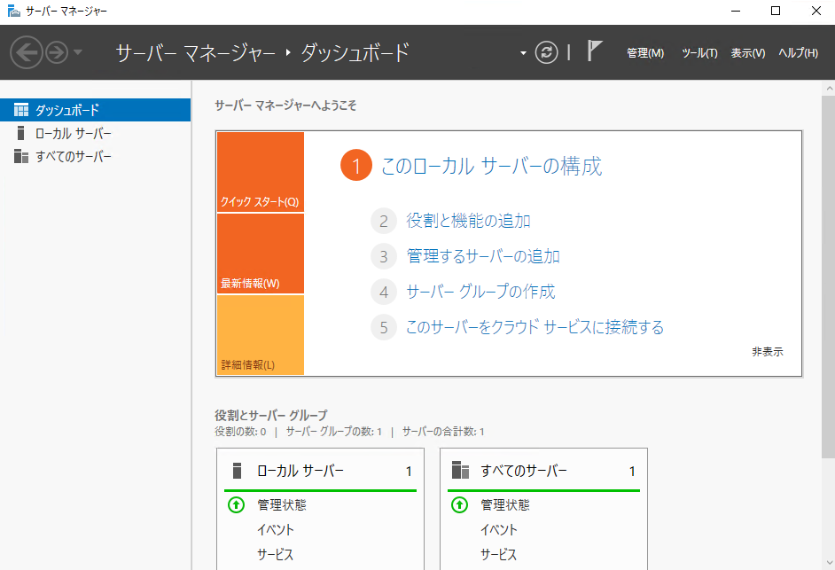

表示言語の切り替え後、更新プログラムやアプリのインストールをご実施ください。  
タイムゾーンの変更等の手順は、再掲となりますが、以下の Blog 記事をご参照いただきますようお願い申し上げます。
>Azure 環境における Windows Server の日本語環境化について
>[https://docs.microsoft.com/ja-jp/archive/blogs/jpaztech/japanese_langpack_etc](https://docs.microsoft.com/ja-jp/archive/blogs/jpaztech/japanese_langpack_etc)

こちらの情報が、少しでも皆様のご参考となれば幸いでございます。