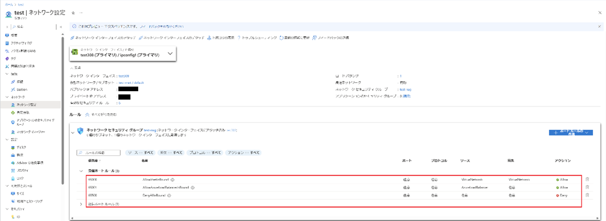
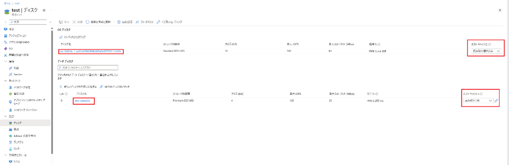
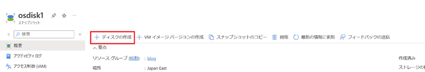

Azure テクニカル サポート チームの藤澤です。 
 
Azure VM のいくつかの設定項目は、VM 作成後は変更いただくことが叶いません。

しかしながら、OS / データディスクの内容を保持したまま、VM を再作成いただくことで再作成時に変更することが可能でございます。 

本記事では、通常変更不可であるが、VM を再作成することで変更可能となる設定項目についてご紹介し、その変更手順についてご案内します。 

<!-- more -->

## ■再作成が必要となるシナリオ一覧紹介
以下の項目を変更したい場合、 VM の再作成が必要です。 
 - 可用性ゾーンの変更 / 追加 / 削除 
 - 可用性セットの変更 / 追加 / 削除 
 - Spot VM 設定の有効 / 無効 の変更 
 - 一時ディスク有り無し 
 - VM リソース名称の変更 
 - VNet の変更

## ■ポータルで VM 再作成を行う手順 
それでは、実際に VM 再作成で各項目を変更するための手順について説明させていただきます。 

### 1. 必要事項を控える
 まずは、VM 再作成時に再度同じ設定をするためにAzure ポータルの対象 VM の画面を開き 、赤枠の項目を控えます。 
 多くの項目がございますが、代表的なものについて説明させていただきますので、以下の通り設定値を控えておきましょう。 
 #### a. 概要メニュー
 - リソースグループ名 
 - 場所 
 - サイズ 
 - パブリック IP アドレス 
 - 仮想ネットワーク / サブネット 
 - 可用性とスケーリング 

 

 #### b. ネットワークメニュー
 元の NIC を用いるかどうかによって、以下の 2 パターンに分けられます。VM 再作成時は Azure Portal にて既存 NIC を指定できませんが、VM 再作成後に後から NIC を付け替えることが可能です。該当する方を控えてください。 

 **b-1. 元の NIC を用いて新しい仮想マシンを作成する場合**
- ネットワーク設定メニュー
  - NIC名 (元のNICが複数ある場合はすべて控える) 
   

 **b-2. 新しい仮想マシンを作成する際に、元の NIC を使用しない場合**
- ネットワーク設定メニュー
  - NSG 
   
- 負荷分散メニュー
  - 負荷分散の設定 
   
   
- ディスクメニュー
  - OS ディスク名 
  - データディスク名 
  - 全ディスクのホストキャッシュ設定
   
これで、再作成のための情報を控えることができました。

[!WARNING]
次の「スナップショットからゾーン設定を変更したディスク作成」については該当するシナリオに合致する場合のみ実施をお願いいたします。 
 
---
### # スナップショットからゾーン設定を変更したディスク作成 
この手順は**以下のシナリオに該当する場合のみ**実施をお願いいたします。 
該当しない場合は、後述の「2. 元の仮想マシンを削除する」に進んでください。

 
 **【該当シナリオ】**
 - もともと可用性ゾーンを使っており、可用性ゾーンに関する変更を行う
   
    例：ゾーン番号の変更・可用性ゾーンから可用性セットへの切り替え・可用性ゾーンをやめる
 - 可用性ゾーンを使っていなかったが、今回可用性ゾーンに変更する
 

 上記シナリオの場合は、そのゾーン設定に対応するディスクを作成する必要があります。 

 理由としては、以下の例のように特定のゾーン対応に存在しないディスクから、そのゾーン以外の VM を作成しようとすると、以下のような警告メッセージが表示され、VM 再作成ができないからです。 

 

 ### A. 元の仮想マシンの OS ディスクのスナップショットを取る
  a. Azure ポータルより [Virtual Machines] - [<当該 VM 名>] を開きます。 

  b. 左メニュー “設定” より [ディスク] を選択し、開いた画面 “OS ディスク” より [<当該 OS ディスク名>] をクリックします。

  c. 画面の [+ スナップショットの作成] をクリックします。

  

  d. 必要項目を適宜入力し、[確認および作成] - [作成] をクリックします。 
  [ストレージの種類] は、スナップショットを高パフォーマンスのディスクに保存する必要がある場合を除き、 [Standard HDD(ローカル冗長ストレージ)] を選択します。 

  

  e. データディスクがある場合、データディスクについても同様にスナップショットを作成します。 

  

 ### B. スナップショットからディスクを作成する際に可用性ゾーン/可用性セットを変更する
  a. Azure ポータル 上部の検索バーに “スナップショット” と入力し、サービス [スナップショット] を選択します。 
  上記手順で作成した OS ディスクおよび、データ ディスクのスナップショットが作成されていることを確認します。 

  

  b. 対象ディスクのスナップショットを選択し、[+ ディスクの作成] をクリックします 

  

  c. 必要項目を適宜入力し、[確認および作成] - [作成] をクリックします。 
  特定の可用性ゾーンに所属させたい場合は、以下のように可用性ゾーン番号をご指定ください。 
  それ以外の場合は [インフラストラクチャ冗長は必要ありません] を選択します。 

  

これにより、特定のゾーンに所属するディスク（もしくは、ゾーン設定の無いディスク）を用意することが出来ました。 
この作成したディスク名は VM 再作成時に使用しますので、控えておいてください。 

---

### 2. 元の仮想マシンを削除する 

 元の仮想マシンを削除します。 

 なお、この際にディスク等のリソースは残しますので、データが消失するものでは無い点はご安心ください。 
 一時ディスクの内容は破棄されます点はご承知おきくださいませ。
 
 a. 対象の仮想マシンの概要上部にある「削除」をクリック 
 

 b. 以下赤枠内にチェックを入れないように気を付けて削除してください 
 

仮想マシンのリソースを削除できました。 
次は残されたディスクから VM を再作成します。 
VM 再作成時にお好みの設定に変更が可能となっております。 
 
### 3. 元の仮想マシンの OS ディスクから新規仮想マシンを作成する際に変更したい項目を変更する 
 a. Azure ポータルより削除した VM で使用していた OS ディスク (控えていた OS ディスク名を参照) の画面を開きます。
 上述の「スナップショットからゾーン設定を変更したディスク作成」を実施した場合は、その際に作成したディスクを選択します。

 b. [VM の作成] をクリックします。 

 

 c. 1. [必要事項を控える]()にて控えていた内容をもとに入力していきます。 
  - リソース名を変更したい場合 

    

  - データディスクを追加したい場合 

    元の仮想マシンのデータディスクを追加したい場合は、[既存のディスクの接続] より追加。 

    

    

  -  新しい仮想マシンで可用性セットを使用したい場合

     [可用性オプション] にて [可用性セット] を選択し、[可用性セット] の項目にてご希望の障害ドメイン、更新ドメイン数を入力ください。 

     

  -  新しい仮想マシンで可用性ゾーンを使用したい場合 

     [可用性オプション]の項目で[可用性ゾーン] を選択し、[可用性ゾーン] の項目では、3-c にてスナップショットからディスクを作成する際に指定したゾーン番号を選択します。 

     

  -  Azure Spot 割引を変更したい場合 

     

   [!NOTE]
   ネットワークについて、 
   既存のネットワーク インターフェースの接続は VM 作成後に行います。 
   そのため、この段階での “NIC ネットワーク セキュリティ グループ” の設定は不要です。

   [!NOTE]
   既存の VNET/ Subnet、NIC をご利用いただく場合、既存の NSG との紐づけが実施されたままとなりますので、仮想マシン作成時に新たに NSG を設定いただく必要はございません。 

   

 d.全ての設定が完了後、 [確認および作成] から[作成] をクリックします 

 

### オプション NIC の付け替え
  VM 作成時には既存 NIC を指定できませんが、 VM 再作成後に後から NIC を付け替えることが可能です。

  a. 仮想マシンを作成後、既存の NIC を接続するため、VM を停止 (割り当て解除)します。

  

  b. VM 停止 (割り当て解除) 後、VM のページから [ネットワーク] - ネットワーク設定 - [ネットワーク インターフェイスのアタッチ] を選択し、削除した VM で使用していた NIC を接続します。 

  

  

  c. 既存の NIC の接続完了後も、VM 作成時に作成された NIC がまだプライマリとなっている状態なので、[ネットワーク インターフェイスのデタッチ] を選択し、分離する必要があります。 

  

  

  NIC のデタッチを実施後、セカンダリとして接続した既存 NIC は自動的にプライマリとなります。 
  なお、デタッチした NIC については削除されても問題ありません。 

  d. VM を起動します。 

手順は以上となります。 

本記事が皆様のお役に立ちましたら幸いです。 

 

<!-- 文字修飾 -->

<!-- 画像 (リポジトリ内ファイルを参照 -->

<!-- 画像 (外部 URL を参照) -->

